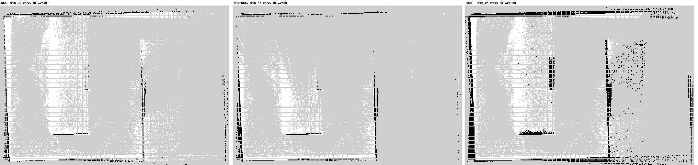

# 调试手册：建图链路 `mode:=mapping` + `lio:=fastlio` + `mapper:=cartographer`（实战沉淀）

> **本文是一次完整排查的可复用路径**：从"RViz 里地图跟着车转"一路查到根因（时间基 → 先验源 → QoS 丢帧 → 稀疏扫描 → 栅格清除），
> 含**分层判读法、三个工具、实测基线数字、症状→判据→处置速查表、以及踩过的坑**。
> 相关：`issues_and_findings.md`（#19–#25 是这条链上的每一环）、`sim_real_contract.md`（改动该落在 sim/real 哪一侧）、
> `architecture.md` §3.2.4（谁吃什么）、`tf_interface_contract.md`（帧契约）。
>
> 适用症状：地图跟着车转 / 地图飞 / 残影 / 特征先有后没 / 建图时好时坏 / `/scan` 频率异常 / cartographer 崩 `exit -6`。

---

## 0.1 这套链路是什么（本文的适用范围）

**本文所有数字与结论都在这一套上实测得到：**

```bash
ros2 launch rm_nav_bringup bringup_sim.launch.py world:=RMUL2026 \
    mode:=mapping lio:=fastlio mapper:=cartographer
```

| 角色 | 节点 | 输入 → 输出 | 本文涉及的文件 |
|---|---|---|---|
| 数据源（仿真替身） | Gazebo `LivoxPointsPlugin` + `imu_plugin` + `mecanum_controller` | `/livox/lidar`(CustomMsg)、`/livox/lidar/pointcloud`(PC2)、`/livox/imu`、`/odom_ground_truth` | `livox_points_plugin.cpp`（时间基、假点）、`sentry_robot_sim.xacro` |
| **LIO** | `fastlio_mapping` | `/livox/lidar` + `/imu/data` → `/odom`（+ 孤立岛 `camera_init→body`） | `FAST_LIO/src/laserMapping.cpp`（`child_frame_id`） |
| 里程计 TF | `lio_tf_adapter` | `/odom` → TF `odom→base_link`（含杆臂 `xyz`） | `lio_tf_adapter.yaml` |
| 感知① | `ground_segmentation`（linefit） | `/livox/lidar/pointcloud` → `/segmentation/obstacle` | `ground_segmentation_node.cc`（**订阅 QoS**）、`segmentation_sim.yaml` |
| 感知② | `pointcloud_to_laserscan` | `/segmentation/obstacle` → `/scan`（高度带 -1.0~0.1） | `laserscan_params.yaml` |
| **mapper** | `cartographer_node` + `cartographer_occupancy_grid_node` | `/scan` + **`/odom_ground_truth`**（先验）→ TF `map→odom` + `/map` | **`cartographer.lua`**、`bringup_sim.launch.py`（传 `odom_topic:=/odom_ground_truth`） |
| 其它 | `robot_state_publisher`（URDF 静态边）、`fake_vel_transform`、`rviz2` | — | `sentry_robot_sim.xacro` |

**哪些结论换配置后仍适用 / 要重测：**

- ✅ 仍适用：时间基（#19）、QoS 大消息丢帧（#25）、TF 单父边、`map→odom` 三态判读、栅格清除（§5.2）。
- 🔁 要重测：先验源（#21）—— `lio:=cartographer`（全包形态）没有 LIO 的 `/odom`，用的是 `cartographer_lio*.lua`；换 `mapper:=slam_toolbox` 时 `cartographer.lua` 的参数完全不适用（但 QoS/时间基/扫描率三条照样适用）。
- ⚠️ 与 `localization`（amcl/icp/纯定位）**不能同时开**：`map→odom` 只能有一个发布者。

---

## 0. 一句话结论（本轮根因链）

```
① 插件时间基混用（header 仿真钟 / 逐点 offset 墙钟）
      → /odom 时间戳带墙钟抖动 → cartographer 时间序 CHECK → exit -6            (#19)
② 先验源给错：用 LIO 自己的 /odom（同源 + 晚到）
      → 反馈回路 + 撞 CHECK；改为**独立底盘 odom**（/odom_ground_truth）        (#21)
③ linefit 订阅 QoS 与插件发布端不对齐（BEST_EFFORT 收 RELIABLE 发的 480KB 大消息）
      → 分片丢失不重传 → 2182 帧只收到 68 帧（3%）                              (#25)
      → /scan 只有 0.31~3.3Hz 且带秒级空洞
④ cartographer 在扫描之间"朝向不转"，每来一帧扫描补一刀
      → map→odom 84 次正向大跳、单步最大 76.8°、累计 66° ⇒ **地图跟着车转**     (#23)
⑤ 修好 ③ 后地图不再跟转；剩下的"特征先有后没"是**栅格清除**问题：
      /scan 有 37% 的角度 bin 是 inf（无回波：地面被 linefit 去掉 + 上视射线打空），
      cartographer 把这些方向**清到 missing_data_ray_length=3m** ⇒ 3m 内的内部小墙
      一旦不再被命中就被主动擦掉 ⇒ "扫描到就有、被挡住就没了"                  （本文 §5.2）
```

---

## 1. 分层判读法（**先定量，再猜**）

| 层 | 看什么 | 命令 | 判据 |
|---|---|---|---|
| **L0 时钟/时间基** | 各话题 `header.stamp` 是否同轴 | `ros2 topic echo <t> --field header.stamp --once`、`/clock` | 出现 `6213559xx`（墙钟 .NET ticks 被当 ns）这类值 = 混时钟 |
| **L1 输入流** | **每个话题**：平均率 / 中位间隔 / **最大空洞** / 空洞数 / 戳异常 | `python3 tools/analyze_slam_bag.py --bag <bag>` | ⚠️ **只看中位间隔会骗人**：/scan 中位 300ms 像 3.3Hz，实际平均 1.67Hz、空洞 6.6s |
| **L2 感知链逐段** | 插件 → linefit → p2l 各自出帧率 | 同上（bag 里录 `/livox/lidar/pointcloud`、`/segmentation/obstacle`、`/scan`） | 保留率掉在哪一段，就是那一段的问题 |
| **L3 调度/CPU** | 是否算力饱和 | `top -H -b -n6 -d1 -p $(pgrep -x ground_segmentation_node)` | CPU 空闲 + 输出低 ⇒ **不是算力，是交付/阻塞** |
| **L4 传输/QoS** | 两端 Reliability/Depth | `ros2 topic info <t> --verbose \| grep -E "Node name\|Reliability\|History"` | RELIABLE 发 + BEST_EFFORT 收 = 大消息静默丢帧（见 §5.3） |
| **L5 算法/参数** | 单个算法本身要多久 | `tools/seg_bench_offline.cc`（离线喂数据计时） | linefit 实测 1.01ms/帧 ⇒ 排除算力 |
| **L6 TF 与帧契约** | 帧树单一父边 + `map→odom` 曲线形态 | `ros2 run tf2_tools view_frames`、`python3 tools/monitor_map_odom.py` | 多父边 = 查找结果在两条路径间跳；`map→odom` 分三态（§5.1） |

**核心原则**：每一步都要能"一句话给数字"。说不清数字的猜测，先别改配置。

---

## 2. 工具（本轮新建，都在 `tools/`）

| 工具 | 用途 | 关键判据 |
|---|---|---|
| `monitor_map_odom.py` | **在线**采样 `map→odom`，判"平滑 / 锯齿 / 高频抖动" | P95(\|Δyaw\|) > `--jump-deg` ⇒ 高频抖动；少数大跳 ⇒ 锯齿 |
| `analyze_slam_bag.py` | **离线**bag 体检：各流 平均率/中位/最大空洞/戳异常；IMU 启动零值；两条里程计对比；`/tf` 各边 | 判"在甩"看**速率抖动 P95**，不是逐样本 Δyaw |
| `seg_bench_offline.cc` | 把录到的点云**直接喂 linefit 核心库**计时（不经 ROS/DDS） | 用来证伪"算力不够" |

配套：`ros2 bag record -o .tmp_bags/x /clock /scan /livox/imu /odom /odom_ground_truth /tf /tf_static /livox/lidar/pointcloud /segmentation/obstacle`
（**录制要早于 launch**，否则抓不到启动瞬间；bag 放在工作区内便于离线复算。）

---

## 3. 本轮实测基线（留档，便于对比）

| 量 | 实测值 |
|---|---|
| 插件 `/livox/lidar/pointcloud` | **10.00 Hz（仿真时间）/ 0 个 >0.5s 空洞**；墙钟 7.96 Hz（RTF≈0.8） |
| linefit `/segmentation/obstacle`（修 QoS 前） | **0.31 Hz / 49 个 >0.5s 空洞 / 最长 20.8 s** |
| p2l `/scan` | 68 条 = linefit 的 68 条（**一帧不丢**） |
| `segment()` 单帧耗时 | **平均 1.01 ms、最慢 1.80 ms**（30000 点，sim 参数） |
| 同一发布端、不同订阅者 | RELIABLE(rosbag2) **2182/2182=100%**；BEST_EFFORT(linefit/hz) **3%~26%** |
| `map→odom`（修 ② 前） | 84 次 >2° 跳变**全为正向**、单步最大 **76.8°**、累计 **−66.6°**；同期机器人净转 +3.8° |
| `/scan` 构成 | 1462 bin；有回波 **62.7%**（37.3% 为 `inf`）；距离 P50 2.3 m、4~10 m 占 16% |
| 插件发的假点 | 每帧 **78.4%**（23500/30000）是 `(0,0,0)`（无回波被填零；真实驱动只发有效回波） |
| `base_link→base_link_fake` | 5508 条中 **3317 条戳非单调**（`fake_vel_transform` 待修） |

---

## 4. 症状 → 判据 → 处置（速查表）

| 症状 | 先量什么 | 判据 | 处置 |
|---|---|---|---|
| **地图跟着车转 / 地图飞** | `monitor_map_odom.py` | `map→odom` 出现**单向大跳**且跳变紧跟 scan ⇒ "扫描间朝向不转、每帧补刀" | 先修**扫描率**（§5.3），`map→odom` 会同时变好；IMU 是可选补强 |
| **残影 / 双层墙** | 收尾日志 `Score histogram` | `Count: 0` = 回环没命中、无全局锚定 | 回环门槛回到 `0.65/0.70`；搜索距离/窗口保持收紧 |
| **特征先有后没（内部小墙、遮挡后消失）** | `/scan` 的 `inf` 比例 + `missing_data_ray_length` | `inf` 比例高（我们 37%）且该参数 3 m ⇒ 无回波方向每帧清 3 m | **调小 `missing_data_ray_length`**（§5.2） |
| **静默丢帧（话题"看着有"但下游没有）** | 逐段率 + QoS | 大消息 + BEST_EFFORT 收 | 订阅端改 **RELIABLE**（§5.3） |
| **`cartographer_node` exit -6** | 崩溃栈**第一行** | `Check failed: ...` | 读 CHECK 语义；时间序类看时间基（#19/#21），IMU 类看数据（#24） |
| **帧树诡异 / 车乱抖** | `view_frames` 的父边计数 | 任一帧**两个父** ⇒ 查找结果跳变 | 删掉多余的静态桥/残留节点（`static_transform_publisher`） |
| **`topic hz` 看着正常但仍丢帧** | bag（存储时间）vs header 戳 | 两个时间轴不一致 | 用 bag 的**接收时间**看真实节奏（§6.1） |

---

## 5. 关键机制（本轮真正学到的三条）

### 5.1 `map→odom` 的定义就是"矫正量"——先分清三态

`T_map_odom = T_map_base(全局) × T_odom_base(里程计)⁻¹`。它**必然在动**；不动只意味着"完全信任里程计、永不纠偏"。
判据（用 `monitor_map_odom.py`）：

| 形态 | 含义 | 处置 |
|---|---|---|
| 平滑、缓慢、几度内 | **正常**（这就是它的职责） | 不动 |
| **锯齿**：慢慢涨到十几度再被拉回 | 局部 SLAM 在子图内走偏 + 全局事后矫正 → **留残影** | 查局部输入/扫描率 |
| **高频抖动**：逐样本就跳 | 局部匹配/时间戳/交付问题 | 查输入与 QoS |

⚠️ 别把 `map→odom` 有常数偏置当 bug：map 帧原点=建图起点、朝向每次重启都不同（cartographer_ros #1170，wontfix）。

### 5.2 特征"先有后没"的真实机理（⚠️ 本节的旧结论已于**十一次修正**被源码+离线复现推翻，见 5.2.4）

> **一句话新结论**：擦墙的不是"无回波光束"，而是**打到东西的光束自己在墙上留下的"锯齿"**——
> 5cm 栅格把墙面量化成台阶，打到"深齿"的射线会从"浅齿"的格子上压过去；而每个墙格子平均
> **9 帧才轮到一次命中**（一帧只有 ~373 个不同的命中格子），于是"命中 vs 清除"净票 ≈ 0，
> 栅格就在阈值附近随机游走 = 用户看到的"闪 + 慢慢化掉"。旧机理的证伪与数据见 **5.2.4**。

**（以下 5.2 / 5.2.1~5.2.3 保留为当时的推理过程，读的时候请对照 5.2.4 的更正）**

**先记住一件事**：cartographer 的 2D 栅格不是"画上去就永久"，而是**每一帧对每个格子投票**：

| 票 | 什么时候投 | 效果 |
|---|---|---|
| **命中 +** | 这一束真的打在这个格子上 | 概率上升（`hit_probability` → odds ×1.22 起） |
| **穿过 −** | 射线从原点走到命中点，途经的格子 | 概率下降（正常、且正确） |
| ~~**无回波 −（关键）**~~ | ~~这个角度没有障碍物（`inf`）~~ | ❌ **证伪**：p2l 发 `inf`，cartographer_ros 的 `LaserScanToPointCloudWithIntensities` 用 `range_min<=r<=range_max` 过滤，**`inf` 直接丢弃**，既不命中也不清除。`missing_data_ray_length` 因此**空转**（见 5.2.4 与 `cartographer.lua` 顶部注释） |

**（以下为当时基于"无回波=清 3m"的错误推理，保留备查）**

而这条链路里 **`inf` 的 bin 特别多：实测 37.3%**（1462 个 bin 里 546 个）。来源是两个"物理上正常"的原因：

- `linefit` 把**地面**去掉了 → 朝地面的那些角度**没有障碍物** → `inf`；
- MID360 垂直 FOV 是 −7°~+52°，**上视**的射线打不到东西 → `inf`。

于是**每帧都有 37% 的方向把 3 m 以内"投票成空地"**。这解释了为什么"**主要是内部小墙**"消失：

```
        外侧大墙（4~7 m，在"3 m 常清区"之外）
   ┌────────────────────────────────────────┐
   │                                        │
   │         ▮ 内部小墙（1.2 m）
   │         ▲
   │         │ ← 这一束打中小墙 → 小墙拿到 1 张"命中"票（稀疏！）
   │      (车)
   │         │
   │         └──► 车一转 / 小墙被挡 → 同一束变成 inf
   │                → cartographer 把 0~3 m 全标 FREE
   │                → 小墙每帧吃一张"清除"票
   └────────────────────────────────────────┘
```

**为什么内墙死、外墙活 —— 数字正好对上**（我们实测有回波点的距离分布）：

| 距离 | 占比 | 是否在 3 m"常清区"内 |
|---|---|---|
| 1~2 m | 32% | ✅ 在内 → **每帧被清** |
| 2~4 m | 47% | ✅ 大部分在内 |
| **4~10 m** | **16%** | ❌ 在外 → 只被"真正穿过的射线"清，命中票还多 → **留得住** |

P25=1.8 m / P50=2.3 m / P75=3.1 m ⇒ **约 3/4 的命中都落在 3 m 的常清区里**，而外侧大墙只有 16% 的命中、且大多在常清区外。

再叠加两件事，小墙就更站不住：
1. **命中票稀疏**：`/scan` 每帧只有约 3100 个有效障碍点摊在 1462 个 bin 上（≈2 点/bin），而**机器人一转，同一面小墙每帧落进不同的 bin** ⇒ 同一个格子被命中的频率很低；
2. **清除票每帧必到**：只要那一束没打中小墙，`inf` 就给它一张"清 3 m"的票。

⇒ 概率在阈值附近来回摆 ⇒ **"扫到就有、扫不到就没"的闪烁**。（这不是"忘了"，是**被主动擦掉**。）

**处置（`cartographer.lua`）**：

| 参数 | 现值 | 建议 | 作用 |
|---|---|---|---|
| `TRAJECTORY_BUILDER_2D.missing_data_ray_length` | **3.0** | **0.5~1.0** | **首选**：常清区从 3 m 缩到贴身范围，1.2 m 的小墙不再被无回波束擦掉 |
| `...probability_grid_range_data_inserter.hit_probability` | 0.55 | **0.62** | 命中更"粘" |
| `...miss_probability` | 0.49 | **0.45** | 清除更弱（两者拉开差距，墙才立得住） |
| `TRAJECTORY_BUILDER_2D.num_accumulated_range_data` | 1 | **3** | 3 帧累积再插入 ⇒ 同一格有效命中 ×3 |

判别实验：临时 `insert_free_space = false` 跑一圈 —— 若小墙立刻稳稳留住，即确认"清除太狠"；确认后按上表**调弱**，不建议永久关掉（会失去清动态物的能力）。

> **2026-09-22 **第一组已改、但当场被实测否掉 → 已回退****：`missing_data_ray_length 3.0 → 1.0`、`hit_probability 0.55 → 0.62`、`miss_probability 0.49 → 0.45`；`num_accumulated_range_data` 仍为 1（留作下一组变量）。一次只动一组，便于归因。

#### 5.2.1 实测：低矮特征到底死在哪儿（8 帧 bag，**已排除插件发的假点**，地面按实测 `z=-0.226m` 标定）

| 离地高度带 | 真实点/帧 | linefit 障碍/帧 | 进入 `/scan` | raw→障碍 | 障碍→scan |
|---|---|---|---|---|---|
| 地面 0~3cm | 453 | 1 | 0 | **0.1%** | — |
| **低 3~8cm** | 347 | 10 | 4 | **2.8%** | 36.8% |
| 低 8~15cm | 1061 | 627 | 173 | 59.1% | 27.6% |
| 中 15~30cm | 3246 | 1417 | 584 | 43.7% | 41.2% |
| 中 30~60cm | 927 | 860 | 103 | 92.8% | 11.9% |

**结论（三层，缺一不可）**：

1. **linefit 把 ≤8cm 的东西几乎删光**（存活 0.1% / 2.8%）——两个参数共同造成：
   - `max_dist_to_line = 0.1`：**离"地面线"10cm 以内都算地面**；
   - `sensor_height = 0.275`，而**实测雷达离地只有 0.226 m（差 4.9cm）** ⇒ 地面线被整体抬高约 5cm，再叠 10cm 容差 ⇒ **15cm 以内的低矮特征大量被当"地面附近"删掉**（表里 8~15cm 只活 59%、15~30cm 只活 44% 也与场地的坡道/高地有关）。
2. **p2l 再砍 60~90%**：每角度 bin **只留最近的那个点** ⇒ 近处残余（地面漏网点、车体自身）会**遮住**后面的墙 ⇒ 这是"越近越留不下"的第二层原因。
3. **第一层是几何，参数改不了**：MID360 垂直 FOV 下视只有 **−7°**，雷达离地 0.226m ⇒ 一堵高 h 的墙只有距离 **d ≥ (0.226−h)/tan7°** 才可能被看到：
   `h=0.20m → d≥0.21m`；`h=0.15m → d≥0.62m`；`h=0.10m → d≥1.03m`；`h=0.05m → d≥1.44m`
   ⇒ **离得越近，低墙越在雷达下视视野之外**（真机同样，所以这条也解释"为什么是内部低墙"）。

**⇒ 因此"七次修正"（调弱清除）已回退**：当数据里根本没有低墙时，减少清除只会让残影/噪声留得更久（观感更差）。
正确的顺序是：**先把低墙送进 `/scan`**，再谈栅格累积/清除的调参。

**修法候选（都是感知参数，需拍板）**：
- `segmentation_sim.yaml`：`sensor_height 0.275 → 0.226`（按实测标定，纯修正）
- `segmentation_sim.yaml`：`max_dist_to_line 0.1 → 0.05`（≤8cm 的小台阶不再算地面；场地有坡道/高地，别调更小）
- 可选（p2l）：`min_height -1.0 → -0.15` 可减少"近处遮住远处"，但**会连真低墙一起挡掉**，必须与上面两条一起评估
- **验收判据（可量化）**：改完重录一段 bag，再跑同样的分带统计 —— 期望 **"低 3~8cm" 的 raw→障碍保留率从 2.8% 显著上升**，且 `/scan` 的低带返回数增加。

> **2026-09-22 已改（感知侧两个参数）**：`segmentation_sim.yaml` 的
> `sensor_height 0.275 → 0.226`（实测标定）、`max_dist_to_line 0.1 → 0.05`。
> 注意：这两个是 **linefit 的地面分割参数**，与 FAST-LIO 无关（不同节点、不同输入话题、无共享状态），
> 也不改"什么算障碍"的语义，只是把"地面线"标定对、把 10cm 容差收到 5cm。
> ⚠️ `sensor_height` 是**每个平台各自标定**的量（换车/换安装/上实车都要重量）。
> ⚠️ 几何那条（MID360 下视 FOV −7°）**任何参数都修不了**：低矮特征"离得够远才看得见"，
> 真机同样 —— 所以建图时**别贴着矮墙走**。

---

#### 5.2.2 用 `/map` 直接把"留不住"量化（`analyze_slam_bag.py` 第 ⑤ 段）

录制时**把 `/map` 也录上**（`cartographer_occupancy_grid_node` 以 ~1Hz 发，带 `transient_local`），
然后 `python3 tools/analyze_slam_bag.py --bag <bag>` 会给出：

| 输出 | 含义 |
|---|---|
| 曾占据格子数 / 结束时仍占据（%）/ 被擦掉 | "留不住"的直接比例 |
| **留存曲线 +2/+5/+10/+20 帧** | 首次占据后还能保持多久 |
| **闪烁统计**（同一格 occupied→free 次数） | 高 = 被**主动擦除**（清除与命中在拉锯） |
| 最终栅格取值分布（自由/中间/占据） | 占据数远小于中间数 ⇒ 概率卡在阈值附近 |

**判读（决定往哪边修）**：
- 闪烁多 + 留存曲线掉得快 ⇒ **被主动擦除** ⇒ 调 cartographer 的清除/命中（先做 `insert_free_space = false` 判别实验）；
- 曾占据很少 + 闪烁少 ⇒ **数据里就没进来** ⇒ 修感知/几何（linefit 容差、`sensor_height`、MID360 下视 FOV）。

**实测（2026-09-22，`.tmp_bags/ret`，222 帧 `/map`，感知参数已修 + QoS 已修）**：

| 指标 | 值 | 判读 |
|---|---|---|
| `/scan` | **10.00 Hz / 最大空洞 200 ms** | QoS 修复彻底生效（原来 0.31 Hz / 20.8 s） |
| `map→odom` | 峰峰值 **7.04°**、单步最大 2.54° | 定位已稳（原来 83° / 76.8°） |
| 曾占据 → 结束仍占据 | 3779 → 1837（**49%**） | **51% 被擦掉** |
| 留存曲线 +2/5/10/20 帧 | 87.5 / 74.4 / 63.9 / **63.8%** | 10 帧内掉到 64% 后走平 |
| 闪烁（occupied→free） | 中位 2 / P95 6 / max 12，**87% 的格子闪过** | **被主动擦除**（不是数据没进来） |

⇒ **下一步判别实验（已设为临时值）**：`insert_free_space = false`，复测第 ⑤ 段。
预期：被擦掉 51% → ~0、闪烁消失、留存曲线走平 ≈100%。
**判别实验结果（`.tmp_bags/ret2`，183 帧 `/map`，`insert_free_space = false`）**：

| 指标 | true（旧） | **false（诊断）** |
|---|---|---|
| 结束仍占据 | 49% | **89%** |
| 被擦掉 | 51% | **11%** |
| 留存 +20 帧 | 63.8% | **78.9%** |
| 闪烁≥1 的格子 | 87% | 54% |
| **自由格子(0~30)** | 35856 | **0** ← 关掉清除 ⇒ 自由空间也没了 ⇒ 栅格全灰（"一点点出来很艰难"） |

⇒ **"留不住"确实是清除造成的**；但**不能靠关掉清除解决**（自由空间会一起消失，地图没法用；
本题场景虽无动态物，实车有，清除能力要保留）。**已改为"保留清除 + 调弱"**（八次修正）：
`insert_free_space = true`、`missing_data_ray_length 3.0→1.0`、`hit/miss 0.62/0.45`，
并把 `num_range_data` / `optimize_every_n_nodes` 由 30 调回上游 **90**（扫描率提高 10 倍后，
30 = 每 3 秒换一个子图/优化一次，子图重叠缝暴增）。

**"谁在清它"再定量（ret2 的 7 帧，逐帧重建 p2l 的每-bin 选点与其高度）**：

```
低矮特征(离地 3~15cm)的 2D 格子：每帧 90.4% 会被某束光**命中**
                                36.3% 会被"命中高度>25cm 的光束"**从上方穿过**（= 一张清除票）
⇒ 命中票 : 清除票 ≈ 1 : 0.4
```
⇒ **主导的清除不是"从上方穿过"，而是 37% 的无回波光束 × `missing_data_ray_length`**。
关键认识：对**真实 2D 雷达**"无回波 = 这段是空的"成立；但我们是 **3D FOV(−7°~+52°) 转 2D**，
无回波大多来自"朝天上打空" ⇒ 该假设**不成立** ⇒ 这个半径必须小。
另外：`num_accumulated_range_data` **不解决**这个问题 —— 累积多帧把命中与清除**同时放大，比值不变**。

**九次修正（现场观感"墙变淡/变灰、慢慢化掉" ⇒ 清除仍压过命中）**：
`missing_data_ray_length 1.0→0.5`、`hit 0.62→0.68`、`miss 0.45→0.40`
⇒ odds 比 hit/miss：1.27（旧）→ 2.0（八次）→ **3.2**；清除半径 3.0→1.0→**0.5 m**（被清面积约 1/6）。

**九次修正的实测结果：失败（这也是一个教训）**。九次把 5 项一起改了（清除 3 项 + **我额外加的**
`num_range_data`/`optimize_every_n_nodes` 30→90），`.tmp_bags/ret3` 实测：

| 指标 | ret（八次前 3.0/0.55/0.49, 30/30） | ret2（不清除） | **ret3（九次 0.5/0.68/0.40, 90/90）** |
|---|---|---|---|
| 结束仍占据 | 49% | 89% | **30%** |
| 被擦掉 | 51% | 11% | **70%** |
| 曾占据格子 | 3779 | 5560 | **2291** ← 连"曾占据"都变少 ⇒ 证据变少，不是清除变强 |
| 自由格子 | 35856 | 0 | 26311 |

⇒ `num_range_data`/`optimize_every_n_nodes` 的 30→90 **已回滚**（疑似子图覆盖范围变大后、
超出子图栅格的数据被裁掉，墙的证据成片减少）。
**⚠️ 方法论教训：一次只改一项，其余保持不动** —— 这次因为捆了 5 项，白跑一轮、无法归因。

**另一条可选路线（"不清除"）**：`insert_free_space = false` 实测留存 **89%**（ret2），
代价是**自由格子 = 0**（地图全灰）；导航侧需要 `track_unknown_space: false` / `allow_unknown: true` 才能用。

#### 5.2.3 为什么"不清除"会连自由空间一起没有 —— 以及怎么两全

占据栅格里每格只有两种写：**命中**（射线在此结束 → 占据）与 **miss**（射线由此穿过 → 自由）。
`insert_free_space` 就是"要不要写第二种"的总开关：

- 开 ⇒ 车开过的地面被射线穿过 ⇒ 白格出现；
- 关 ⇒ 没有任何"这里是空的"被记录 ⇒ 车开过的地面停在 p=0.5 ⇒ 发布为中灰(~50) ⇒ **自由格子=0**（ret2 实测）。

⇒ **"擦旧墙"和"标空地"本是同一个写**（都是给射线途经的格子写 miss），所以那个开关是二值的。
**但两种射线的 miss 价值不同，强度可以解耦**：

| 射线 | 它标的"自由" | 可信度 |
|---|---|---|
| **打到东西的射线** | 起点 → 命中点 | ✅ 真观测过 ⇒ **白格的正当来源** |
| **无回波射线**（本链路占 37%，多来自朝天打空） | 0 ~ `missing_data_ray_length`（**假设**为空） | ❌ 没观测过 ⇒ **乱擦墙的元凶** |

⇒ 正解：**保留 `insert_free_space = true` + 把 `missing_data_ray_length` 压到 ≈0**
（十次修正：0.5 → **0.05**）。白格照样来自命中射线，而"没回波的光束"几乎不再擦任何东西
⇒ 预期**留存 ≥ 不清除时的 89%，且自由格子 >0**（即"两全"）。

**预测（待 ret4 验证）**：留存 +20 帧 ≥89%、被擦掉 ≤10%、自由格子 >0。
**并顺手把 `submaps.num_range_data` 与 `optimize_every_n_nodes` 从 30 调回上游默认 90**：
扫描率从 0.3 Hz 提到 10 Hz 后，节点插入率涨了约 10 倍，30 意味着"3 秒一个子图 / 3 秒优化一次"，
子图间重叠缝会明显增多（这也是"留不住"的一个来源）。

#### 5.2.4 ★ 十一次修正：离线复现之后，"留不住"的真机理与参数扫描（**本节取代 5.2 的旧结论**）

**为什么要做离线复现**：`ret / ret2 / ret3 / ret4` 是**四条不同路线、不同时长**的 bag
（167s / 137s / 78s / 104s），"留存百分比"跨 bag 比毫无意义 —— 九次修正"实测变差"的错误结论就是这么来的。
于是新写了 `tools/replay_scan_grid.py`：把一条 bag 的 `/scan` + `/tf` 位姿**离线重放**成 cartographer 的概率栅格，
逐条照抄 `probability_grid_range_data_inserter_2d.cc` 的写入顺序，再用 `analyze_slam_bag.py` 第 ⑤ 段同一套指标打分。
之后"调参数"就变成秒级的事，**同一条轨迹**下的对比才成立。

**复现可信度（对 ret4 同一条轨迹）**

| 指标 | 真 `/map` | 离线复现 | 判读 |
|---|---|---|---|
| 末态仍占据比例 | 40.5% | 43.3% | ✅ 同量级 |
| 留存 +10 帧 | 52.9% | 52.8% | ✅ |
| 闪烁中位 | 3 | 3 | ✅ |
| 留存 +2 / +5 / +20 帧 | 78.1 / 64.4 / 37.3 | 69.1 / 60.8 / 42.2 | ⚠️ 复现偏乐观 5~9 个点（位姿用 `/tf` 复合、子图模型是近似） |

⇒ 绝对值别当真，**相对排序可以当真**。

**源码层面被推翻的三条旧假设**（都是"读源码才发现"，不是靠调参试出来的）

| 旧假设 | 事实（出处） |
|---|---|
| 无回波 `inf` 会被 cartographer 当成"3m 内是空地" → 乱擦墙 | p2l 的 `use_inf: true` 把无回波 bin 发成 `inf`；`cartographer_ros/src/msg_conversion.cpp` 的 `LaserScanToPointCloudWithIntensities` 条件是 `range_min <= first_echo && first_echo <= range_max` ⇒ **`inf` 直接被丢掉**（既不命中也不清除） |
| `missing_data_ray_length` 是"擦墙半径"旋钮 | 该值只在 `local_trajectory_builder_2d.cc` 的 `range > max_range` 分支用（把超距回波截到该距离当 miss）。`/scan` 的 `range_max=10.0` < 这里 `max_range=12.0` ⇒ **这条分支永不执行** ⇒ `range_data.misses` 恒空 ⇒ **八/九/十次修正里所有围绕它的推理与改动都是空转** |
| 一帧内"命中优先"能保护墙 | 只在**同一个 `Insert()` 周期内**成立（`ApplyLookupTable` 的 `if (*cell >= kUpdateMarker) return;` + 注释 "hits priority"）。**跨帧没有任何保护** ⇒ 下一帧的射线照样能把上一帧的墙格子写成 free |
| `/map` 里 100 = 满占据 | 取值上限是 **75**：`value = round((1-color/255)*100)`，`color` 由 `DrawToSubmapTexture` 的 `delta=128-ProbabilityToLogOddsInteger(P)` 在**暗红底上预乘合成**得到 ⇒ `P=0.5→50、0.68→58、0.80→65、0.90→75`。**所以工具的 `>=65` 等于 `P>=0.80`**：墙要 **2 次命中**才变黑，但只要 **3 次清除**就掉出去 |

**实测机理（ret4，`tools/diag_wall_passes.py` + `--mode diag`）**

- 真 `/map` 里的墙格子：每帧 **~12% 被命中**、**~17% 被"更远的回波"压过**、~71% 没人碰
  ⇒ 净票 = `0.116×ln(0.68/0.32) − 0.175×ln(0.40/0.60)` ≈ **+0.017/帧**（≈0！）
  ⇒ 栅格在阈值附近做**随机游走** ⇒ 表现就是"闪烁中位 3 次 + 慢慢化掉"。
- 压过它的回波有多远？**82% 在 50cm 以内**（0~5cm 19%、5~10cm 23%、10~20cm 17%、20~50cm 23%），
  只有 **7%** 是"那一帧该方位根本没看见墙"。⇒ 元凶是 **5cm 栅格把连续墙面量化成"锯齿"**，
  打到"深齿"的射线从"浅齿"格子上掠过（掠射/量化），**不是"看不见墙"，更不是无回波光束**。
- 命中为什么这么稀：一帧 30000 点 → p2l 压成 1310 条 range → cartographer 的 5cm 体素滤波后
  只剩 **~373 个不同的命中格子**（而墙有几千格）；再加上世界里挡板只有 **~0.4 m** 高、
  雷达在 **0.226 m**，能落进 p2l 高度带（≤0.326 m 离地）的竖直窗口很小
  ⇒ 单格平均 **约 9 帧才轮到一次命中**。物理背景见 §5.2.1 的几何公式。

**同轨迹参数扫描（`--mode sweep`，"曾稳定≥5帧"= 连续 5 秒都算占据的格子）**

| 参数（hit / miss / num_range_data） | 留存+2 | +5 | +10 | +20 | 闪烁中位 | 末态自由 | 末态中 | 末态占据 |
|---|---|---|---|---|---|---|---|---|
| 0.68 / 0.40 / 30（旧） | 69.1% | 60.8% | 52.8% | 42.2% | 3 | 7664 | 2241 | 1087 |
| 0.85 / 0.40 / 30 | 83.5% | 75.3% | 67.4% | 57.0% | 2 | 7439 | 1480 | 2073 |
| 0.85 / 0.40 / 90（十一次修正） | 83.5% | 75.3% | 67.4% | 57.0% | 2 | 7439 | 1480 | 2073 |
| 0.68 / 0.49 / 30 | 78.1% | 66.6% | 57.3% | 45.0% | 2 | **31** | 9547 | 1414 |
| 0.68 / 0.49 / 300 | 90.6% | 82.0% | 71.9% | 59.9% | 2 | 6502 | 2260 | 2230 |
| 0.68 / 0.49 / 600 | 92.6% | 85.2% | 76.8% | 66.7% | 1 | 6646 | 1993 | 2353 |
| **0.68 / 0.49 / 100000** | **94.3%** | **88.6%** | **82.5%** | **75.2%** | **1** | **6556** | 1851 | **2585** |
| 0.55 / 0.49 / 100000（纯上游默认+长窗） | 94.0% | 87.3% | 79.0% | 68.9% | 1 | 7532 | 1860 | 1600 |
| 0.85 / 0.49 / 100000 | 94.3% | 88.9% | 83.4% | 76.9% | 1 | 5705 | 1832 | 3455 |
| 0.68 / 0.40 / 30 + `insert_free_space=false` | — | — | ~78% | — | — | **0** | — | — |
| 原始 3D 点云（z∈[−0.15,0.2]）当输入 | 72.2% | 64.8% | 57.1% | 46.9% | 3 | 10313 | 1873 | 1544 |
| 0.85 / 0.30（清除更猛） | — | — | — | 55.6% | — | 8062 | 1108 | 1822 |
| `num_accumulated_range_data`=2 / 3 | — | — | — | 46.3% / **30.2%** | — | — | — | — |

**★★★ 十二次修正的结论：真凶是本项目自己把 `miss_probability` 从上游 0.49 调到了 0.40**

上游默认（`/opt/ros/humble/share/cartographer/configuration_files/trajectory_builder_2d.lua`）：
`hit 0.55 / miss 0.49 / num_range_data 90 / insert_free_space true`。
上游 hit:miss 的 log-odds 比是 `+0.201 : −0.040`（**1 次命中顶 5 次清除**）；本项目调成 `0.68/0.40`
后变成 `+0.754 : −0.405`（1 次命中只顶 1.9 次清除）⇒ **单张清除票的强度是上游的 ~10 倍**。而当初"把清除调猛"
的理由正是**已被证伪**的"无回波光束 × `missing_data_ray_length` 乱擦墙"（见 §5.2.4 源码表）。
"墙留不住 → 去关清除（89% 但没自由空间）→ 回头再调 `missing_data_ray_length`（空转）"这条歧路，
根子就在这个漂移上。

**离线预测图（同一条 ret4 轨迹，末态快照，黑=占据 / 白=自由 / 灰=未知或中间态）**



左（旧 `0.68/0.40/30`）：墙只剩零星碎片、大片灰；中（纯上游 `0.55/0.49/90`）：几乎没墙、全是灰；
右（本次 `0.85/0.49/300`）：**场地外圈连成深色闭合线、内部隔墙成块、中间一大片白自由空间**。
生成命令：`python3 tools/replay_scan_grid.py --mode sweep --events .tmp_cache/ret4_raw.npz --pgm .tmp_cache/pred --set hit=0.68,miss=0.40,nrd=30 --set hit=0.55,miss=0.49,nrd=90 --set hit=0.85,miss=0.49,nrd=300`
（同时会写出 nav2 风格 `.pgm/.yaml`，可直接丢进 RViz 的 Map 显示项对比；本次的图在
`docs/img/cartographer_pred_new_h0.85_m0.49_n300.pgm`）

**两个参数必须一起改，缺一不可**：

1. `miss_probability 0.40 → 0.49`（**回上游**）：让"打到东西的射线"沿途的清除票变弱 → 墙格子的净票转正。
2. `num_range_data 30 → 300`（30 秒窗口）：**真正杀死自由空间的不是 `miss=0.49`，而是 `nrd=30`！**
   自由格子靠"很多帧的清除票"累积（`miss=0.49` 时从 P=0.5 到 P=0.1 需要 ~55 张），
   3 秒（30 帧）的子图窗口根本攒不够（实测 `0.68/0.49/30` 只剩 **31** 个自由格子 —— 这就是
   上一轮"0.49 会让地图长不出空地"这个错误结论的来源）；窗口一拉长，`miss=0.49` 照样长出 6556 个白格。

**本次取值**：`miss 0.40 → 0.49`、`num_range_data 90 → 300`、`hit` 保持 `0.85`。
预期（离线同轨迹）：留存 +2 帧 69%→94%、+20 帧 42%→75%、闪烁中位 3→1、
实心墙格子 1087→2585、自由空间不损失（6556 格）——**即"用户认可的 89% 效果" + 白格自由空间同时拿到**。

⚠️ `num_range_data` 越大墙越粘，但子图越少 ⇒ 回环约束越少（长距离建图全局一致性变差）。
300（30 秒）是折中；只跑一小段/只求这张图最稳，可直接给 100000（整段一个子图）。
⚠️ 若之后闪炼仍然多，下一个**待单独验证**的变量是 `POSE_GRAPH.optimize_every_n_nodes`
（本项目 30，上游默认 90）：位姿图每 3 秒优化一次会让已画好的子图整体挪动，是"闪"的一个独立来源。
离线复现不建模位姿图，无法预测，只能单独 A/B。

**★★★ 十三次修正（2026-09-23）：参数到顶了 ⇒ 改源码给"已占据格子"加清除豁免**

先把"消失"量化到底：`tools/diag_map_loss.py`（四份 bag）显示 ret4 里消失的墙格子
**40.6% 被清成自由(0~30)**、16.2% 淡成中间、**只有 3.3% 变成 unknown** ⇒ 确实是清除，
不是子图覆盖丢失。再给离线复现加上长时程指标（+50/+100 帧 = 5/10 秒）：

| 配置（同一条 ret4 轨迹） | +2 | +20 | +50 | +100 | 末态自由 | 末态占据 |
|---|---|---|---|---|---|---|
| `0.68/0.49/nrd=30`（弱清除+短窗） | 78.1% | 45.0% | — | — | 31 | 1414 |
| `0.85/0.49/nrd=300`（我上一版） | 91.5% | 65.0% | 57.2% | 42.0% | 6086 | 3105 |
| `0.68/0.49/nrd=∞`（弱清除+长窗，参数最优） | 94.3% | 76.9% | 69.4% | **46.4%** | 5705 | 3455 |
| `insert_free_space=false`（你认可的 89% 那档） | 100% | 100% | 100% | 100% | **119** | — |
| **`0.68/0.49/nrd=3000 + min_probability_to_clear=0.80`（本次）** | **100%** | **99.9%** | **99.9%** | **100%** | 5037 | 4794 |

⇒ **参数只能把时间常数拉长，永远到不了 89% 那一档**：清除票会一直累积（长窗下墙的净票虽为正，
但**新子图一旦接班，格子从 P=0.5 重新累积，被"穿过"一次就掉到 0.48** ⇒ 读出来就是灰/没了）。
要长期稳定必须**让清除不碰已经确信是障碍的格子**——上游没有任何开关能表达这件事（只有
`insert_free_space` 这个全有/全无的布尔），所以在工作区里 fork 了核心：

- `src/rm_localization/cartographer/`（= `ros2/cartographer` 2.0.9004 的 fork；`third_party/` 保持原样，
  见该目录的 `PATCH_README.md`）
- 改动：概率栅格插入器新增 `min_probability_to_clear`：**P(occupied) ≥ 该值的格子不再被"穿过"的射线清除**；
  白格照旧生长（空格子的 P 很低，不受影响）。`0` = 完全保持上游行为。
- 构建：`colcon build --packages-select cartographer cartographer_ros --cmake-args -DCMAKE_BUILD_TYPE=Release`
- 副作用：动态障碍物一旦被记为占据就不会被"穿过"的射线清掉（本场景无动态物；实车复用时把阈值调到 0.9 或设 0）。

**✅ 现场确认（2026-09-23，用户实测）**：用这套配置（patched 核心 + `0.68/0.49/3000/0.80`）跑
`mode:=mapping` + `lio:=fastlio` + `mapper:=cartographer`，用户反馈"**这个地图是可以的**"——
墙不再随时间化掉（此前是"比之前好，但运行久了还是没了"）。
补丁生效的硬证据：把 `min_probability_to_clear` 故意写成 1.5 会让节点在
`probability_grid_range_data_inserter_2d.cc:131` 触发 `Check failed: ... < 1.`；
写 0.80 正常 `Added trajectory with ID '0'`。（本轮没录 ret5 bag，结论为**目视确认** +
上表的离线同轨迹预测，未做 bag 量化。）

**外部资料印证**（社区同症状 + 同结论）：[cartographer_ros#1818](https://github.com/cartographer-project/cartographer_ros/issues/1818)
（"桌子转身就没了"）的提问者用 **`hit_probability=0.75` + `miss_probability=0.49`** 修好 —— 与本节
"回上游 0.49"完全一致；官方 [tuning 文档](https://google-cartographer-ros.readthedocs.io/en/latest/tuning.html)
把 `submaps.num_range_data` 定义为子图大小且只在"低延迟"里建议*减小*它；
[cartographer_ros#1538](https://github.com/cartographer-project/cartographer_ros/issues/1538)（"怎么调动态物体消失时间"）
**0 条回复**、维护者从未给出过"不擦已占据格子"的开关。

**nav2 陷阱（同一份 /map 的另一个坑）**：cartographer 的 `/map` 取值上限是 **75**，而 nav2
`static_layer` 的 `lethal_cost_threshold` 默认 **100** + `trinary_costmap: true` ⇒ **静态层会把
每一面墙都判成 FREE_SPACE**。用 cartographer 的图喂 costmap 时必须设 `lethal_cost_threshold: 60`
（本仓库的 `nav2_params*.yaml` 还没设，已记入 `issues_and_findings.md`）。

**工具用法**

```bash
# ① 把一条 bag 的 /scan + 位姿重放成事件矩阵（每周期"命中格子 / 只清不命格子"）
python3 tools/replay_scan_grid.py --bag .tmp_bags/ret4 --mode events --pose tf
# ② 同一条轨迹上秒级扫参数
python3 tools/replay_scan_grid.py --mode sweep --events .tmp_cache/ret4_raw.npz \
    --set hit=0.68,miss=0.40 --set hit=0.85,miss=0.40 --set hit=0.85,miss=0.40,nrd=90
# ③ 看"真 /map 留住的 vs 化掉的"两组的命中/清除票数
python3 tools/replay_scan_grid.py --mode diag --bag .tmp_bags/ret4 --events .tmp_cache/ret4_raw.npz
# ④ 看压过墙格子的回波来自多远（区分"锯齿量化" vs "真没看见"）
python3 tools/diag_wall_passes.py --bag .tmp_bags/ret4
# 变体：离线重算 p2l 高度带 / 直接用原始 3D 点云当输入
python3 tools/replay_scan_grid.py --bag .tmp_bags/ret4 --mode events --band 0.6
python3 tools/replay_scan_grid.py --bag .tmp_bags/ret4 --mode events --raw-cloud=-0.15:0.2
```

⚠️ 复现里的近似（影响绝对值，不影响相对排序）：射线途经格子用 0.4 格步长采样代替超覆盖 Bresenham；
子图用"每 `num_range_data` 周期清零 + 被写过才刷新发布值"近似（真实是 2 个活跃子图同时写、后画的赢）；
位姿用 `/tf` 的 `map→odom∘odom→base_link`（与真 `/map` 同系；**别用 `/odom_ground_truth`**，
它的数值是世界坐标，而 cartographer 的 `map` 系是出生点相对系，直接用会整体错开 ~4.4m）。

### 5.3 大消息 + BEST_EFFORT = 静默丢帧（本轮最隐蔽的一环）

- 480 KB 的 `PointCloud2` 必须**分片**发送；**BEST_EFFORT 不重传** ⇒ 丢任意一个分片，**整帧作废**。
- ROS 2 的 `rclcpp::SensorDataQoS()` 预设 = `BEST_EFFORT + KeepLast(5)`，会让这问题雪上加霜。
- **判决实验（最省事）**：同一个发布端、同一台机器上比两种订阅者 —— RELIABLE 拿到 100%、BEST_EFFORT 拿到 3%。
- 处置：订阅端改 `rclcpp::QoS(rclcpp::KeepLast(10)).reliable()`，与发布端对齐（FAST-LIO 一直就是这么订的）。
- 同类风险：任何"大消息 + 传感器预设 QoS"的链路（点云/图像/大 CustomMsg）都要核两端 Reliability。

---

## 6. 踩过的坑（每条一句话，都是真的疼过）

1. **只看中位间隔会掩盖长空洞**：`/scan` 中位 300ms（像 3.3Hz），实际平均 1.67Hz、98 个 >0.5s 空洞、最长 6.6s → 必须同时报 **平均率 + 最大空洞 + 空洞计数**。
2. **`ros2 topic hz` 会被自己的反序列化拖死**：30000 点的 `PointCloud2`/CustomMsg 用 Python 工具测会低估 → 更可信的是 **bag**（rosbag2 订阅）与**双时间轴**对照。
3. **两个时间轴要分开看**：header 戳（仿真钟，反映"数据时刻"）vs bag 接收时间（墙钟，反映"真实节奏"）。我们遇到过"仿真时间 10Hz 完美、墙钟成串带洞"。
4. **症状在感知层 ≠ 根因在感知层**：插件时间基 bug（#19）的症状是 cartographer 崩 + 地图跟转，害我们在感知/cartographer 参数上兜了几圈。
5. **`exit -6` 要读栈的第一行**：`F <file>:<line> Check failed: ...`；没有源码时可 `strings libcartographer.a | grep "Check failed"` 把候选 CHECK 全列出来，再按语义定位。
6. **"关掉先验"和"用同源先验"都是坑**：先验要**独立且不晚到**（实车=轮速 odom，仿真=`/odom_ground_truth`）；LIO 自己的 odom 与 scan 同源且晚一整帧。
7. **打开 IMU 有前置条件**：`use_imu_data=true` 前要确认 ①首帧 IMU 不是 `(0,0,0)`（`imu_tracker.cc:67` 拿**第一帧**当重力基准）②三路时间戳同轴。FAST-LIO 没事只因为它**多帧求均值**。
8. **任何"为了跑得动而改感知输出"都要拒绝**：那是拿 sim2real 保真度掩盖仿真伪影（见 `sim_real_contract.md` §四）。
9. **多父边会让 TF 查找在两条路径间跳**：症状与"SLAM 在矫正"极像；`view_frames` 看每帧父边数，`node list` 找残留进程。
10. **`pkill -f gzserver` 会匹配到自己的 shell**（`-f` 匹配整条命令行）→ 用 `pkill -x`（精确进程名）或按 PID 杀。
11. **测量要早于/同时于数据源**：`ros2 topic hz` 必须在话题已有发布者时启动；录制要早于 launch 才能抓启动瞬间（我们连续两次错过）。
12. **工具自身的判读口径要先用合成数据验**：`monitor_map_odom.py` 与 `analyze_slam_bag.py` 都先用合成 bag/曲线验过判读（锯齿/抖动/平滑三态），否则会拿错结论去改配置。

---

## 7. 复现与验收命令合集

```bash
# 录制（放在工作区内，便于离线复算；先开录制再 launch 才能抓启动瞬间）
mkdir -p .tmp_bags && ros2 bag record -o .tmp_bags/x /clock /scan /livox/imu /odom \
  /odom_ground_truth /tf /tf_static /livox/lidar/pointcloud /segmentation/obstacle

# 离线体检（各流率/空洞/戳、IMU 启动、两条里程计、map→odom）
python3 tools/analyze_slam_bag.py --bag .tmp_bags/x

# 在线看 map→odom 形态
python3 tools/monitor_map_odom.py --csv /tmp/mo.csv

# QoS 两端
ros2 topic info /livox/lidar/pointcloud --verbose | grep -E "Node name|Reliability|History"

# 感知链逐段（仿真在跑时）
ros2 topic hz /livox/lidar/pointcloud ; ros2 topic hz /segmentation/obstacle ; ros2 topic hz /scan

# 帧树
ros2 run tf2_tools view_frames
```

**验收判据（本轮）**：`/segmentation/obstacle` ≈ 7.5 Hz（墙钟）/ 10 Hz（仿真）；`/scan` 同步；
`monitor_map_odom.py` 无锯齿（单帧转角 = 角速度 × 0.1 s < 20° 搜索窗）；转一圈后墙是连续深色线、不再"先有后没"。

---

## 8. 未决项

| 项 | 说明 |
|---|---|
| ~~插件不发 `(0,0,0)` 假点~~ **已完成 2026-09-23** | 原来无回波射线被填成 `(0,0,0)` 发出（每帧 78.4%，30000 点里只有 ~6200 真有回波）⇒ 480 KB/帧 @10Hz 灌 DDS；**RELIABLE + KEEP_LAST(10)** 的写者一旦积压就会阻塞 Gazebo 的 sensor 回调 ⇒ 整条感知链冻死且不自恢复（实测 `/scan` 与 `/segmentation/obstacle` 同时停更 180 s，而 linefit/p2l 进程仍活着）| **已改**：`ros2_livox_simulation/livox_points_plugin.cpp` 先数有效回波再 resize、无回波整点丢弃（CustomMsg 同步受益）⇒ 消息 ~480 KB → ~100 KB。真实驱动行为一致 |
| IMU 首帧重力 | 要"先录制 → 全新 launch"才能抓到首帧；确认后加"丢掉开头零加速度帧"的管道滤波（实车同样需要） |
| **`fake_vel_transform` 戳 ★★** | `base_link→base_link_fake` 5508 条里 **3317 条戳非单调**（会让 tf2 按 `TF_OLD_DATA` 丢弃）。**2026-09-24 升级为 §9.2 候选①：costmap 位姿「冻在启动那一刻」的最可能原因** |
| `/odom`(LIO) 重复戳 | 1905 条里 20 条重复（同样会让显示侧抖） |

---

## 9. 2026-09-23 ~ 09-24 两天总账：问题 → 判据 → 解法

> 只记「真疼过 / 真改过」的。每条都带判据命令或 commit，便于回查。上一轮 5.2.4 的十一次修正仍有效，本节是它的续集。

### 9.0 总表

| # | 症状 | 根因与判据 | 解法 | 状态 |
|---|---|---|---|---|
| 1 | cartographer 建图：特征「先有后没 / 慢慢化掉 / 跑久了就没了」 | `replay_scan_grid.py` 把 bag 重放成事件矩阵：墙格**命中票数不低，是被 miss 票清掉**；离线复现出真参数漂移（`miss_probability 0.49→0.40`、`num_range_data 90→30`） | 核心补丁 `min_probability_to_clear: 0.80`（`probability_grid_range_data_inserter_2d.cc` 的 `SkipClearing()`）+ 参数回到 `hit 0.68 / miss 0.49 / num_range_data 3000`，保持 `insert_free_space: true` | ✅ 已解（你确认「这个地图是可以的」；预测留存 100%/99.9%/100%） |
| 2 | `save_grid_map.sh` 报 `Magick: Unable to open file` | `PROJECT_ROOT=${SCRIPT_DIR}/../..` 在 `scripts/`→`tools/scripts/` 合并后少了一级，指到了 `tools/` | 4 个脚本统一改 `../../..` | ✅ |
| 3 | 配置改完直接崩（`yaml.parser.ParserError` line 10） | **我自己**把 `target_frame: ""` 写在第 0 列，破坏 `laserscan_params.yaml` 缩进 | 修好并立规矩：**任何配置改完先 `yaml.safe_load` / `ast.parse` 校验再提交** | ✅ |
| 4 | nav2 规划器卡死（`/plan` 不出、goal 无响应） | gdb 栈：`PlannerServer::waitForCostmap()` ← `computePlan()` **无超时自旋**；起因是本 fork 的 `expected_update_rate: 0.5` 让 costmap `isCurrent()` 永远 false | 12 处 `expected_update_rate: 0.5 → 0.0`；并修正 `planner_server`/`map_server` 的 `use_sim_time: True`（墙钟戳 vs sim 时钟 TF 缓冲） | ✅ 卡死消失 |
| 5 | **RViz 给目标，BT 秒报 `Goal succeeded`、`distance_remaining` 不动、`/cmd_vel` 零样本、车一步不走** | **假到达链**（§9.1）：costmap 位姿冻在启动那一刻 ⇒ 目标姿态转换失败 ⇒ 上游丢弃失败 ⇒ 目标变 `(0,0,0)` ⇒ 与车实际位姿只差 1.4 cm < 容差 0.25 m ⇒ 「到达」 | 机制已闭环；**根因（costmap 的 tf 摄入冻结，§9.2）未解** | ⚠️ 机制已确认 / 根因未解 |
| 6 | costmap「看着活着但内容僵死」 | `published_footprint` 戳**恒为 644.682**（181 秒两次采样一字不变），而同一节点的 `costmap_raw` 戳**新鲜（1067.58）**、`/tf` 线上 42.9 Hz 全新鲜 ⇒ 节点时钟/发布线程/更新循环都好，**只有 tf 摄入死了** | 见 §9.2 三个候选 | ⚠️ 未解 |
| 7 | 我的一次错误尝试：把 `local_costmap.transform_tolerance` 放大到 1000 想「别让转换失败」 | 在 tf2 里这个值经 `getCurrentPose()` 传成了**等待超时**，遇到「过去的时间点」这种永远等不来的查询会让 costmap 线程一次阻塞到超时（1000 秒） ⇒ **小病治成大病** | 已撤销回 `0.3`，注释里写明原因 | ⚠️ 教训（已撤销） |
| 8 | 反复假警报：`/scan`「DEAD」、`/clock`「收不到」、p2l 报 RELIABLE 订阅者 QoS 不兼容 | `ros2 topic echo/hz` **默认 RELIABLE**，而 `/scan`(p2l)、`/clock`(gzserver) 都是 **BEST_EFFORT** 发的 ⇒ 根本收不到；那条被拒的 RELIABLE `/scan` 订阅者就是这种探测（costmap 硬编码 sensor QoS、amcl/rviz 都匹配，均排除） | **一切活性探测一律加 `--qos-reliability best_effort`**；`watch_stack.sh` 已修 | ✅ 方法论 |
| 9 | 插件每帧发 78.4% 的 `(0,0,0)` 假点，~480 KB/帧 @10Hz | 无回波射线被填成 `(0,0,0)`；RELIABLE+KEEP_LAST 写者一旦积压就**阻塞 Gazebo 的 sensor 回调** ⇒ 整条感知链冻死且不自恢复 | 先数有效回波再 resize、无回波整点丢弃（消息 ~480 KB → ~100 KB） | ✅（上一轮已改） |
| 10 | RViz「崩溃」 | 实际是**退出时** librclcpp `SIGSEGV`（teardown）且与 fastlio 同帧，不是点云洪泛/GL 问题 | 记录待查（不影响运行） | 记录 |

### 9.1 假到达链（因果闭环，可 100% 复现）

```
costmap 子节点的 tf2 缓冲区在启动 ~0.2 s 后不再进数据（最新样本恒为 644.682）
  ↓ getRobotPose() 用「最新可用」查询 ⇒ 一直「成功」地返回同一个旧位姿
     （published_footprint 以 20 Hz 重复发这同一戳 ⇒ 话题看起来还活着）
  ↓ isGoalReached() 里 nav_2d_utils::transformPose(costmap 的旧缓存) 要把目标 map→odom
     [tf_help] Transform data too old when converting from map to odom
     [tf_help] Data time: 682.982 / Transform time: 645.482     ← 主证据（相隔 37.5 s）
     ⇒ 该函数 return false
  ↓ 上游 controller_server.cpp:602 **丢弃这个返回值** ⇒ transformed_end_pose 保持默认 (0,0,0)
  ↓ SimpleGoalChecker（xy 0.25 m / yaw 0.25 rad）比较车实际 (0.013, -0.007) 与 (0,0,0)
     相距 1.4 cm < 容差 ⇒ 「Reached the goal!」（与报错相隔 20 微秒）
  ↓ 零速 + BT 报 Goal succeeded ⇒ 车一步没动
```

- 两次目标相隔 203 秒，`distance_remaining` 都是 **2.3042919635772705**、都以 SUCCEEDED 结束。
- **日志分工要分清**：`[tf_help] Transform data too old …` 才是 `isGoalReached()` 那条路；另一条
  `[controller_server] Exception in transformPose: … from frame [odom] to frame [map]` 是**同一周期里「全局路径转局部系」**
  那条路（只有 `transformPoseInTargetFrame` 会打印 `ex.what()`），是同一旧缓存的**第二个症状**，不是假到达的直接原因。
  本地 costmap 是 `global_frame: odom`（不是 map）✓。

### 9.2 仍未知：costmap 的 tf 摄入为何在启动后 ~0.2 s 永久停止

**已排除（都有活图证据，别再重复试）**：`/tf` QoS（6 发 9 订全部 RELIABLE/KEEP_LAST(100)/VOLATILE 一致）·
RMW（**已在 CycloneDDS**）· DDS profile 残留（geometry2 #727 那个坑；本机只有 `RMW_IMPLEMENTATION` 与
`ROS_LOCALHOST_ONLY=0`）· `use_sim_time`（含两个 costmap 全 True）· 僵尸进程（`/cmd_vel` 5 个发布者 =
velocity_smoother + behavior_server 4 个行为插件，正常）· 组合容器（`use_composition:=False` 后同样复现）·
第二时钟源（`/clock` 只 1 个发布者）· tf2 时间跳变清空缓冲区（**全日志无 `Clearing TF buffer`**）·
`transform_tolerance` 大小（见 9.0 #7 与 §9.3）。

**候选①（最值得先试，来自本文 §8 的老线索）**：`fake_vel_transform` 发的 `base_link→base_link_fake`
**3317/5508 条戳非单调**，而 costmap 的 `robot_base_frame` 正是 `base_link_fake`。若它持续发出「比已接受样本更旧」的戳，
tf2 会按 `TF_OLD_DATA ignoring data from the past` 丢弃 ⇒ 该帧「最新样本」永远停在启动那一刻 ⇒ **与 644.682 恒定的观测完全吻合**。
→ 判据：录 30 s `/tf`，单独统计 `base_link_fake` 的戳是否单调；同时 grep `tf2_buffer` 的 `TF_OLD_DATA` 行。
→ 解法：让 `fake_vel_transform` 每次回调只取一次 `now()` 并保证单调（不与输入消息的戳混用）。

**候选②（零代码可试）**：启动竞态 —— 日志里 costmap 激活时 TF 尚未就绪
（`Timed out waiting for transform from base_link_fake to odom … frame does not exist`），冻结戳正好是那一刻。
→ 判据：`autostart:=False` 起栈 → 等 `tf2_echo odom base_link_fake` 出数 →
`ros2 service call /lifecycle_manager_navigation/manage_nodes nav2_msgs/srv/ManageLifecycleNodes "{command: 0}"` →
看 footprint 戳是否一直跟着 `/clock` 走。

**候选③**：RMW/reader 层饿死（geometry2 #727 类）。本机 DDS profile 已排除，但「进程内所有读者一起停」这一形态仍属此类。

### 9.3 上游查证（2026-09-24）

| 事实 | 出处 |
|---|---|
| 「丢弃 `transformPose` 返回值」是上游缺陷：**PR #2780**（2022-01-21）引入 | https://github.com/ros-navigation/navigation2/pull/2780 |
| main 已修：**PR #6436**（2026-09-20，关 #6320/#6316）—— 换 `nav2_util::transformPoseInTargetFrame`（false 抛 `nav2_core::ControllerTFError`）+ 新增 `transform_staleness_threshold` | https://github.com/ros-navigation/navigation2/pull/6436 |
| **#6436 无 `backport-*`，Humble 永不回移** ⇒ 只能自己补回这套纪律 | — |
| 最接近的「footprint 冻结」报告 **#3352** 被判为 **RMW 缺陷**（换 CycloneDDS 即消失），我们已在 CycloneDDS ⇒ 残余病例 | https://github.com/ros-navigation/navigation2/issues/3352 |
| `transform_tolerance` 在 Humble 对 controller **实为惰性**（`nav_2d_utils::transformPose` 不用它当超时，只在 Extrapolation 回退里判「旧变换能否凑合」）；上游 #5234 closed **未修** | https://github.com/ros-navigation/navigation2/issues/5234 |
| tf2 的 `lookupTransform(…, timeout)` 里 timeout **只是等待时长，不是外插容差**，对「过去的时间点」永远无效 | https://github.com/ros2/geometry2/blob/humble/tf2_ros/src/buffer.cpp |
| 「节点健康但 /tf 回调饿死」唯一可复现原因：`~/.bashrc` 残留 `FASTRTPS_DEFAULT_PROFILES_FILE` | https://github.com/ros2/geometry2/issues/727 |

**结论**：不要继续找配置开关；本地要做的是 ① 把 #6436 的纪律补回 `controller_server.cpp`（假到达 → 诚实失败），
② 单独解决 costmap 摄入冻结（候选①）。

### 9.4 下一步（按性价比）

| 选项 | 内容 | 预期 | 代价 |
|---|---|---|---|
| **A** | 先验候选①：统计 `base_link_fake` 戳单调性（录 30 s `/tf` 即可，不重启整栈） | 若证实非单调 ⇒ 根因锁定，改 `fake_vel_transform` 一个函数 | 极低 |
| **B** | 候选项②的 `autostart:=False` 实验（等 TF 就绪再激活 nav2） | 若成立 ⇒ **不改代码就能让车动** | 低（launch 可能要先加一个开关） |
| **C** | overlay 补丁：`controller_server.cpp` 补回 #6436 纪律（+ `transform_staleness_threshold`） | 让「假到达」变「诚实失败」，防再被误导；**不解决车不动** | 中（要把 nav2 拷进 `src/` 构建） |
