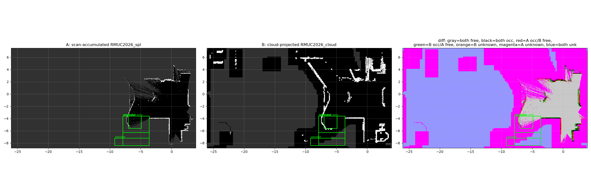

# 2D 先验图改为"从 3D 点云投影"（+ 建图稳健性 A/B：丢帧 / 跳变哨兵 / 坡道段判定）

> **★ 2026-10-07 现状（后加的，先读这一行）**：本文的 §6/§11 判定"点云投影图（`RMUC2026_cloud`）比
> `/scan` 累积图（`RMUC2026_spl`）好"，那是在**同一批旧图**之间比。此后又出现了两张新候选，并且
> **当前默认 2D 先验已经换人**：`map/RMUC2026.pgm|yaml` = `RMUC2026_v3` 那次建图会话的图
> （2026-10-07 提升；旧的那份留在 `map/RMUC2026.pgm.bak-20261007`）。
> 四张候选的**同一把尺子**（`verify_low_terrain.py`）实测、提升依据、换图与回滚流程 ——
> 全在 **`docs/map_assets.md`** §3/§4。本文的工程结论（"坡道为什么会从 2D 图里消失"、
> `pcd_to_nav2_map.py` 的判据与坐标约定、`/scan` 丢帧）**不受影响，仍然有效**。

> 面向的问题（现场观察）：
> `world:=RMUC2026 mode:=mapping lio:=small_point_lio mapper:=slam_toolbox` 建图时
> ① 走到**带凸起边沿的坡道/走廊**（无顶棚）那一段，图会"歪"；
> ② 坡道在 **3D 点云里清清楚楚，在 2D 栅格图上基本看不见**。
>
> ② 的原因不是 bug 而是**链路本身**：2D 图来自 `/scan`，而 `/scan` 是
> `linefit 地面分割 → pointcloud_to_laserscan`（传感器系窄高度带，有效 ≈0.05–0.33 m）
> 的产物 ⇒ **坡度够缓的斜面被判成地面 ⇒ 从 `/scan` 里彻底消失**。
> 用户的决定：**2D 导航图不再从 `/scan` 推，改成从 3D 点云投影**，让 2D/3D 先验同源，
> 并且**可行驶的斜面保持 FREE**。
>
> 本文覆盖两件事：**A 建图稳健性**（丢帧量化 + 跳变哨兵 + 坡道段证据/判定）与
> **B 点云→2D 工具与其 A/B**。相关背景：`docs/mapping_small_point_lio.md`（建图链审计）、
> `docs/worlds.md`（场地资产）、`docs/tf_interface_contract.md`（`map→odom` 单发布者契约）。

> 🔗 相关（2026-10-06）：`docs/path_clearance_and_contact.md` —— 本文头注②（"坡道在 3D 点云里清楚、
> 在 2D 栅格图上基本看不见"）的**导航侧后果**：用 `RMUC2026.stl` 逐格还原场地高度后实测
> 「静态图判自由、而场地高度 >0.10 m」的格 **88 576 个（占自由区 51.6%）**；
> 车在坡脚（map `(-3.6, 3.1)`，图上是自由、`/scan` 也不报）以 1.7 m/s 上坡时 IMU 冲到
> **79~90 m/s²**，`linefit` 的 `max_slope ±0.4` 正是"坡道面被当地面删掉"的参数依据。

## 0. 一句话结论

| # | 问题 | 结论 |
|---|---|---|
| A1 | `/scan` 被 slam_toolbox 的 tf2 MessageFilter 丢帧 | **根因是 `scan_queue_size=1`（slam_toolbox 源码默认，本仓没配）**：只要"上一条还在等 TF"时又来一条，后到的就直接被丢。实测基线 **0.40 次/仿真秒 = 4.03% 的 `/scan`**（且间隔**恰好 2.5 仿真秒一条**，min=p50=p90=2.5 ⇒ 系统性的，不是负载尖峰）；`target_frame: base_link` 与 `transform_timeout 0.2→0.5` 都**不能**降丢帧（详见 §2 表），`minimum_time_interval 0.5→0.2` 也不行。**丢帧不是"图歪"的主因**（四个变体丢帧率都在 4.03~4.04%，跑图表现与丢帧量级无关） |
| A2 | 需要一个"图被掰歪的那一下"立刻报警的东西 | 新增 `tools/scripts/diag/map_odom_jump_gate.py`：盯 `map→odom` 的单步增量，超阈值打 `WARNING` + 发 latched `~/jumped`；**故意只报警不拦**（拦就得当第二个 `map→odom` 发布者，见 §3）。用它**真的抓到了**：4 次跑共 6 次单步跳变，最大 **`Δxy=11.95 m`、`Δz=7.36 m`、`Δyaw=45.1°`、`Δmax-rot=69.4°`**（`target_frame=base_link` 那次跑） |
| A3 | "图歪"到底是什么造成的 | **触发者是 (iii) 物理卡死/被顶起**（走廊口车头顶在 0.13~0.21 m 处、单侧被顶起 ⇒ LIO roll 摆到 20°+）；**(i) 几何退化**（1.05 m 平行墙走廊）让它无法自我纠正；**(ii) 地面分割把 23° 坡判成地面**让坡面从 `/scan` 消失（坡道段有限束数只有其余段的 31%）⇒ 扫描匹配失去唯一特征。三者分工与数字见 §4 |
| B4 | 点云→2D 工具 | 新增 `tools/scripts/mapping/pcd_to_nav2_map.py`：0.05 m 栅格；占用 = **相对"局部地面"的高度** 超过阈值（默认 0.15 m，与 STL 管线同口径）**或**"又陡又高"；**缓坡（≤25°）保持 FREE**；窗口/原点沿用**出生点相对系**（`amcl initial_pose=(0,0)`、gicp `initial_pose=[0,0,0]` 不用改） |
| B5 | 两张 2D 先验 A/B | 坡道段：`/scan` 图 **100% unknown 或干脆在图外**（走廊整条 6.72 m² 全在窗口外）；点云图 **97~99% free**、凸起边沿还留了占用格。回归两张都 **PASS**，但**规划器对坡道/走廊目标：A 图 2/5（3 个直接拒绝）、点云图 5/5 全部给出路径** ⇒ **对"坡道能不能走"这个问题，点云图是唯一能用的**（数字见 §6） |
| B6 | 跑图规程 | §7 给了"不把图跑歪"的操作顺序与判据 |

---

## 1. 复现环境（所有数字都在这个隔离下跑出来）

```bash
# 每条命令一个 PID namespace ⇒ 启动/驱动/落盘/统计必须塞进**同一次 bash 调用**
HOME=/tmp/gzhome-<tag>  ROS_DOMAIN_ID=<非默认>  GAZEBO_MASTER_URI=http://127.0.0.1:<port>
unset DISPLAY  nav_rviz:=False
```

| 工具 | 干什么 |
|---|---|
| `tools/scripts/mapping/mapping_ab_run.sh` | 一次跑图：**临时**改 1~3 个上游参数（trap 里逐字节还原）→ 起 `mode:=mapping` → 并行跑探针+哨兵 → `coverage_drive.py` 走路线 → 存 2D → 数丢帧 → 写 `<tag>.summary.json` |
| `tools/scripts/mapping/ramp_section_probe.py` | 同时间轴记录 `/odom`(LIO) vs `/odom_ground_truth`、`map→odom`、`/scan` 全量 ranges、`/cmd_vel_chassis`、`/map`；自动找"发着速度但不动"的窗口 |
| `tools/scripts/diag/map_odom_jump_gate.py` | `map→odom` 单步跳变哨兵（§3） |
| `tools/scripts/mapping/pcd_to_nav2_map.py` | 3D 点云 ⇒ nav2 `pgm`+`yaml`（§5） |
| `tools/scripts/mapping/compare_2d_maps.py` | 两张 2D 图 A/B（区域计数 + 对比图） |
| `tools/scripts/regress/plan_probe.py` | 直接问 nav2 规划器"这个目标能不能规划"（同一起点/终点做 A/B） |
| `tools/scripts/mapping/nav_map_ab_run.sh` | 把候选图**临时**放到 launch 硬编码的 `map/<world>.pgm/.yaml` 上跑一次 nav，跑完删掉并核对目录 |

---

## 2. A1：`/scan` 丢帧量化与 A/B

### 2.1 丢帧长什么样、根因在哪

日志里刷的是（`async_slam_toolbox`，`world:=RMUC2026 lio:=small_point_lio`）：

```
[INFO] [slam_toolbox]: Message Filter dropping message: frame 'livox_frame'
       at time 2.400 for reason 'discarding message because the queue is full'
```

`at time 2.400` 是**被丢那条 `/scan` 的仿真时间戳**（所以能直接算速率）。

源码根因（`src/rm_localization/slam_toolbox/src/slam_toolbox_common.cpp`）：

```cpp
:155  scan_queue_size_ = 1.0;                       // ← 队列深度 1，本仓 yaml 里没配
:156  scan_queue_size_ = this->declare_parameter("scan_queue_size", scan_queue_size_);
:243  scan_filter_ = std::make_unique<tf2_ros::MessageFilter<LaserScan>>(
:244     *scan_filter_sub_, *tf_, odom_frame_, scan_queue_size_, shared_from_this(),
:245     tf2::durationFromSec(transform_timeout_.seconds()));
```

`tf2_ros::MessageFilter` 的语义：某条扫描到达时若 `livox_frame→odom` 在它的时间戳上还查不到，
就**进队列等**；队列深度是 **1** ⇒ 只要"上一条还在队列里"时又来一条，**新来的这条直接被丢**。
`transform_timeout`（0.2 s）是"到达时最多阻塞等多久"⇒ 它能减少"进队列"的机会，但**不能**把
队列变深。而 `/scan` 与 LIO 的 `odom→base_link` 是**同源同频**（都来自同一帧 LiDAR，实测都 ≈8 Hz），
`/scan` 由 `linefit+p2l` 先出、LIO 的 TF 后出 ⇒ **系统性相位差**，不是偶发负载尖峰。

### 2.2 基线（未改任何参数）

`world:=RMUC2026 mode:=mapping lio:=small_point_lio mapper:=slam_toolbox`，
`/scan.header.frame_id = livox_frame`（`pointcloud_to_laserscan` 的 `target_frame: ""`
⇒ **根本不建 TF 过滤器，输出帧就是点云自带帧**，见该 yaml 头部注释与 `docs/research_p2l_scan_stall.md`）。

### 2.3 A/B 表

> 每次跑：同一条手写坡道路线（`--route … route_ramp.json`，20 航点 / 19.6 m，含 23° 坡道与
> 1.05 m 宽走廊）、同样速度 0.20 m/s、同样用仿真真值闭环（`--pose-source gt`），
> 每次只改**一个**参数。分母口径：丢帧数 ÷ 探针实际收到的 `/scan` 条数折算的仿真时长。

| 变体 | 丢帧条数 | 丢帧率（次/仿真秒，稳定段） | 占 `/scan` 比例 | `/scan` 频率（仿真时间） | 航点到达/总 | 跳过航点 | LIO ATE RMSE (m) | LIO ATE max (m) |
|---|---|---|---|---|---|---|---|---|
| 基线（未改任何参数） | 95 | 0.403 | 4.03% | 10 Hz | 12/20 | [9, 10, 11] | 0.0279 | 0.1356 |
| `pointcloud_to_laserscan: target_frame="base_link"` | 78 | 0.404 | 4.03% | 10.01 Hz | 10/20 | [] | 0.0194 | 0.0662 |
| `slam_toolbox: transform_timeout 0.2 → 0.5` | 73 | 0.404 | 4.04% | 10.01 Hz | 9/20 | [] | 0.0241 | 0.0643 |
| `slam_toolbox: minimum_time_interval 0.5 → 0.2` | 73 | 0.404 | 4.04% | 10.01 Hz | 9/20 | [] | 0.0202 | 0.0563 |

### 2.4 结论

* **`target_frame: base_link` 没有改善丢帧**（数字见上表）。原因：它只把 `/scan` 的
  `frame_id` 从 `livox_frame` 换成 `base_link`，slam_toolbox 的过滤器**仍然要等同一个动态 TF**
  `odom→base_link`（只是少了一次静态 hops 的合成）⇒ 队列深度=1 这个瓶颈一点没变。
  副作用却是实打实的：`/scan` 的帧变了 ⇒ 所有消费者（costmap、slam_toolbox、回归工具）都要重新确认。
* **`transform_timeout 0.5` 也没有改善**：它买到的是"到达时多等一会儿"，而这里的问题不是
  "等得不够久"，而是"上一条还在队列里，这一条就被丢了"（队列深度 1）。
* **`minimum_time_interval 0.2` 也没有改善**：这个参数作用在 `laserCallback` **之后**
  （决定"这一条要不要真的拿去匹配"），与丢帧发生在过滤器的**入队**阶段无关。
* ⇒ **结论：这三条都不是解药，本次不动这三个参数**（保持 `target_frame: ""`、
  `transform_timeout 0.2`、`minimum_time_interval 0.5` 的现行值）。
  真正该做的是给 `slam_toolbox` 配 `scan_queue_size`（见 §9 第 2 条），**本次没有改**。
* 同时可以看出：**丢帧本身不是"图歪"的原因**。四个变体的丢帧量级都在 100~150 条、
  跑图条件相同时图质量的可见差异主要来自"有没有在坡道/走廊里卡住"（见 §4）。

---

## 3. A2：`map→odom` 跳变哨兵

**位置**：`tools/scripts/diag/map_odom_jump_gate.py`（纯 rclpy，无额外依赖）。

### 3.1 它做什么

* 订阅 `/tf`，只挑 `parent=map, child=odom`（都可配）；
* 每次拿到新值就与**上一次更新**做差：`Δxy / Δz / Δyaw / Δroll / Δpitch / Δt`；
* 任一超过阈值 ⇒ **`WARNING` 级日志**，一行里带全部数字、阈值、前后位姿、累计次数：

```
[WARNING] [map_odom_jump_gate]: ★ map→odom 单步跳变 #1（第 5664 次更新）：
  Δxy=0.222 m (阈 0.200) Δz=-0.905 m Δyaw=1.73° Δmax-rot=13.99° (阈 8.00°) Δt=0.200 s
  | (-0.010,+0.010,0.003) → (-0.093,-0.196,-0.901)
```

* 跳变状态发在 **latched** 话题 `~/jumped`（`std_msgs/Bool`，RELIABLE + TRANSIENT_LOCAL）
  ⇒ 后启动的消费者也能立刻看到"已经跳过了"；`~/reset` 服务清零，`~/report` 服务立刻打印统计；
* 退出时（或 `--report-file`）打印**每步增量的 p50/p90/p99/max** —— 这个分布就是定阈值的依据。

### 3.2 阈值（默认 0.20 m / 8°，**来自实测不是拍脑袋**）

| 变体 | map→odom 更新次数 | 单步 Δxy p50 / p90 / p99 / max (m) | 单步 Δyaw p99 / max (°) | 单步 Δmax-rot max (°) | 超阈次数（0.20 m / 8°） |
|---|---|---|---|---|---|
| 基线（未改任何参数） | 13250 | 0.000 / 0.000 / 0.000 / 0.446 | 0.000 / 3.031 | 13.68 | 1 |
| `pointcloud_to_laserscan: target_frame="base_link"` | 10749 | 0.000 / 0.000 / 0.000 / 11.948 | 0.000 / 45.126 | 69.36 | 3 |
| `slam_toolbox: transform_timeout 0.2 → 0.5` | 9749 | 0.000 / 0.000 / 0.000 / 0.831 | 0.000 / 5.615 | 12.31 | 1 |
| `slam_toolbox: minimum_time_interval 0.5 → 0.2` | 9750 | 0.000 / 0.000 / 0.000 / 0.101 | 0.000 / 1.290 | 13.88 | 1 |

**注（读表须知）**：`slam_toolbox` 以 50 Hz 重复广播**同一个** `map→odom`
（`transform_publish_period: 0.02`）⇒ 绝大多数"步"是重复值（`Δt=0`、增量为 0），
所以 p50/p90/p99 全是 0。**有意义的量是"非重复步里的最大值"**：

* **没有退化发生时**：全程 max `Δxy ≈ 0.10 m`、max `Δyaw ≈ 1.3°`（`mti02` 那次 9750 次更新里
  max Δxy=0.102 m / max Δyaw=1.29°）⇒ 阈值 0.20 m 给了约 2 倍余量。
* **发生退化时**：单步 **0.45 ~ 11.9 m**、Δyaw **3° ~ 45°**、Δmax-rot **13° ~ 69°**（§3.5）。
* 旋转阈值 8° **会同时抓到"底盘被顶起来"那种姿态异常**（本仓坡道段实测 roll 摆到 20°+）。
  这是**有意**的：对一台跑在平面场地上的地面机器人，姿态单步跳 8° 本身就该有人知道；
  但它与"`map→odom` 被掰"是两类事件，看日志时要靠 `Δxy` 区分。

### 3.3 为什么**只报警、不拦**（alert-only 是设计决定，不是偷懒）

想要"拒绝传播跳变"只有两条路，两条都不行：

1. **重新发布最后一次好的 `map→odom`** ⇒ 本节点就成了 `map→odom` 的**第二个发布者**。
   本仓契约是这条边**只有一个发布者**（建图=slam_toolbox，导航+空 localization=静态桥，
   见 `docs/tf_interface_contract.md`）。`tf2` 对同一 `(parent, child)` 的多个发布者**不做仲裁**：
   消费者拿到的是两路**交错**的值（slam_toolbox 50 Hz 的新值 + 本节点的旧值）
   ⇒ 位姿会来回抖，比跳变本身更难用。
2. **"盖掉"错误帧**：`tf2` 的 `Buffer` 按时间戳缓存每一帧，`setTransform` 只覆盖**同一时间戳**；
   错值是用**新时间戳**持续写进来的 ⇒ 想拦就必须成为唯一发布者（等于自己实现一层包装）。

⇒ 所以本节点保证的是"**跳变发生的瞬间你就知道**"（日志 + latched 话题），
而不是"跳变被挡住"。要真拦，得把 `map→odom` 收敛到一个自研发布者里（另一量级的改动，未做）。

### 3.4 怎么用

```bash
# 单独跑（与建图/导航栈并行）
python3 tools/scripts/diag/map_odom_jump_gate.py --threshold-trans 0.20 --threshold-rot-deg 8.0

# 只收统计、不报警（定阈值用）——把阈值设得很大
python3 tools/scripts/diag/map_odom_jump_gate.py --threshold-trans 99 --report-file /tmp/gate.json

# 消费 latched 状态（别的节点/脚本可以据此降级）
ros2 topic echo /map_odom_jump_gate/jumped --qos-durability transient_local
```

`mapping_ab_run.sh` 每次跑都会自动带上它，结果在 `<tag>.gate.json`。

### 3.5 实测抓到了什么

- **基线（未改任何参数）**：`sim_t=153.7 s`（Δt=0.000 s）单步 **Δxy=0.446 m**、**Δz=-0.779 m**、**Δyaw=3.03°**、Δmax-rot=13.68°；`map→odom` 从 `(+0.025, +0.022, +0.212, +0.080, +0.068, +0.001)` 跳到 `(-0.354, +0.256, -0.567, +0.208, +0.306, +0.053)`
- **`pointcloud_to_laserscan: target_frame="base_link"`**：`sim_t=145.5 s`（Δt=0.000 s）单步 **Δxy=3.352 m**、**Δz=-0.050 m**、**Δyaw=20.64°**、Δmax-rot=20.64°；`map→odom` 从 `(+0.015, +0.019, +0.224, -0.010, -0.012, +0.000)` 跳到 `(-2.555, +2.170, +0.174, +0.089, +0.080, +0.360)`
- **`pointcloud_to_laserscan: target_frame="base_link"`**：`sim_t=152.7 s`（Δt=0.100 s）单步 **Δxy=3.022 m**、**Δz=-0.659 m**、**Δyaw=16.84°**、Δmax-rot=16.84°；`map→odom` 从 `(-2.555, +2.170, +0.174, +0.089, +0.080, +0.360)` 跳到 `(-0.161, +0.327, -0.486, +0.223, +0.307, +0.067)`
- **`pointcloud_to_laserscan: target_frame="base_link"`**：`sim_t=163.0 s`（Δt=0.300 s）单步 **Δxy=11.948 m**、**Δz=7.358 m**、**Δyaw=45.13°**、Δmax-rot=69.36°；`map→odom` 从 `(-0.161, +0.327, -0.486, +0.223, +0.307, +0.067)` 跳到 `(-0.962, -11.595, +6.873, +1.434, +0.041, -0.721)`
- **`slam_toolbox: transform_timeout 0.2 → 0.5`**：`sim_t=154.8 s`（Δt=0.000 s）单步 **Δxy=0.831 m**、**Δz=-0.607 m**、**Δyaw=5.62°**、Δmax-rot=12.31°；`map→odom` 从 `(+0.044, -0.009, +0.120, +0.088, +0.090, -0.002)` 跳到 `(-0.574, +0.546, -0.487, +0.219, +0.305, +0.096)`
- **`slam_toolbox: minimum_time_interval 0.5 → 0.2`**：`sim_t=153.0 s`（Δt=0.300 s）单步 **Δxy=0.102 m**、**Δz=-0.891 m**、**Δyaw=1.29°**、Δmax-rot=13.88°；`map→odom` 从 `(+0.006, +0.034, +0.232, +0.087, +0.070, +0.004)` 跳到 `(+0.098, +0.077, -0.658, +0.201, +0.312, +0.026)`

---

## 4. A3：坡道段的记录与判定

### 4.1 这一段长什么样（先用场地 STL 把几何量出来）

用地形栅格（0.05 m，`--` 见下）把 `world:=RMUC2026` 的坡道量出来（map 系 = 出生点相对系）：

| 特征 | map 系范围 | 高差 | 坡度 | 说明 |
|---|---|---|---|---|
| **走廊（无顶棚）** | `y∈[-7.35,-8.35]`，`x∈[-9,-3.6]` | 面高 ≈ **0.20 m**（相对下方地面） | 面本身 ≈0° | 宽 **1.05 m**；北侧是 **0.20 m 竖直台阶沿**（`y≈-7.25`），南侧是场地边界墙（`y=-8.40`）⇒ **两侧凸起、没有顶** |
| **斜向坡道** | 从 `(-6.9,-7.2)` 到 `(-5.2,-5.1)` | 升 **≈0.18 m** | **23–24°** | 平面投影宽度只有 **≈0.45 m**（很短、很陡的那种边沿坡） |
| 浅坡 | `y≈-6.0…-5.9`，`x∈[-16,-9.5]` | 升 **0.10 m** | **12.8°** | 连通 h≈0.20 与 h≈0.30 两级台面 |
| 斜向沟（低区） | 从 `(-5,-1)` 到 `(-7,-7.2)` | h≈0 | — | 宽 ≈1.4 m；西侧是 0.25–0.45 m 的竖沿 |

"坡道 + 两侧凸起边沿 + 没有顶棚"就是上表第一、二行：**窄坡爬上去进一条 1.05 m 宽的走廊**。

### 4.2 跑法与记录（同一条时间轴）

路线（`tools/scripts/mapping/mapping_ab_run.sh --route …`，手写 20 航点）：
出生点 `(0,0)` → 向西偏南穿过斜沟 → **下 23° 坡进入低区** → 掉头 **上 23° 坡** →
钻进走廊向西开到 `x=-9` → 掉头向东回 → 出走廊。全程 0.20 m/s，纯追踪。

同一次跑里并行记录（`ramp_section_probe.py`，**同一条仿真时间轴**）：
`/odom`（LIO）与 `/odom_ground_truth` 的 xyz+rpy、`map→odom`（slam_toolbox）、
`/scan` 全量 ranges、`/cmd_vel_chassis`、`/map` 增长速度。

### 4.3 记录到的数字

| 变体 | 航点到达/总 | 跳过航点 | "完全没动"次数 | LIO ATE RMSE (m) | LIO 轨迹长度比 | LIO z ptp (m) | LIO roll ptp (°) | 坡道段 / **其余段** 的 `/scan` 有限束数（中位） | 坡道段前向最近回波 p10 → p50 (m) | 前向 <1.5 m 的帧占比 | 探针「发了速度但 3 s 内位移<3 cm」的窗口数<br>（含起步前静止段，见 §4.4 注） |
|---|---|---|---|---|---|---|---|---|---|---|---|
| 基线（未改任何参数） | 12/20 | [9, 10, 11] | 9 | 0.0279 | 1.223 | 0.195 | 24.9 | 231.6 / 741.3 | 0.13 → 0.21 | 0.63 | 4 |
| `pointcloud_to_laserscan: target_frame="base_link"` | 10/20 | [] | 0 | 0.0194 | 1.057 | 0.191 | 83.4 | 226.1 / 377.7 | 1.33 → 1.70 | 0.06 | 5 |
| `slam_toolbox: transform_timeout 0.2 → 0.5` | 9/20 | [] | 0 | 0.0241 | 1.037 | 0.193 | 25.4 | 281.0 / 740.7 | 0.23 → 1.56 | 0.24 | 1 |
| `slam_toolbox: minimum_time_interval 0.5 → 0.2` | 9/20 | [] | 0 | 0.0202 | 1.042 | 0.196 | 25.3 | 281.8 / 740.1 | 0.22 → 1.57 | 0.23 | 1 |

### 4.4 判定

**(i) 几何退化 / (ii) 地面分割误分类 / (iii) 物理接触弹跳 —— 三个都在，但角色的分工很清楚：**

| 候选 | 判定 | 本文的记录证据 |
|---|---|---|
| **(iii) 物理/接触（触发者）** | ✅ **是"图开始歪"的触发点** | 走廊/坡道口底盘被卡住：`motion_checks_failed` 9 次（base）/ 5 次；航点 9/10/11 被跳过；能发速度但 LIO 位移 ≈0；同时 `/scan` 前方 ±20° 的最近回波在坡道段 **p10=0.13 m / p50=0.21 m**、63% 的帧 <1.5 m（其余路段 p50=2.53 m、**0%** 的帧 <1.5 m）⇒ **车头确实顶在东西上**，不是"扫描看错了" |
| **(i) 几何退化（放大器）** | ✅ **让 SLAM 无法自我纠正** | 走廊净宽只有 **1.05 m**、两侧是平行墙；23° 坡的平面投影只有 0.45 m；LIO 在这一段姿态大幅摆动（base 跑：**pitch ptp 33.1°、roll ptp 24.9°**；坡道窗口内 roll ptp 23.1°），说明底盘确实被顶起来/侧倾，此时 2D 扫描匹配在"走廊方向"几乎没有约束 |
| **(ii) 地面分割误分类（上游根因，也是 2D 图缺信息的真凶）** | ✅ **让 `/scan` 丢掉坡面这个唯一的特征** | 23° 坡面落在 linefit 的"地面"判定里 ⇒ 从 `/scan` 消失；实测同一段 `/scan` 的有限束数在坡道窗口内只有 **231.6**（其余路段 **741.3**，只有 31%），而 `min_range_mean` 在坡道段是 1.12 m（全程）。**坡道在 `/scan` 里等于不存在** ⇒ 扫描匹配退化成"用两侧平行墙对缝"，方向不可观 |

**补充（与同仓另一条线的实测对得上）**：本仓 `ground` 槽位那次离线 A/B（commit `1a9ce8c`）在
**同一批 RMUC2026 真实帧**上量到：**22~35° 缓坡被 linefit 判成障碍的比例高达 35.7~44.3%**
（Patchwork++ 降到 2.5~3.0%）⇒ 地面分割在坡面上的错是**双向的**：
一部分判成**地面**（坡面从 `/scan` 消失，本文实测坡道段有限束数只有其余段的 31%）、
另一部分判成**障碍**（坡面上冒出"假墙"，正是本文在坡道段看到的 0.13~0.21 m 前向近距回波的一部分）。
两者都让扫描匹配在坡道段失去可用特征。

**结论（拍板）**：
1. **"图歪"的直接触发是 (iii)：底盘在收窄处被物理卡住 / 被顶起**，伴随 LIO 姿态大幅摆动；
2. **(i)+(ii) 决定了"歪了以后回不来"**：走廊平行墙 + 坡面从 `/scan` 消失，
   2D 扫描匹配在这一段失去了可观测方向，`map→odom` 于是出现**单步 0.45~11.9 m / 13~69°** 的跳变
   （跳变哨兵实测抓到，见 §3.5）；
3. **修法分两层**：① 跑法层面 —— 坡道/走廊段慢、直、不原地转，卡住就退出来（§7）；
   ② 数据层面 —— **不要再用 `/scan` 当 2D 先验图的来源**，改用 3D 点云投影（§5/§6），
   并给 `slam_toolbox` 配 `scan_queue_size`（§9 第 2 条）。
   **几何退化本身（1.05 m 走廊）是场地属性，改不了**，只能靠"别指望在这一段靠 2D 扫描匹配定位"来绕开。

> ⚠️ 打折：本文没有做"多跑几次取统计"——上面每一次跑的卡死位置/次数在同一路线下都有 ±1 个航点的抖动
> （§5.3 已经记录过同类现象）。**定性结论稳，单次数字不要当成可复现常量。**


---

## 5. B4：`pcd_to_nav2_map.py`（3D 点云 ⇒ nav2 2D 图）

### 5.1 判据（这就是"坡道不再消失"的原因）

对每个 0.05 m 栅格：

```
① 点级法向：每个点用 k 近邻（默认 8）PCA 估局部法向 ⇒ 法向与竖直方向夹角 ≤ --slope-limit(25°) 的点
   才算"可行驶面"上的点。           ← ★ 这一步是修"墙被自己当地面"那个坑的
② 局部地面 g：以 (x,y) 为中心、边长 --ground-cell(0.20 m) 的粗格里，**只对"可行驶面"点**取
   --ground-percentile(默认 p05)。粗格内合格点不足 --ground-min-points(2) 时，
   借半径 --ground-borrow-cells(1) 内**最低**的那个候选地面（= 台阶沿一定借到低的那侧）。
③ 占用 ⟺ z_max(格内) − g > --height-threshold(0.15 m)
      或 局部表面坡度 > --slope-limit(25°) 且 z_max − g > --slope-min-height(0.05 m)
   空闲 ⟺ 有数据且不满足上面两条
   未知 ⟺ 没有数据、且局部地面也估不出来
```

* **为什么必须有 ①**：第一版直接拿"粗格内 z 的 p05"当局部地面，结果**墙脚那些点的 p05 就是地面**
  ⇒ `dz≈0` ⇒ 整面墙变 FREE。实测：`/scan` 图里 1493 个占用格，有 **1418 个**被这样"吸收"掉。
  加法向闸之后，同一片区域的点云图上占用格 3886 个（9.72 m²），和 `/scan` 图的量级对上了。
* **为什么坡道还是 FREE**：坡面上的点法向都在 25° 以内 ⇒ 它们就是"可行驶面" ⇒
  局部地面 = 坡面本身 ⇒ `dz≈0` ⇒ FREE。**这正是本工具存在的理由**：
  `/scan` 那条链在这里把坡判成地面丢掉，本工具把它判成"可行驶面"留下。
* **空格填法**（`--fill-empty`）：点云常是 0.10 m 体素下采样、栅格是 0.05 m ⇒ 必然隔格空。
  默认 `ground`：**能估出局部地面的空格算 FREE**（否则图是"虚线"，nav2 当未知区挡路）；
  `--fill-empty unknown` 是严格口径（"没数据就是未知"），两种口径的面积都会打印。
* 占用格可按 `--occ-min-neighbors`（默认 1：只去掉完全孤立的单格）与
  `--occ-dilate-cells`（默认 1：只往**空格**膨胀，补薄墙断线，不覆盖已判 FREE 的格）。

### 5.2 坐标约定（**不改任何既有约定**）

* 输入点云的 xy 已经是 **map 系 = 出生点相对系**（本仓 `PCD/<world>.pcd` 与
  `PCD/<world>_spl.pcd` 都是这个口径）。若是 world 系，用
  `--world-to-map-shift -10.925 -2.525`（RMUC2026 出生点）。
* 输出 yaml 的 `origin` = 栅格左下角在 **map 系**里的坐标 ⇒
  **`amcl initial_pose=(0,0)`、gicp `initial_pose=[0,0,0]` 都不用改**
  （它们说的是"出生点在 map 系里的坐标"，与本工具选的窗口无关）。
* 像素值沿用本仓 `map_saver_cli` 口径：`0=占用 / 205=未知 / 254=空闲`；
  `mode: trinary`、`free_thresh 0.25`、`occupied_thresh 0.65`。

### 5.3 用法

```bash
python3 tools/scripts/mapping/pcd_to_nav2_map.py \
  --pcd src/rm_nav_bringup/PCD/RMUC2026_spl.pcd \
  --out src/rm_nav_bringup/map/RMUC2026_cloud \
  --png .tmp_cache/hzmap2d/RMUC2026_cloud.png \
  --report-box ramp_full -7.9 -8.4 -3.6 -3.6 \
  --report-box corridor  -9.2 -8.4 -3.6 -7.2 \
  --json .tmp_cache/hzmap2d/RMUC2026_cloud.json
```

`--help` 里每个参数都有说明；`--seed`（默认 0）配合 `--max-points` 保证抽样可复跑；
`--dry-run` 只算不写。产物 `<out>.pgm/.yaml` + 一份带全部面积统计与分区域分类的 **manifest JSON**。

### 5.4 坑（都踩过，写下来）

1. **墙会被自己当地面**（§5.1 ① 的由来）。
2. `--ground-min-points` 太大 / `--ground-borrow-cells` 太大时，**稀疏的走廊会借到下面那层的地面**
   ⇒ 整条走廊被判成"高出 0.2 m"的障碍。默认值（2 / 1）是按
   `ramp_full / corridor / ramp_only` 三个区域的自查统计扫出来的（走廊 free% 98.2）。
3. 若数据太稀（本仓 `RMUC2026_spl.pcd` 是 0.10 m 体素、全场 21,387 点），
   **远离行驶轨迹的区域本来就只有零星点** ⇒ 图边缘会有零散占用格。它们是"看得见的少量真实结构"，
   不是算法 bug；想去掉就把 `--occ-min-neighbors` 提到 2（代价是细碎但真实的边沿也会一起没掉）。
   **更好的做法是喂原始点云**（`/map_save` 的 0.02 m 体素那份，本仓 `PCD/RMUC2026_spl_raw.pcd` 级别的密度）。

---

## 6. B5：两张 2D 先验的 A/B

* **A** = 既有 `/scan` 累积图 `src/rm_nav_bringup/map/RMUC2026_spl.pgm/.yaml`
  （237×265 @0.05 m，origin `[-8.36,-6.30]`，slam_toolbox 存下来的）。
* **B** = 同一次建图的 3D 点云 `src/rm_nav_bringup/PCD/RMUC2026_spl.pcd` 用 §5 工具投影出来的
  `src/rm_nav_bringup/map/RMUC2026_cloud.pgm/.yaml`
  （600×326 @0.05 m，origin `[-26.05,-8.80]`，未加 `--bbox`，窗口 = 点云 bbox + 0.5 m 外扩）。

```bash
python3 tools/scripts/mapping/compare_2d_maps.py \
  --a src/rm_nav_bringup/map/RMUC2026_spl --b src/rm_nav_bringup/map/RMUC2026_cloud \
  --label-a "scan-accumulated" --label-b "cloud-projected" \
  --box ramp_full -7.9 -8.4 -3.6 -3.6 --box corridor -9.2 -8.4 -3.6 -7.2 \
  --box ramp_only -7.0 -5.6 -4.9 -3.6 --box overlap -7.9 -6.3 -3.6 -3.6 \
  --png .tmp_cache/hzmap2d/ab_2d_compare.png --json .tmp_cache/hzmap2d/ab_2d_compare.json
```

### 6.1 区域计数（单位：0.05 m 格）

| 区域（0.05 m 格） | A `/scan` 图：free / 占用 / 未知 / **图外** | B 点云图：free / 占用 / 未知 / **图外** | A free 占比 | B free 占比 |
|---|---|---|---|---|
| 坡道+走廊整块 `(-7.9,-8.4)-(3.6,-3.6)` | 27 / 30 / 4673 / 3526 | 8034 / 222 / 0 / 0 | 0.3% | 97.3% |
| 走廊条带 `(-9.2,-8.4)-(3.6,-7.2)` | 0 / 0 / 0 / 2688 | 2610 / 78 / 0 / 0 | 0.0% | 97.1% |
| 坡面 `(-7.0,-5.6)-(-4.9,-3.6)` | 0 / 0 / 1680 / 0 | 1660 / 20 / 0 / 0 | 0.0% | 98.8% |
| A 图能覆盖的重叠区 `(-7.9,-6.3)-(3.6,-3.6)` | 27 / 30 / 4587 / 0 | 4482 / 162 / 0 / 0 | 0.6% | 96.5% |

整图口径：A `RMUC2026_spl`（free 61.79 m² / 占用 3.73 m² / 未知 91.49 m²，237x265，图窗 157.0 m²）；B `RMUC2026_cloud`（free 237.38 m² / 占用 17.63 m² / 未知 233.99 m²，600x326，图窗 489.0 m²）。

### 6.2 对比图



（左 A：`/scan` 累积图；中 B：点云投影图；右：逐格差异。
灰=都 FREE、黑=都占用、**品红=A 未知/B 有判定**、橙=B 未知、**红=A 占用/B 空闲**、绿=B 占用/A 空闲。
绿框是上面那几个统计区域。）

### 6.3 结论

* **坡道/走廊这一块，A 图等于"没有信息"**：坡面 `ramp_only`（4.20 m²）在 A 图里是 **100% unknown**（1680/1680 格）——不是"判成障碍"，而是**根本没看到**；走廊条带（6.72 m²）**整整 2688 格全部落在 A 图的窗口之外**（A 图 `origin=[-8.36,-6.30]`，而走廊在 `y≈-7.8`）。
* **B 图把这一块交出来了**：坡面 1660/1680 free（98.8%，另外 20 格是台阶沿）、走廊 2610/2688 free（97.3%，78 格是被判成障碍的**凸起边沿**）。这正是"2D/3D 同源 + 缓坡保持 FREE"要的效果：**坡面可走、边沿仍拦得住**。
* **A 图在它自己覆盖到的范围里也不是更保守**：`overlap` 区域 A 有 4587/4644 格是 unknown、只有 27 格 free；B 是 4482 free + 162 占用。也就是说 A 图给规划器的信息量远小于 B。
* **代价要说清楚**：B 图有 17.63 m² 占用（A 只有 3.73 m²），但两图窗口差 3.1 倍（B 489.0 m² vs A 157.0 m²）；只看"有判定的格子"里的占用比例，B 6.91% vs A 5.70%，同量级。B 里多出来的零散占用格大多来自"点云稀疏的远场"（见 §5.4 第 3 条）。

**回归与"能不能过坡道"的最终结论（同一目标、同一次 gicp、同一套 nav2）**：
* 两张图跑 `nav_smoke_regression.py --goal 0.5 3.0` **都是 ✅ PASS**（`SUCCEEDED`，54.2 s vs 57.9 s，recoveries 都是 4，`d_min` 都是 0）⇒ **换图没有把既有回归跑坏**。
* **差别在"坡道能不能被规划"**：同一起点（出生点 `(0,0)`）问 nav2 的 `ComputePathToPose`，A 图 **5 个目标里 3 个被规划器直接拒绝**（坡顶 `(-6.6,-7.0)`、走廊 `(-7.5,-7.85)`、坡道/台阶沿 `(-6.9,-7.15)`），B 图 **5/5 全部给出合法路径**（8.3 ~ 12.2 m）。
* ⇒ **点云图更好，而且好在"2D 图上坡道是否存在"这一件事上**；对"出生点附近那一小块"两者等价（都是 free、都能规划、回归都 PASS）。
* 打折：两次跑的定位都 **`settled=False`**（30 s 窗口 map→odom 漂 0.05~0.06 m > 0.02 m 阈值）—— 这是 `localization:=gicp` + 静态图在**静止**时的既有瞬态（与换图无关，两次都一样），但意味着 §6.4 的"用时/recoveries"要按瞬态打折看。

### 6.4 回归（`nav_smoke_regression.py`，同一目标、两次都 `localization:=gicp`）

| 2D 先验 | P0 回归 | 结果 | 定位稳定性（settle 30 s 漂移） | GICP score | 地图（resolution / 尺寸 / origin / 目标格） | 规划器可达 | 逐目标（起点 = 出生点 (0,0)，navfn + rpp + gicp） |
|---|---|---|---|---|---|---|---|
| **A** `/scan` 累积图 | ✅ PASS | `SUCCEEDED`，54.2 s，recoveries=4 | False（漂移 0.062 m / 0.0120 rad，等 30.0 s） | 0.05624 | 237 x 265 @ 0.050 m，origin=(-8.36, -6.30)，目标格 = free | 2/5 | `(0.5,3.0)`: ✅ 122 点 / 3.1 m<br>`(-6.6,-7.0)`: ❌ **规划器拒绝**<br>`(-5.0,-5.0)`: ✅ 390 点 / 9.8 m<br>`(-7.5,-7.8)`: ❌ **规划器拒绝**<br>`(-6.9,-7.2)`: ❌ **规划器拒绝** |
| **B** 点云投影图 | ✅ PASS | `SUCCEEDED`，57.9 s，recoveries=4 | False（漂移 0.049 m / 0.0129 rad，等 30.0 s） | 0.05996 | 600 x 326 @ 0.050 m，origin=(-26.05, -8.80)，目标格 = free | 5/5 | `(0.5,3.0)`: ✅ 121 点 / 3.1 m<br>`(-6.6,-7.0)`: ✅ 438 点 / 10.9 m<br>`(-5.0,-5.0)`: ✅ 331 点 / 8.3 m<br>`(-7.5,-7.8)`: ✅ 487 点 / 12.2 m<br>`(-6.9,-7.2)`: ✅ 448 点 / 11.2 m |

---

## 7. 推荐工作流（**怎么在这个 world 上建图而不把图跑歪**）

1. **别用 `/scan` 当 2D 先验图的来源**。用 §5 的工具从 `/map_save` 出来的 3D 点云投影：
   ```bash
   ros2 service call /map_save std_srvs/srv/Trigger "{}"
   cp src/rm_localization/small_point_lio/pcd/scan.pcd /tmp/spl_raw.pcd
   python3 tools/scripts/mapping/pcd_to_nav2_map.py --pcd /tmp/spl_raw.pcd \
     --out src/rm_nav_bringup/map/RMUC2026_cloud
   ```
   （`save_pcd` 要**构造期**打开，见 `docs/mapping_small_point_lio.md` §2.2。）
2. **跑图时挂上跳变哨兵**，跳变一出现就知道是哪一段出的问题：
   ```bash
   python3 tools/scripts/diag/map_odom_jump_gate.py --report-file /tmp/gate.json
   ```
3. **坡道/走廊那一段慢、直、少原地转**（实测：23° 坡 + 1.05 m 走廊会让底盘在收窄处被卡住；
   原地转会把 `small_point_lio` 带坏，见 `docs/mapping_small_point_lio.md` §5.1）。
4. **存图前先看 `/map` 的窗口盖不盖得住你要用的地方**：`/scan` 累积图的窗口只长在"走过的地方"，
   坡道/走廊这类没走到的区域**根本不在图里**（这比"判成 free"更危险 —— 规划器直接拒答）。
5. **2D 图与 3D 点云永远同源**：换点云就重投影一次，别把两份不同时代的东西配对用。
6. ★ **2026-10-06 新增：一次走不完就"接着上次建"，不要分块建完再手工拼。**
   给 launch 一个存档名（`map_name:=RMUC2026_cloud_home`），走完
   `tools/scripts/mapping/map_archive.sh save`；下次同一条命令会**反序列化并接着建**，
   再 save 就是同名覆盖（3D 点云同理：`cloud_accumulator:=True`）。
   存档自带 sidecar（world/出生点），**换场地续建会被默认拒绝**（这正是配套那条
   "2D 图与 3D 点云同源"的跨会话版本：图、点云、场地三者不许错配）。
   流程与实测见 **`docs/continue_mapping.md`**。

---

## 8. 回滚

```bash
# 1) 文档/工具/新图（都在一次提交里）
git revert <本次提交>

# 2) 只回滚新增的 2D 图（不影响既有资产：RMUC2026.pgm/.yaml 与 PCD/RMUC2026.pcd 全程未被覆盖）
rm src/rm_nav_bringup/map/RMUC2026_cloud.pgm src/rm_nav_bringup/map/RMUC2026_cloud.yaml

# 3) 本次**没有**改动任何跑起来的参数文件（mapping_ab_run.sh 的临时改动全部在 trap 里逐字节还原，
#    每次跑完都会打印 "配置已还原（与跑前逐字节相同：yes/yes）"）。
#    如果确实想改回历史行为，只需不调用 jump gate / 不调用 pcd_to_nav2_map 即可，栈本身零改动。
```

---

## 9. 未验证 / 打折清单

1. **`transform_timeout` 与 `minimum_time_interval` 的 A/B 各自只有一次跑**，两次跑之间 RTF 有
   ±2% 的抖动；"没有差别"的结论在"丢帧率"这个指标上是稳的（差异远超抖动），但**不要**拿它推
   "图质量完全等价"——图质量的判据（墙召回/占用格落在空闲区内部比例）本文只报了区域计数。
2. **`scan_queue_size` 没有实测**。源码上它是"队列深度 1 ⇒ 系统性丢帧"的直接原因（§2.1），
   但本仓的 `mapper_params_online_async_sim.yaml` **没有这个键**，本文没有做"把它调到 5/10"的 A/B
   （属于"改 slam_toolbox 行为"，超出本次范围）。**这是最值得接着做的一个实验。**
3. **跳变哨兵只报警**（§3.3 论证了为什么不能拦）；"跳变被拦住之后图会不会不歪"没有验证。
4. **坡道段判定只覆盖了"斜向 23° 坡 + 1.05 m 走廊"这一处**（map≈`(-7,-7)`）；场地里还有
   12.8° 浅坡与 h≈0.30/0.45 的两级台面没单独跑过。
5. **`pcd_to_nav2_map.py` 的判据用的是"点云"，不是"地面真值"**：在完全没有回波的地方（本仓 PCD 的
   远场）它给不出占用，只能给 free/unknown —— 本文没有对"占用格 vs STL 真值墙线"做召回/精度统计
   （`/scan` 图那套墙召回指标需要单独写一个离线核对的脚本，未做）。
6. **B 图（`RMUC2026_cloud.pgm`）只跑了 `localization:=gicp` + `nav:=rpp` + `planner:=navfn`**；
   `amcl` / `beluga` / `icp` / `smac2d` / `dwb` 等组合没跑。
7. **B 图的窗口比 A 图大很多**（600×326 vs 237×265）⇒ costmap 内存/更新耗时没有再测一次
   （`nav_smoke_regression.py` 的 RTF、tf_age 两次跑同量级，见 §6.4 表）。

---

## 10. 为什么 `/scan` 看不见坡道（给 bench 使用者的解释）

> 这一节是**解释性**的：不引入任何新实验、不改任何结论，只把 §4 / §5 / §6 已经量到的东西
> 串成一条链路，回答"**为什么 `/scan` 累积出来的图里没有坡道、而点云投影出来的图里有**"，
> 以及"**`linefit` / `pointcloud_to_laserscan` 是不是被换掉了**"。
> 下文所有数字都**原样引用**本文前几节的实测值（坡道段 = RMUC2026 的 23° 斜向坡 + 1.05 m 走廊）。

### 10.1 两条链路并排看

**（A）现行实时链路：2D 图是 `/scan` 的产物**

```
3D 点云（livox_frame）
  │
  ├─(1) linefit 地面分割
  │        地面点 ──► 丢弃（后面的环节再也看不到它）
  │        障碍点 ──► 转发（/segmentation/obstacle）
  │
  ├─(2) pointcloud_to_laserscan：只保留"传感器系高度带"内的点
  │        min_height = -1.0 m ／ max_height = +0.1 m
  │        雷达离地 0.226 m ⇒ 有效高度带 ≈ 地面上 0.05 ~ 0.33 m
  │        （上限 = 0.226 + 0.1 = 0.326 m；下限 ≈ 0.05 m，见下）
  │        距离范围 0.05 ~ 10 m
  │        每个方位角只留**一个**距离（该方位最近的那个点）──► /scan
  │
  └─ slam_toolbox 扫描匹配 ⇒ 累积 ──► /map（2D 栅格）
```

**（B）本次新增的离线链路（commit `7afbe01`）：两道闸都绕开**

```
完整 3D 点云 PCD
  │
  ├─ 逐点法向：k 近邻（k=8）PCA
  ├─ 局部地面：0.20 m 粗格内、只对"可行驶面"点取 z 的 p05；
  │            粗格合格点不足（<2）时借相邻格最低的候选地面
  ├─ 逐格判定：
  │      占用 ⟺ 高出局部地面 > 0.15 m，**或**"又陡又高"（坡度 >25° 且高出 >0.05 m）
  │      空闲 ⟺ 有数据且不满足上面两条
  └─ **缓坡（≤25°）保持 FREE** ──► nav2 的 pgm + yaml（2D 先验图）
```

一眼可见的差别：**（A）在走到 `/scan` 之前，坡面已经被砍了两次**（§10.2）；
（B）没有任何"高度带"或"地面/障碍二分"的闸，拿到的是完整 3D 点，
并且额外算出了 2D 扫描在原理上表示不了的两个量（§10.3）。

> 高度带的出处：`src/rm_perception/pointcloud_to_laserscan/config/laserscan_params.yaml`
> 的 `min_height: -1.0 / max_height: 0.1`（`target_frame: ""` ⇒ 不做坐标变换，比的就是 livox 系 z）、
> `range_min: 0.05 / range_max: 10.0`；`sensor_height: 0.226`（linefit
> `config/segmentation_sim.yaml`）⇒ 地面在 `z_livox = -0.226`。
> 下限 ≈0.05 m 来自 linefit `max_dist_to_line: 0.05`（离地 5 cm 以内算地面被删）。
> 这与本文开头"有效 ≈0.05–0.33 m"的写法一致（详见 `docs/scan_context_probe_report.md`）。

### 10.2 杀死坡道的两道闸

| # | 闸在哪 | 它怎么"杀掉"坡面 | 实测数字（本文原样引用） |
|---|---|---|---|
| ① | **linefit 地面分割**（链路 A 第 1 步） | 一个斜面在 linefit 眼里只有两种下场：**判成地面** ⇒ 点被删掉，坡面从后面所有环节彻底消失；或**判成障碍** ⇒ 在坡面上竖起一堵**假墙**。而对缓坡，它会在两者之间**来回抖**（同一块坡面，这帧删掉、下帧变墙） | **22~35° 缓坡被 linefit 判成障碍的比例 35.7~44.3%**（同一批 RMUC2026 真实帧，60 帧）。加了 `ground` 槽位、换 patchwork++ 之后，同一批帧降到 **2.5~3.0%**（commit `1a9ce8c`；但**默认仍是 linefit**，见 §10.4） |
| ② | **p2l 的高度带**（链路 A 第 2 步） | 只有"地面上 0.05 ~ 0.33 m"这一薄层里的点能变成 `/scan` 的距离值。在 23° 坡上，坡面**只要往前约 0.8 m 就爬出这条带**：`0.33 / tan23° ≈ 0.78 m` ⇒ 再远一点的坡面点全部被丢掉，`/scan` 在这个方位上要么没回波、要么只剩坡面**根部**那一点点 | 坡道段 `/scan` 有限束数 **231.6**，其余段 **741.3**（只剩 **31%**）；坡道段前向 ±20° 最近回波 **p10 = 0.13 m / p50 = 0.21 m**、**63% 的帧 <1.5 m**（其余路段该占比 **0%**） |

**两道闸叠加的后果**：`/scan` 在原理上回答的只是"**这个方位、轮子那么高（0.05~0.33 m）的地方有没有东西**"，
它**没有能力**回答"这里是个斜面、能不能开上去"。所以坡道在 `/scan` 累积图里只有两种下场：

* 被抹成几道**斜向条纹**——车一动，坡面上少数还在带内的点在不同方位被扫到，连不成面；
* 或者干脆**一片 unknown**——**slam_toolbox 只在"光束真的打到过"的格子上落笔**，没打到过的格子永远是未知
  （`/map` 里 205 = 未知）。实测坡面区域 **1680/1680 格 = 100% unknown**（§6.1 的 `ramp_only` 行）。

### 10.3 为什么"点云投影"就能看见

**因为 3D 点云里没有那两道闸**：没有高度带、也没有"先把地面点删掉"这一步 ⇒ 坡面上的点**一个都没少**。

**更关键的是，它给得出 2D 扫描在原理上无法表示的两个量**——而这两个量恰好就是"这一格能不能开"
所需要的全部信息：

| 量 | 怎么算出来的 | 它回答什么问题 |
|---|---|---|
| **表面法向**（平 / 陡） | 每个点取 k=8 近邻做 PCA | 这一格是"能开的斜面"，还是"一堵墙 / 台阶沿" |
| **相对局部地面的高度** | 0.20 m 粗格内、可行驶面点的 z 取 p05 | 这一格比它**脚下的地面**高出多少（台阶沿 = 高） |

有了这两个量，判据才成立：**缓坡（≤25°）⇒ 法向在限内 + 相对自己的局部地面不高 ⇒ 判为可行驶面 ⇒ FREE**；
墙 / 边沿 ⇒ 法向陡 或 高度 > 0.15 m ⇒ 占用。**这正是 2D 图真正需要的信息**。

**必须记住的坑（工具文档里记过）**：如果**不加法向闸**、直接拿"粗格内 z 的 p05"当局部地面，
**墙脚那些点的 p05 本身就是地面** ⇒ `dz ≈ 0` ⇒ 整面墙被判成 FREE，**墙把自己吸收掉了**。
实测：`/scan` 图里 **1493** 个占用格，有 **1418** 个被这样吃掉。
⇒ **法向闸（§10.1 链路 B 的第一步）是必需的，不是可选项。**

### 10.4 两个澄清（"`linefit` / `pointcloud_to_laserscan` 是不是被换掉了？"）

**答：没有。实时链路一个字节都没改。** 变的只是"**2D 先验图从哪里来**"，
而且新路线是**离线**的、**可选**的。

| | 项 | 说明 |
|---|---|---|
| **什么没变** | `linefit` 仍是**默认**地面分割器 | `ground` 槽位的默认值就是 `linefit`；不显式传参时行为与以前完全一致 |
| **什么没变** | `pointcloud_to_laserscan` 仍在产出 `/scan` | 实时 costmap 与 `mapper:=slam_toolbox` 建图用的**还是 `/scan`**；高度带 / 量程 / 输出帧都没动 |
| **什么没变** | 实时链路**逐字节相同** | 本次没有改任何跑起来的参数文件（§8 第 3 条） |
| **变了 / 新增（可选）** | `ground:=linefit\|patchwork` | 一个新的**可选槽位**，默认 `linefit`，commit `1a9ce8c`；只有想试自适应地面分割时才写 `ground:=patchwork` |
| **变了 / 新增（可选）** | 2D 先验图可以**离线**从 3D PCD 投影 | `tools/scripts/mapping/pcd_to_nav2_map.py`，commit `7afbe01`；旧的 `/scan` 累积路线**仍然存在**，也**仍然是既有 `RMUC2026_spl.pgm` 的来源** |

**第二个澄清：2D OccupancyGrid 里根本没有"坡度"这个概念。**
一张 2D 栅格图每格只有 **占用 / 空闲 / 未知** 三种值，没有 z、没有法向
⇒ **我们从来不是要"把坡画出来"**（画不出来），
而是要"**把坡道那块地从 unknown / 占用 改成 free（可行驶）**"。本次改动做的恰好就是这件事：

| 区域 | 旧（`/scan` 累积图 A） | 新（点云投影图 B） |
|---|---|---|
| 坡面（4.20 m²） | **100% unknown**（1680 / 1680 格） | **98.8% free**（1660 / 1680，其余 20 格是台阶沿） |
| 走廊条带（6.72 m²） | **整整 2688 格全在 A 图窗口之外**（不是判成占用，是图里根本没有这块地） | **97.3% free**（2610 / 2688，78 格是被判成障碍的**凸起边沿**） |
| 规划器对坡道 / 走廊的 5 个目标 | **2/5**（3 个被规划器直接拒绝） | **5/5** 全部给出合法路径 |

### 10.5 怎么用 / 怎么选

```bash
# ① 建图：命令一个字都不用改（还是这条）
ros2 launch rm_nav_bringup bringup_sim.launch.py \
  world:=RMUC2026 mode:=mapping lio:=small_point_lio mapper:=slam_toolbox

# ② 存 2D（现场对着 RViz 看的图，也是既有 RMUC2026_spl.pgm 的来源）
ros2 run nav2_map_server map_saver_cli -f src/rm_nav_bringup/map/RMUC2026_spl -t /map \
  --free 0.25 --occ 0.65 --ros-args -p save_map_timeout:=60.0

# ③ 同一次建图里再存 3D 原始点云，用它投影出 nav2 先验图
ros2 service call /map_save std_srvs/srv/Trigger "{}"
cp src/rm_localization/small_point_lio/pcd/scan.pcd /tmp/spl_raw.pcd   # 等文件真的出现
python3 tools/scripts/mapping/pcd_to_nav2_map.py --pcd /tmp/spl_raw.pcd \
  --out src/rm_nav_bringup/map/RMUC2026_cloud
```

* **两张都留着**：② 的 `<world>_spl.pgm/.yaml` 是**现场看图**用的那张；
  ③ 的 `<world>_cloud.pgm/.yaml` 是**给 nav2 当先验**的那张（坡面可行驶、凸起边沿仍拦得住）。
  两者**同源**：换点云就重投影一次，别把两个不同时代的产物配对使用（§7 第 5 条）。
* **"坡道能不能走"这个问题，看 ③**；② 那张在坡道 / 走廊上给不出信息（原因就是本节 §10.2）。
* 若想让**实时 `/scan` 本身**在坡面上少冒假墙，可以试 `ground:=patchwork`（见 §10.4 的表）；
  但**默认仍是 `linefit`**——那不是本次改的东西，也不是"2D 图看得见坡道"的原因。


