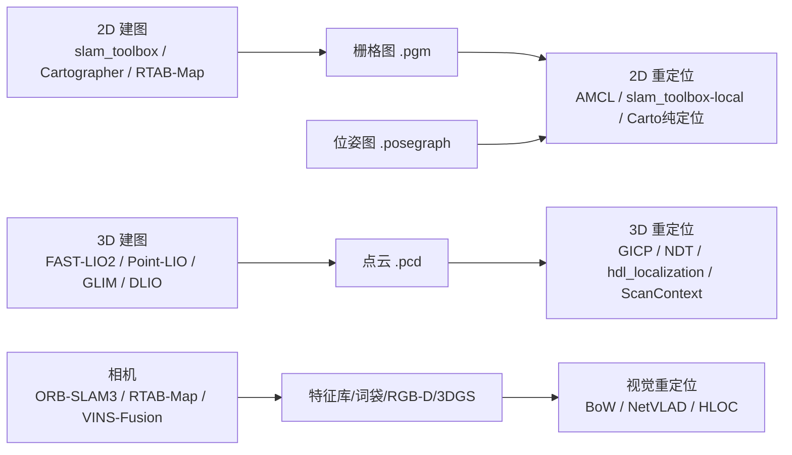

# 建图 / 重定位 算法选型目录（2D × 3D，经典 × 先进）

> 配套文档：`docs/rm_algolab_plan.md`（宏架构）、`docs/rm_algorithm_overview.md`（角色 × 一体性 × 场景）
> 用途：给「建图」「重定位」两个可替换角色做候选清单，支持**组合替换**（每个角色选一个，替换即换编译宏/换 launch）。
> 场景基线：**差速底盘 + MID-360 非重复扫描 LiDAR + IMU，ROS2**。
> 信息来源：各项目官方 README / 论文 / NAV2 文档 / OpenSLAM，已交叉核实（2026-08 检索）。

---

## 〇、选型铁律：地图产物 ↔ 重定位算法 必须配对

**这是"组合替换"的约束条件**——先想清楚你手上/将建的是哪种地图，才能选重定位算法：

| 地图产物 | 由谁产出（建图） | 谁能用它重定位 |
|---|---|---|
| `.pgm/.yaml` 栅格图 | Cartographer、slam_toolbox、Gmapping | **AMCL**（首选）、Free-Space Features、IR-MCL/ENM-MCL |
| `.posegraph` | slam_toolbox | **slam_toolbox localization 模式**（不吃 .pgm） |
| `.pbstream` | Cartographer | **Cartographer 纯定位模式**（不吃 .pgm；可导出栅格图喂 AMCL） |
| `.pcd` 点云 | FAST-LIO / Point-LIO / hdl_graph_slam / GLIM / DLIO | **ICP 族 / NDT / hdl_localization / Scan Context 检索+精化 / 学习式全局定位** |
| 视觉：特征库 / 词袋 / RGB-D 稠密地图 / 3DGS | ORB-SLAM3 / RTAB-Map / VINS-Fusion | **BoW 重定位 / NetVLAD / HLOC / SuperPoint+SuperGlue→PnP** |



---

## 一、2D 建图算法

### 1.1 经典 / 传统

| 算法 | 类别 | 传感器 | 建图+定位一体 | 纯定位/重定位 | ROS2 | 一句话评价 |
|---|---|---|---|---|---|---|
| **Gmapping** | 粒子滤波 RBPF | 2D 激光+里程计 | ✅ | ❌（重定位交给 AMCL） | ⚠️ 仅 ROS1+社区移植 | 入门首选，小地图质量好；大场景/回环弱 |
| **Hector SLAM** | 扫描匹配 | 仅 2D 激光（可加 IMU） | ✅ | ❌ | ⚠️ 社区移植 | 免里程计，适合打滑/履带；无回环易漂移 |
| **Karto SLAM** | 图优化 | 2D 激光+里程计 | ✅ | 理念被 slam_toolbox 继承 | ❌ ROS1 | 历史参照，ROS2 直接用 slam_toolbox |
| **Cartographer** | 子图图优化+回环 | 2D 激光+IMU(强烈建议) | ✅ | ✅ **纯定位模式(.pbstream)** | ⚠️ ros2/cartographer 限维护分支，上游已停新开发 | 精度/大场景天花板，调参重；若地图已是 .pbstream 才推荐 |
| **slam_toolbox** | 图优化(Karto 系) | 2D 激光+里程计 | ✅ | ✅ **elastic pose-graph 定位(.posegraph)** + lifelong 续图 | ✅ **原生 ROS2，Nav2 官方推荐** | **2D 主力**：建图/续图/纯定位一站，一个包干完 |
| TinySLAM / CoreSLAM | 极简粒子+扫描匹配 | 2D 激光+里程计 | ✅ | ❌ | ❌ 独立库 | 教学/嵌入式用，精度有限 |

### 1.2 先进 / 前沿

| 算法 | 类别 | ROS2 | 一句话评价 |
|---|---|---|---|
| **RTAB-Map** | 图优化+词袋回环 | ✅ 原生（Humble→Rolling） | 强回环、多会话/长时建图；对纯 2D 激光偏重，与 slam_toolbox 互补 |
| **MOLA** | 模块化图优化框架 | ✅ 原生 | 现代可配置管线，含 `mola_relocalization`；偏 3D/LO 导向 |
| **MRPT 3.x**（mrpt_slam） | icp-slam / rbpf-slam 多算法库 | ✅ 原生 | 一个库内多种 2D SLAM + MCL 定位，适合深度定制 |
| 学习式（IROS17 / DSC / OverlapNet / Neural-SLAM / DeepPointMap） | 神经网络匹配/回环/端到端 | ❌ 研究代码 | **仅研究跟踪**：生产级可跑 ROS2 的学习式 2D SLAM 目前不存在；深度学习只在"匹配/回环/定位"子模块 |

> **2D 建图结论**：工程首选 **slam_toolbox**；精度/大场景加评 **Cartographer(ROS2 分支)**；长时/强回环用 **RTAB-Map**。

---

## 二、3D 建图算法（对齐 MID-360 场景）

### 2.1 经典 / 传统

| 算法 | 类别 | MID-360/非重复 | 回环 | 纯定位/重定位 | ROS2 | 一句话评价 |
|---|---|---|---|---|---|---|
| A-LOAM | 特征+scan2map | ❌ | ❌ | ❌ | 移植 | SLAM 开山鼻祖，学习用 |
| LeGO-LOAM | 地面分割+因子图 | ❌ | 弱 | ❌ | 移植 | 轻量 UGV；面向旋转雷达 |
| LIO-SAM | LiDAR+IMU 紧耦合因子图 | 弱(需定制) | ✅ | 外接 hdl_localization | 官方 ros2 分支 | 成熟生态大；对 MID-360 支持弱 |
| **FAST-LIO2** | IEKF+ikd-Tree 增量建图 | ✅ **原生** | ❌ | ✅ 扩展 FAST-LIO-LOCALIZATION | 社区 ROS2 成熟 | **3D 主力**：对 Livox 原生最好、>100Hz；无回环需自加 |
| **Point-LIO** | 逐点紧耦合 LIO | ✅ | ❌ | ❌ | 移植 | 4k–8kHz 高带宽，剧烈运动/IMU 饱和极稳 |
| Cartographer(3D) | 子图图SLAM | 一般 | ✅ 强 | ✅ 纯定位 | ROS2 二进制(维护停滞) | 室内回环好；3D 计算重、维护停 |
| hdl_graph_slam | NDT 图SLAM+g2o | ❌ | ✅ | ✅ 配套 hdl_localization | 移植 | 模块化多约束，回环+纯定位配套全 |
| LIO-Livox | Livox 专用 LIO | ✅ MID-360 | ❌ | ❌ | 移植 | 官方算法、隧道/高速稳健；较旧无回环 |
| R3LIVE | LIO+视觉光度 | ✅ | ❌ | ❌ | 移植 | 实时 RGB 稠密地图+mesh；依赖相机标定 |

### 2.2 先进 / 前沿

| 算法 | 类别 | MID-360/非重复 | 回环 | 纯定位/重定位 | ROS2 | 一句话评价 |
|---|---|---|---|---|---|---|
| **KISS-ICP** | 极简点对点 ICP | ✅ 雷达无关 | ❌ | ❌ | ✅ 原生+`pip install` | 零参数开箱即用、换雷达不用改；纯里程计无回环 |
| CT-ICP | 连续时间 ICP+位姿图 | 弱 | ✅ | ❌ | 需封装 | KITTI 榜第一(RTE 0.59%)；面向旋转雷达 |
| **DLIO** | LIO 连续时间运动校正 | ✅(CustomMsg) | ❌ | ❌ | feature/ros2 | 轻量、低规格硬件可跑、支持 Livox |
| **GLIM** | 因子图+GPU GICP | ✅ **原生 MID-360** | ✅(glim_ext) | ✅(glim_ext) | ✅ 原生 glim_ros2 | 作者=hdl_graph_slam 作者；**MID-360+ROS2+回环原生**，GPU/CUDA 偏重 |
| FAST-LIVO2 | LiDAR+视觉紧耦合 | ✅ | ❌ | ❌ | 移植 | 退化环境(隧道/无纹理)极稳、RGB 稠密地图；需相机 |
| SplaTAM / MonoGS / GS-SLAM | 3DGS 稠密 SLAM | —（**RGB-D/单目相机，非 LiDAR**） | — | — | ❌ Python | 照片级真实感重建；**不适用 LiDAR 移动机器人**，仅研究跟踪 |

> **3D 建图结论**：工程首选 **FAST-LIO2**（MID-360 原生、已有）；要"回环+ROS2+MID-360"一步到位看 **GLIM**；轻量备选 **DLIO / KISS-ICP**；加相机走视觉增强看 **FAST-LIVO2 / R3LIVE**。

---

## 三、2D 重定位算法

### 3.1 经典 / 传统

| 算法 | 类别 | 先验地图 | 需要初值? | ROS2 | 一句话评价 |
|---|---|---|---|---|---|
| **AMCL（Nav2）** | 自适应粒子滤波 MCL | 栅格图 .pgm/.yaml | 都支持（`global_localization` 服务=真全局搜索） | ✅ 官方 nav2_amcl | **2D 重定位事实标准**：稳健、绑架恢复、差速+2D 激光开箱即用 |
| MCL（1999） | 粒子滤波 | 栅格图/似然场 | 全局或局部 | 已被 AMCL 吸收 | AMCL 的学术内核，无独立包 |
| **slam_toolbox localization** | 图优化+扫描匹配 | .posegraph | 需要（`/initialpose` 同 AMCL API） | ✅ 原生 | 精度高、同一 posegraph 可续建图；依赖高质量里程计 |
| **Cartographer 纯定位** | 子图+全局回环 | .pbstream | 需要（start_trajectory 带初值） | ⚠️ 无正式 ROS2 | 精度高可大场景；集成成本高 |
| laser_scan_matcher (+csm) | 几何扫描匹配 ICP/PLICP/NDT | 无需全局地图 | **必须**（纯局部跟踪） | ⚠️ 社区移植 | 极轻量实时，丢定位后"拖住"位姿；**不能解决开机无初值** |

### 3.2 先进 / 前沿（多数面向 3D，但思想可下放 2D）

| 算法 | 类别 | 需要初值? | ROS2 | 一句话评价 |
|---|---|---|---|---|
| **IR-MCL**（PRBonn, RA-L'23） | 神经占用场观测模型+MCL | ❌ 全局 | ❌ 研究代码 | **唯一明确 2D 专用的学习式全局定位**，最对口 |
| **ENM-MCL**（PRBonn, ICRA'25） | 轻量神经地图+MCL | ❌ 全局 | ❌ 研究代码 | IR-MCL 工程演进版，可嵌入式实时；仍需自工程化 |
| **Scan Context / ++** | 手工全局描述子+检索+精化 | ❌ 全局检索 | ⚠️ C++ 无官方 ROS2 | 旋转不变检索极快，回环标准件；**2D 单线激光区分度下降** |
| OverlapNet + MCL | 学习式 overlap 观测模型 | ❌ 全局 | ❌ | 学习式观测模型 MCL 开山；2D 需大改造+GPU |
| Free-Space Features | 距离函数图描述子 | ❌ 全局 | ❌ | 专门解决 2D 信息量少；论文较老无开箱实现 |
| BEVPlace / RING++ / S-BEVLoc | 学习式 BEV+NetVLAD | ❌ 全局 | ❌ | 端到端、鲁棒视角/外观变化；BEV 平面化思想可套 2D |

> **2D 重定位结论**：工程上 **AMCL 必选基线**（真全局搜索+绑架恢复）；用 .posegraph 就换 **slam_toolbox localization**；前沿看 **Scan Context 检索→喂 AMCL/ICP** 突破重复场景失效，长期跟踪 **IR-MCL / ENM-MCL**。Cartographer 纯定位除非地图已是 .pbstream，否则不做首选。

---

## 四、3D 重定位算法（对齐 .pcd 场景）

### 4.1 经典 / 传统

| 算法 | 类别 | 需要初值? | ROS2 | 一句话评价 |
|---|---|---|---|---|
| **ICP 族**（point-to-point / point-to-plane / **GICP** / NICP / voxelized GICP） | 局部点云配准 | **必须**（局部收敛） | ✅ PCL 库直接可写（自研 `icp_registration` 即此路线） | 精度高、实现简单；**不能解决开机无初值**，需初值或与全局定位配合 |
| **NDT / NDT-OMP / NDT-MCL** | 体素分布配准 | NDT：必须；NDT-MCL：全局 | ✅ PCL/autoware | 比 ICP 鲁棒大范围收敛，NDT-MCL=粒子滤波版可全局 |
| **hdl_localization** | NDT/ICP 局部化节点 | 需要 | ⚠️ 社区 ROS2 | hdl_graph_slam 配套的"**地图+实时配准**"定位节点，现成工程件 |
| **Scan Context** | 全局描述子检索 | ❌ 全局 | ⚠️ 需集成 | 旋转不变检索出候选→ICP/NDT 精化，LIO-SAM/SC-A-LOAM 回环标准件 |
| SegMatch | 分割级全局匹配 | ❌ 全局 | ⚠️ | 3D 段级特征全局定位，较老 |
| **FAST-LIO-LOCALIZATION** | 基于已有 .pcd 地图的 LIO 重定位 | 需要初值 | ⚠️ 移植 | **FAST-LIO 官方扩展**：把新扫描配准到已存点云地图，与现有 LIO 无缝 |

### 4.2 先进 / 前沿

| 算法 | 类别 | 需要初值? | ROS2 | 一句话评价 |
|---|---|---|---|---|
| **PointNetVLAD** | 学习式点云全局描述子 | ❌ 全局 | ❌ | 3D 位置识别经典基线（2018），检索→几何验证 |
| **Locus**（ICRA'22） | 学习式全局描述子 | ❌ 全局 | ❌ | 面向恶劣环境（雨雪雾/光照变化）全局定位 SOTA |
| **SG_PR**（ICRA'20） | 语义图全局定位 | ❌ 全局 | ❌ | 语义一致性验证，结构信息强时极稳 |
| **OverlapTransformer** | Transformer 全局描述子 | ❌ 全局 | ❌ | 换雷达/视角鲁棒，检索快 |
| **DiSCO** / **MinkLoc** | 学习式（可区分描述子/体素） | ❌ 全局 | ❌ | 位置识别 SOTA 级，研究代码 |
| **AnyLoc / AnyPlace** | 视觉-激光统一定位 | ❌ 全局 | ❌ | 2024-2025 任意地点泛化定位，需多模态 |
| 3DGS/NeRF 时代定位 | 神经场景表征+配准 | 视实现 | ❌ | 前沿方向，工程远，仅跟踪 |

> **3D 重定位结论**：短期工程落地 = **ICP 族(GICP/point-to-plane) / NDT + hdl_localization**（吃 .pcd、可接 LIO 初值）；开机无初值补 **Scan Context 全局检索→喂 ICP/NDT**；与现有 FAST-LIO 最顺的是 **FAST-LIO-LOCALIZATION**；前沿跟踪 **PointNetVLAD→Locus/SG_PR→AnyLoc** 的学习式全局定位。

---

## 五、相机算法（深度相机 RGB-D / 普通单目 / 双目）

### 5.0 相机 vs 雷达：框架相同，观测模型天差地别

**结论**：SLAM 骨架（前端跟踪 → 后端优化 → 回环检测）两者**通用**；区别集中在"观测模型 / 信息类型 / 退化条件 / 建图产物 / 重定位匹配方式"五个点。所以**不能把激光算法直接套到相机**，但框架和工程组件（位姿图、因子图、TF、导航接口）可复用。二者互补，现代主流是融合（LIVO）。

| 维度 | LiDAR | 相机（单目/双目/RGB-D） |
|---|---|---|
| 测距 | 主动直接测距（cm 级） | 被动，深度靠算法恢复；**单目有尺度漂移** |
| 信息 | 稀疏几何点，无颜色/纹理 | 稠密像素，含颜色/纹理/语义 |
| 特征 | 几何特征（角点/平面/曲率） | 视觉特征+描述子（ORB/SIFT/SuperPoint） |
| 光照/天气 | 不敏感（夜晚可用） | 敏感（暗光/过曝/光照变化） |
| 退化场景 | 重复结构/玻璃/长走廊 | **无纹理/弱纹理/运动模糊** |
| 建图产物 | 稀疏点云 .pcd / 栅格 | 稠密彩色点云 / mesh / **3DGS** / 语义图 |
| 重定位方式 | 点云配准(ICP/NDT)+全局描述子(ScanContext) | 图像检索(BoW/NetVLAD)+特征匹配 PnP |
| 学习式渗透 | 中 | **高**（特征/匹配/端到端/3DGS 重建都是视觉先起） |
| 成本/算力 | 贵、点云处理较重 | 便宜、可轻可重（学习式重） |

### 5.1 视觉里程计 / SLAM（经典）

| 算法 | 类别 | 传感器 | ROS2 | 一句话评价 |
|---|---|---|---|---|
| **ORB-SLAM2 / 3** | 特征点图 SLAM + BoW 回环 | 单目/双目/RGB-D（3 支持 IMU） | ⚠️ 社区 ros2 分支 | 视觉 SLAM 事实标杆，多传感器、回环强；需标定 |
| **VINS-Mono / VINS-Fusion** | 视觉惯性 VIO（滑动窗+边缘化） | 单目/双目/鱼眼 + IMU | ⚠️ 社区移植 | 经典 VIO，视觉退化时靠 IMU；可融合 GPS/激光 |
| DSO / LSD-SLAM / SVO | 直接法（稀疏/半稠密）/半直接 | 单目（+双目） | ❌ ROS1/研究 | 直接法三剑客，光照鲁棒强、需调参；工程维护停滞 |
| OKVIS | 视觉惯性滑动窗 | 双目+IMU | ❌ | 早期 VIO 代表作，已被 VINS 取代 |
| **RTAB-Map** | RGB-D 图 SLAM + 词袋回环 | **RGB-D**（也支持激光） | ✅ 原生 ROS2 | 深度相机首选：强回环、多会话、工具完善 |
| Kimera-VIO | 视觉惯性+语义+mesh | 双目/单目+IMU | ⚠️ | 输出语义 mesh，适合研究 |

### 5.2 视觉 SLAM / 重建（先进）

| 算法 | 类别 | 传感器 | ROS2 | 一句话评价 |
|---|---|---|---|---|
| **DROID-SLAM** | 端到端可微 BA（深度学习） | 单目/双目/RGB-D | ❌ 研究代码 | 学习式视觉 SLAM SOTA，精度高；重 GPU、非实时落地难 |
| TartanVO | 学习式 VO | 单目/双目 | ❌ | 跨域泛化强，但仅里程计无回环 |
| **SplaTAM / MonoGS / Gaussian-SLAM / Photo-SLAM / NGP-SLAM** | **3DGS/NeRF 稠密 SLAM** | RGB-D/单目 | ❌ 研究代码 | 照片级稠密重建+定位一体；**实时性/算力是瓶颈，仅前沿跟踪** |
| iMAP | NeRF SLAM | RGB-D | ❌ | 早期 NeRF SLAM 代表作 |
| VINS-RGBD | 视觉惯性（深度版） | RGB-D+IMU | ⚠️ | VINS 的深度扩展 |

### 5.3 深度相机重建（RGB-D，经典）

| 算法 | 类别 | ROS2 | 一句话评价 |
|---|---|---|---|
| KinectFusion / BundleFusion | 体素/关键帧重建 | ❌ | 深度重建鼻祖，室内小场景；非 SLAM 定位 |
| ElasticFusion | 非刚性重建+回环 | ❌ | 室内稠密重建经典，单机 GPU |
| **RTAB-Map** | 见 5.1 | ✅ 原生 | RGB-D 建图+定位+重定位 一站 |

### 5.4 视觉重定位 / 全局定位（VPR + 局部化）

| 算法 | 类别 | 需要初值? | ROS2 | 一句话评价 |
|---|---|---|---|---|
| **DBoW2 / DBoW3 词袋**（ORB-SLAM 内置） | 词袋图像检索 | ❌ 全局 | ✅（随 ORB-SLAM3） | ORB-SLAM 的重定位数据库，工程现成 |
| FAB-MAP | 视觉位置识别（VPR 鼻祖） | ❌ 全局 | ⚠️ | 经典 VPR，已被学习式取代 |
| 特征 PnP（SIFT/ORB+3D-2D） | 特征匹配+位姿求解 | 需要 | ✅ PCL/OpenCV 可写 | 经典 3D-2D 重定位，实现简单 |
| **NetVLAD** | 学习式全局图像描述子 | ❌ 全局 | ⚠️ 集成 | 视觉 VPR 经典基线（2016），检索极快 |
| **SuperPoint + SuperGlue / LoFTR** | 学习式特征+匹配 | 需要 | ⚠️ | 强纹理不变特征匹配，可接 PnP 做重定位 |
| **HLOC（分层视觉定位）** | 检索→特征匹配→PnP 层级管线 | ❌ 全局 | ⚠️ | 视觉定位工程化标杆（2019） |
| Patch-NetVLAD / Conv-AP | 学习式描述子改进 | ❌ 全局 | ❌ | NetVLAD 演进，精度更高 |
| **AnyLoc / AnyPlace** | 视觉+激光统一定位 | ❌ 全局 | ❌ | 2024-2025 任意地点泛化定位，跨传感器 |
| PixLoc | 端到端可微配准 | 需要 | ❌ | 学习式局部精化，配 NetVLAD 用 |
| PoseNet | 端到端位姿回归 | ❌ 全局 | ❌ | 直接回归精度差、泛化弱，**不推荐落地** |

### 5.5 相机路线选型结论

| 需求 | 推荐 | 理由 |
|---|---|---|
| 纯视觉里程计（无激光） | **ORB-SLAM3 / VINS-Fusion** | 多传感器、工程成熟 |
| RGB-D 深度相机一站式 | **RTAB-Map** | 原生 ROS2、建图+定位+重定位全包 |
| 与 MID-360 融合（LIVO） | **FAST-LIVO2 / R3LIVE**（工作区已有） | 激光补尺度/光照，相机补纹理/稠密 |
| 视觉重定位（开机恢复） | **BoW（随 ORB-SLAM3）→ NetVLAD → HLOC** | 图像检索+特征匹配，工程→先进递进 |
| 学习式/3DGS 前沿 | DROID-SLAM / SplaTAM 系 | 仅研究跟踪，不落地 |

---

## 六、"算法包中的部分"清单（一个包拆出多个角色）

| 包 | 建图 | 里程计/定位 | 重定位 | 说明 |
|---|---|---|---|---|
| **slam_toolbox** | ✅ mapping | ✅ 在线 | ✅ localization(.posegraph) | 一包三用 + lifelong 续图 |
| **Cartographer** | ✅ | ✅ | ✅ 纯定位(.pbstream) | 可导出栅格图喂 AMCL |
| **FAST-LIO** | ✅ 建图 | ✅ 里程计 | ✅ 扩展 FAST-LIO-LOCALIZATION | 建图+里程计一体，重定位靠扩展 |
| **hdl_graph_slam / hdl_localization** | ✅ 建图 | ✅ | ✅ hdl_localization(NDT/ICP) | 作者配套拆出独立定位节点 |
| **LIO-SAM** | ✅ | ✅ | 外接 hdl_localization / Scan Context | 回环+GPS 内置 |
| **GLIM** | ✅ | ✅ | ✅ glim_ext(回环/重定位) | 一体化含回环 |
| **MRPT** | ✅ icp-slam/rbpf-slam | ✅ | ✅ MCL | 一个库多算法 |
| **MOLA** | ✅ | ✅ LO | ✅ mola_relocalization | 模块化可插拔 |
| **RTAB-Map** | ✅ | ✅ | ✅ localization 模式(记忆库) | 强回环/多会话 |
| **icp_registration（自研）** | — | ✅ 帧间 ICP | ✅ 3D 配准(.pcd) | 本项目已有，作 3D 重定位后端 |

---

## 七、落到 rm_algolab 宏体系（组合替换的候选池）

每个角色给出"可替换候选"，替换=改一个编译宏：

```
① 重定位 LOCAL_*（互斥）
   2D: LOCAL_2D_AMCL(.pgm) / LOCAL_2D_SLAM_TOOLBOX(.posegraph) / LOCAL_2D_CARTO_PURE(.pbstream, 预留)
   3D: LOCAL_3D_ICP(.pcd, 现有 icp_registration) / LOCAL_3D_NDT(.pcd, 预留) /
       LOCAL_3D_HDLLOCALIZATION(.pcd, 预留) / LOCAL_3D_SCANCONTEXT(全局检索→ICP, 前沿预留)
② 建图 MAPPING_*（互斥）
   2D: MAPPING_2D_SLAM_TOOLBOX / MAPPING_2D_CARTO / MAPPING_2D_RTAB(先进预留)
   3D: MAPPING_3D_FAST_LIO(现有) / MAPPING_3D_POINT_LIO(现有) / MAPPING_3D_GLIM(先进预留) /
       MAPPING_3D_DLIO(轻量预留) / MAPPING_3D_KISS_ICP(雷达无关预留)
③ 规划导航 NAV_*  /  ④ 里程计 ODOM_*   ← 沿用原规划
⑤ 相机 CAM_*（新扩展，预留）
   ODOM_CAM_VIO（VINS-Fusion / ORB-SLAM3，视觉惯性里程计）
   MAPPING_CAM_RGBD（RTAB-Map / ORB-SLAM3-RGBD，深度相机建图）
   MAPPING_CAM_3DGS（MonoGS / Photo-SLAM，3DGS 前沿预留）
   LOCAL_CAM_VISUAL（BoW / NetVLAD / HLOC，视觉重定位）
   融合：LIVO_*（FAST-LIVO2 / R3LIVE，激光+相机+惯性，工作区已有）
```

**推荐"组合替换"样板（MID-360 + ROS2）：**

| 场景 | 建图 | 重定位 | 导航 | 理由 |
|---|---|---|---|---|
| 3D+2D（默认，现有） | FAST-LIO2(.pcd) | ICP(icp_registration) | TEB | 工作区现成，改动最小 |
| 3D+2D（加全局恢复） | FAST-LIO2(.pcd) | Scan Context 检索 → ICP | TEB | 解决开机无初值/重复场景失效 |
| 3D 一体化+回环 | GLIM(.pcd) | glim_ext | TEB | MID-360+ROS2+回环原生 |
| 纯 2D | slam_toolbox(.posegraph) | slam_toolbox localization | TEB | Nav2 官方组合，续图/续定位方便 |
| 2D 高精度 | Cartographer(.pbstream) | Cartographer 纯定位 或 导出→AMCL | TEB | 大场景精度优先 |
| 前沿 2D | slam_toolbox | IR-MCL / ENM-MCL | TEB | 学习式全局定位研究试点 |
| 纯视觉 | ORB-SLAM3 / VINS-Fusion | BoW / NetVLAD→PnP | TEB | 无激光/低成本替代，尺度靠 IMU/双目 |
| RGB-D 深度相机 | RTAB-Map | RTAB-Map 重定位模式 | TEB | 室内稠密建图+定位一站 |
| 激光+相机融合 | FAST-LIVO2 / R3LIVE | 激光重定位(ICP/NDT) | TEB | 激光补尺度/光照 + 相机补纹理/稠密 |

---

## 附：参考来源（精选）

- slam_toolbox：https://github.com/SteveMacenski/slam_toolbox ｜ JOSS 10.21105/joss.02783
- Cartographer：https://github.com/cartographer-project/cartographer ｜ ros2/cartographer
- RTAB-Map：https://github.com/introlab/rtabmap ｜ MOLA：https://github.com/MOLAorg/mola ｜ MRPT：https://github.com/MRPT/mrpt
- FAST-LIO：https://github.com/hku-mars/FAST_LIO ｜ FAST-LIO-LOCALIZATION：hku-mars/FAST_LIO_LOCALIZATION
- Point-LIO：https://github.com/hku-mars/Point-LIO ｜ LIO-SAM：https://github.com/TixiaoShan/LIO-SAM
- GLIM：https://github.com/koide3/glim ｜ DLIO：https://github.com/vectr-ucla/direct_lidar_inertial_odometry ｜ KISS-ICP：https://github.com/PRBonn/kiss-icp ｜ CT-ICP：https://github.com/CVLAB3D/CT-ICP
- hdl_localization：https://github.com/koide3/hdl_localization ｜ hdl_graph_slam：https://github.com/koide3/hdl_graph_slam
- AMCL：https://github.com/ros-navigation/navigation2/tree/main/nav2_amcl ｜ NAV2 docs：https://docs.nav2.org/
- IR-MCL：https://arxiv.org/abs/2210.03113 ｜ ENM-MCL：https://arxiv.org/abs/2503.23480
- Scan Context：https://github.com/irapkaist/scancontext ｜ PointNetVLAD：https://github.com/mikacuy/pointnetvlad ｜ Locus：https://arxiv.org/abs/2203.07274 ｜ SG_PR：https://arxiv.org/abs/2002.12429
- 2D LiDAR SLAM 综述：https://www.mdpi.com/2072-4292/17/7/1214 ｜ LiDAR SLAM 前沿综述：https://arxiv.org/abs/2311.00276 ｜ 全球 LiDAR 定位综述：https://arxiv.org/abs/2302.07433
- ORB-SLAM3：https://github.com/UZ-SLAMLab/ORB_SLAM3 ｜ VINS-Fusion：https://github.com/HKUST-Aerial-Robotics/VINS-Fusion
- RTAB-Map：https://github.com/introlab/rtabmap ｜ DROID-SLAM：https://github.com/princeton-vl/DROID-SLAM
- NetVLAD：https://github.com/Relja/netvlad ｜ HLOC：https://github.com/cvg/Hierarchical-Localization ｜ SuperGlue：https://github.com/magicleap/SuperGluePretrainedNetwork
- 3DGS SLAM 综述：https://arxiv.org/abs/2404.02422 ｜ MonoGS：https://github.com/muskie82/MonoGS ｜ Photo-SLAM：https://github.com/HKU-Mars/Photo-SLAM
