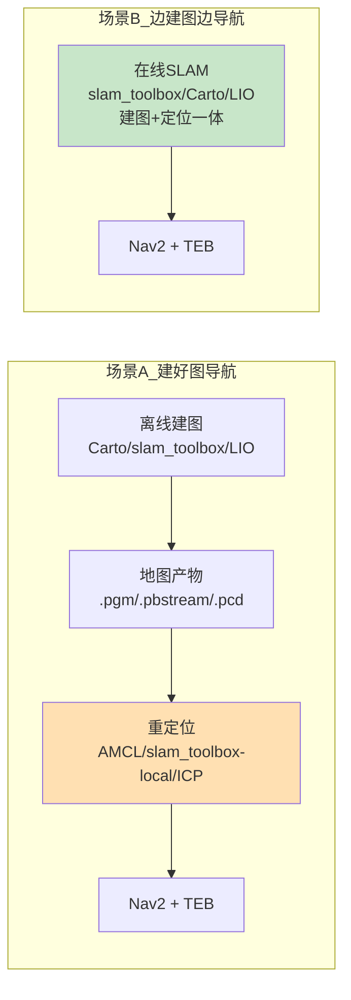

# HzMi_rmsimulation 算法总结（角色 × 一体性 × 两大场景）

> 配套文档：`docs/rm_algolab_plan.md`（宏架构规划）
> 本文回答三个问题：
> 1. 导航拆成「里程计 / 重定位 / 建图 / 导航」四层是否合理？
> 2. 哪些算法是「建图 + 定位 + 重定位一体」的？
> 3. 整套系统分成「建好图导航」与「边建图边导航」两大场景，怎么落地？

---

## 一、算法四个角色（分工）

| 角色 | 干什么 | 是否依赖预存地图 | 典型问题 |
|---|---|---|---|
| **里程计** Odometry | 持续输出机器人位姿，靠自身传感器推算 | 否（或依赖自累积地图） | 连续定位 |
| **重定位** Relocalization | 在已有地图中找回机器人位置 | **是**（栅格图 / .posegraph / .pcd） | 开机 / 丢定位恢复"我在哪" |
| **建图** Mapping | 构建环境地图 | 否（输出地图产物） | 从零造图 |
| **导航** Navigation | 给定目标，规划路径并跟踪执行 | 是（需要地图） | 全局规划 + 局部规划 + 控制 |

> 记忆口诀：**里程计 = 一路在哪儿；重定位 = 重新知道在哪儿；建图 = 画地图；导航 = 走过去。**

---

## 二、核心洞察：算法大多「一体」

**SLAM 本质 = 建图 + 定位一体**。所以不能把算法按四层切碎归类，而要先按"一体性"归类——很多算法是同一个实例同时干好几件事。

### 2.1 一体性矩阵

| 算法 | 里程计 | 重定位 | 建图 | 导航 | 一体性 |
|---|---|---|---|---|---|
| **FAST-LIO** | ✅ | ✅（自带累积地图可重定位） | ✅ 3D 点云 | — | **建图 + 定位一体** |
| **Point-LIO** | ✅ | ✅ | ✅ 3D 点云 | — | **建图 + 定位一体** |
| **Cartographer** | ✅（局部 SLAM） | ✅（纯定位 / 全局 SLAM 模式） | ✅ 2D | — | **建图 + 定位一体** |
| **slam_toolbox** | ✅（在线） | ✅（localization 模式） | ✅ 2D | — | **建图 + 定位一体** |
| **AMCL** | — | ✅（需已有栅格图） | — | — | 纯重定位 |
| **icp_registration** | ✅（帧间 ICP） | ✅（需已有 .pcd） | — | — 纯重定位 / 里程计 |
| NDT（预留） | ✅ | ✅ | — | — | 纯重定位 |
| **Nav2 NavfnPlanner** | — | — | — | ✅ 全局 | 纯导航 |
| **Nav2 DWB / DWA** | — | — | — | ✅ 局部 | 纯导航 |
| **TEB Local Planner** | — | — | — | ✅ 局部 | 纯导航 |

### 2.2 关键澄清：「一体」≠「重定位」

必须指清楚：
- 一体化算法（LIO / Cartographer / slam_toolbox）在线跑时，输出的是**连续定位**（跟随自身历史路径，不需要预存地图）。
- **重定位**是在**没有连续历史**时（开机、被搬动、定位丢失）借助**预存地图**找回位置，这是独立的环节。
- 因此：
  - **边建图边导航** → 用一体化算法的连续定位即可，**不需要重定位环节**。
  - **建好图导航** → 运行期已不建图，**必须显式加一个重定位环节**（AMCL / slam_toolbox-localization / ICP），再交给导航。

---

## 三、两大场景

### 场景 A：建好图导航（Map-then-Navigate）— 预建图 + 重定位 + 导航

```
阶段1 建图（离线，跑一次）                  阶段2 运行（在线，每次）
  一体化算法建图          → 保存地图产物        → 纯重定位算法          → 导航
  Cartographer           →  .pbstream / .pgm  →  AMCL / Cartographer纯定位  → Nav2 + TEB
  slam_toolbox(mapping)  →  .pgm + .posegraph →  slam_toolbox(localization) → Nav2 + TEB
  FAST-LIO / Point-LIO   →  .pcd              →  icp_registration / NDT     → Nav2 + TEB
```

- 地图产物 → 重定位算法的对应关系（**必须配对**）：

| 地图产物 | 谁产出的 | 谁能用它重定位 |
|---|---|---|
| `.pgm` + `.yaml`（栅格图） | Cartographer / slam_toolbox | **AMCL** |
| `.posegraph` | slam_toolbox | **slam_toolbox(localization)** |
| `.pbstream` | Cartographer | **Cartographer 纯定位模式** |
| `.pcd`（3D 点云） | FAST-LIO / Point-LIO | **icp_registration / NDT** |

- 工作区现状（全部现成）：`map/RMUL2026.pbstream`、`map/RMUL{.pgm,.posegraph}`、`map/RMUC{.pgm,.posegraph}`、`PCD/RMUL.pcd`、`PCD/RMUC.pcd`
- 对应 `rm_nav_bringup` 现有 `mode=nav` + `localization∈{amcl, slam_toolbox, icp}`

### 场景 B：边建图边导航（Simultaneous Mapping & Navigation）— 在线 SLAM 直驱导航

```
运行时（无预存地图，探索未知场地）
  一体化算法 在线建图 + 连续定位  ──(位姿)──►  导航
  slam_toolbox(online_async) / Cartographer / FAST-LIO / Point-LIO  → Nav2 + TEB
```

- 关键点：**建图与定位是同一个算法实例**，省掉重定位环节；导航栈（Nav2/TEB）只消费定位结果和地图，不关心地图怎么来。
- 适用：新场地第一次跑、无先验地图。
- 对应 `rm_nav_bringup` 现有 `mode=mapping`（slam_toolbox online_async）+ 导航；LIO 在线建图时更常用"建好图导航"（先存 .pcd）。

### 场景对比

| 维度 | A 建好图导航 | B 边建图边导航 |
|---|---|---|
| 是否需要预存地图 | 是 | 否 |
| 运行期是否有建图环节 | 否（纯重定位） | 是（在线 SLAM） |
| 是否有重定位环节 | **必须** | **不需要** |
| 地图质量 / 稳定性 | 高（离线精调） | 随跑随建 |
| 对应现有 mode | `nav` | `mapping` |

---

## 四、落到 rm_algolab 宏体系

宏四层表达"角色"（`ODOM_* / MAPPING_* / LOCAL_* / NAV_*`），但**一体性**要体现在宏的隐含约束里：

| 一体性规则 | 宏表达 |
|---|---|
| 选 `MAPPING_3D_LIO` ⟹ 隐含 `ODOM_FAST_LIO`（LIO 建图必自带里程计） | 两个宏不重复选，LIO 一档即可 |
| 选 `MAPPING_2D_CARTO` ⟹ 隐含可配 `LOCAL_2D_AMCL`（或 Cartographer 纯定位） | 建图产物决定重定位算法 |
| 场景 A ⟹ 必须且只能选 1 个 `LOCAL_*`（重定位） | 复用互斥校验 |
| 场景 B ⟹ `LOCAL_*` 不强制，用一体化算法的连续定位 | 放宽 LOCAL 必选 |

新增两个**场景 Profile**（对应两大场景）：

```cmake
# 场景 A：建好图导航（默认）— 预存地图 + 重定位 + 导航
option(RM_ALGOLAB_PROFILE_MAP_THEN_NAV  "建好图导航" ON)
# 场景 B：边建图边导航 — 在线 SLAM 直驱导航
option(RM_ALGOLAB_PROFILE_SIMUL_MAP_NAV "边建图边导航" OFF)
```

- 场景 A 落地组合（对应现有 map/PCD 现成数据）：
  - 组合2（默认，最实用）：**LIO(建图存 .pcd) → ICP 重定位 → TEB**，或 **Cartographer(建图存 .pgm) → AMCL → TEB**
- 场景 B 落地组合：**slam_toolbox(online_async) 在线建图+定位 → TEB**（探索未知场地）

---

## 五、一张图总结



> 结论：
> - 四层分工合理，但**算法要按一体性归类**（LIO / Cartographer / slam_toolbox 都是建图+定位一体）。
> - 系统按两大场景组织：**建好图导航**（重定位是必要环节，工作区地图现成）与**边建图边导航**（一体算法直驱，省掉重定位）。
> - `rm_algolab` 用宏四层 + 两个场景 Profile 来表达这套结构。
