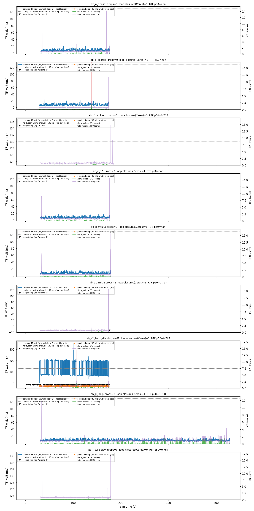

# 建图丢帧 × 回环 × 里程计：两个假设的实测裁决（2026-10-06）

> **本文回答两个问题**（用户在 `world:=RMUC2026 mode:=mapping lio:=small_point_lio
> mapper:=slam_toolbox map_name:=RMUC2026_v2 cloud_accumulator:=True` 的建图跑里看到的）：
>
> * **A**：`slam_toolbox: Message Filter dropping message … 'queue is full'` 的**复现**，
>   是不是刚打开的**回环**（节点加密 `minimum_travel_distance/heading 0.5→0.2`、
>   `minimum_time_interval 0.5→0.25`，commit `5cb93cb`）造成的？
> * **B**：给 slam_toolbox **更好的里程计**，能不能改善（能改善到什么程度）？
>
> 关联：`docs/slam_toolbox_tuning.md`（节点密度 A/B = 回环为什么不触发）、
> `docs/slam_toolbox_scan_drops.md`（丢帧的**上一代**根因 = LIO 戳截断、`scan_queue_size` A/B）、
> `docs/lio_drift_diagnosis.md`（LIO 本身的质量）、`docs/tf_interface_contract.md`（谁发哪条 TF）。
>
> 记号：`[V]` = 本机源码/实测可复现；`[R]` = 上游文档/issue；`[I]` = 推断。

---

## §0 结论（先看这段）

**A：不成立 —— 回环不是这次丢帧的直接原因，它是"放大器"不是"开关"。**

* **直接因**是「这一帧的 `odom→base_link` 比它自己晚到，且晚过下一条 `/scan` 的到达间隔」。
  判据与实测：**同一份完全一样的完美里程计**（ATE = 0.000 m），只把 TF 晚发 130 ms
  ⇒ 丢帧 **0 → 62（4.26%）**，被丢的那些帧"等待 p50 = 200 ms > 各自的下一条到达间隔 p50 = 130.6 ms"
  （§4.3 的 e1/e2 对照 + §2.1）。
* **回环的实测代价**：把**那一帧**的处理时延从 ~17 ms 抬到 **37~58 ms**（< 一个扫描周期 132 ms）；
  那一次 `ceres::Solve` 让 `slam_toolbox` 的 CPU 瞬时到 ~2 核、**本跑进程树合计**瞬时到 14~16 核
  （宿主 28 核，期间用户自己的建图跑也在跑，宿主 load p50 = 2.6~5.4）。
  六格里**没有一条丢帧落在回环 ±2 s 内**（随机基线 1.5%）（§2.2）。
* **加密 vs 不加密没有可分辨差异**：0.2/0.2/0.25 与 0.5/0.5/0.5 的等待分布 p90 = 12.6 / 11.8 ms、
  丢帧都是 0（§3 的 a/b 格）；两者唯一的差别是节点间距 0.315 / 0.779 m 与环秩 48 / 6。
* **用户日志里有一部分丢帧在物理上不可能来自回环**：18:05 那跑的丢帧从仿真 **2.4 s** 就开始，
  而 `loop_match_minimum_chain_size=10` 要求"10 个连续旧节点"，那时图里根本没那么多节点（§2.4）。
* 丢帧形状也不像"优化卡住"：用户三次实跑的相邻丢帧间隔 **p50 = 3.3~3.7 s、min = 2.4~2.5 s**，
  **从不相邻**（§2.4）；而一次长阻塞（实测：收尾 `serialize_map`）只会产生**一条**丢帧（§2.1 的 e1 尾注）。

**B：能，但买到的不是"精度"，是"TF 的时延与稠密度"。**

| 拆出来的量 | 现状 | 上界（实测） | 对丢帧 |
|---|---|---|---|
| 精度 | ATE RMSE **0.021 m**（max 0.042；这条路上 LIO 只有 2 cm） | 真值 = **0.000 m** | **无关**（e1/e2 精度都是 0，丢帧 0 vs 62） |
| TF 时延/稠密度 | TF 比同戳扫描晚 **7.7 ms**（阈值 132 ms ⇒ **17 倍余量**） | 迟到 130 ms ⇒ 丢帧 **4.26%** | **决定性** |

⇒ 在**本仿真**里"更好的里程计"对地图质量的收益已经到顶（2 cm < 分辨率 5 cm），
而它对**丢帧**的收益完全取决于"TF 发得多快、多准时"。真机上 50~100 Hz 的轮速+IMU EKF
（§5）恰好把这条边从"跟着 10~20 Hz 雷达帧"变成"跟着 50~100 Hz 惯性/轮速"⇒ **结构性**地消掉这条通道。

**`slam_toolbox` 的算法参数一个都不改（节点密度保持现状、回环保持打开）**，理由：
① 回环不是这次丢帧的原因（A）；② 加密是这套参数里**唯一**能让回环真的发生的改动
（`docs/slam_toolbox_tuning.md` §3.3 F3）；③ 本文受控跑里**现状配置的驱动阶段丢帧 = 0/1450**（a 格）。

⚠️ **`scan_queue_size` 别当成解药**（本次专门测了，结论是否定的）：
在"TF 系统性晚 130 ms"的工况下，`scan_queue_size: 2` 把 `queue is full` 从 **62 条降到 0 条**，
但同一跑出现了 **70 条另一个原因的丢帧**（`the timestamp on the message is earlier than all the data
in the transform cache`），并且位姿图节点数从 58 掉到 **35**（§3 的 f 格）。
⇒ **丢帧总量没有减少，只是换了个名字**（这与 §2.1 事实 3 的语义一致：队列深度只是把"等待"吸收掉，
被吸收的消息最终仍可能因超时/外推失败而丢）。所以本报告**不推荐**用调大队列来消日志。

如果实跑里那几条丢帧让你难受，按"代价从低到高"两个**可逆**选项：

1. **先看那些进程是不是都要开**：本文的受控跑全部 `nav_rviz:=False`、不开 `cloud_accumulator`
   ⇒ 现状配置**丢帧 0/1450**（且在宿主机上与用户的建图跑同时跑、宿主 load 才 2.6~5.4/28）。
   用户实跑多开了 rviz + `cloud_accumulator`，而他们那三个跑次确实各有 16~22 条丢帧
   ⇒ **差异就在"我没开的那两个东西"或"他们怎么开"上**（这一条本文没有隔离测量，见 §8 第 3 条）。
2. **真机侧上 EKF**（§5）：`odom→base_link` 换 50~100 Hz 的轮速+IMU（LIO 作为一路输入），
   这是唯一**根治**"TF 节奏跟着雷达帧走"的结构性改法。仿真侧不需要动配置。

**唯一不要做的**：用"把节点密度改回 0.5/0.5/0.5"去换日志干净（§6 第 1 条）。

---

## §1 仪器、口径，以及 2.6.10 到底暴露了什么

### 1.1 三条源码级事实（后面所有推断都建立在这三条上）`[V]`

**事实 1：整个 slam_toolbox 里 `ceres::Solve` 只有一条自动调用路径 —— 回环。**

```
Mapper::Process(scan)                          lib/karto_sdk/src/Mapper.cpp:2711
 └─ if (do_loop_closing) TryCloseLoop(...)     :2766
     └─ CorrectPoses()  ←★ 全局优化            :1549
         └─ pSolver->Compute()                 :2017   ← CeresSolver::Compute()
             └─ ceres::Solve(options_, …)      solvers/ceres_solver.cpp:202
```

`CorrectPoses()` 的全部调用点（本仓源码 grep，建图模式下）：

| 调用点 | 何时发生 | 本实验里会不会出现 |
|---|---|---|
| `MapperGraph::TryCloseLoop`（`Mapper.cpp:1549`） | **自动回环被接受** | ✅ 这是被测对象 |
| `LoopClosureAssistant::processInteractiveFeedback`（`src/loop_closure_assistant.cpp:307`） | RViz 里手工拖节点 | ❌ 无 rviz（`nav_rviz:=False`） |
| `slam_toolbox_common.cpp:778` 的 `solver_->Compute()` | **反序列化位姿图**结束时的一次性优化 | ❌ `map_autocontinue:=False`、无 `deserialize_map` |

⇒ **本实验里每一条 `preprocessor.cc:62` 的 glog 行 = 一次被接受的自动回环**，
它自带墙钟时间戳（`W1006 HH:MM:SS.micro`）⇒ 这就是 2.6.10 **没有**回环事件话题时的
**带时刻的直接代理量**。（`num_threads: 50` 是 `solvers/ceres_solver.cpp:126` 里**硬编码**的，
Ceres 每次 `Solve` 都会抱怨一次并被 bound 到 28 ⇒ 一行 = 一次 `Solve`。）

**事实 2：丢帧日志里 `at time X` 的 X 是"被顶掉的那条扫描"的 `header.stamp`（= 仿真时间）。**

`/opt/ros/humble/include/tf2_ros/tf2_ros/message_filter.hpp`：队列满时丢的是
`messages_.front()`（最老的那条，:410-420）⇒ 丢帧可以与**逐帧的 TF 等待/CPU/回环**直接对齐，
不需要墙钟换算。（这条在 `docs/slam_toolbox_scan_drops.md` §3 已考证，本文直接复用。）

**事实 3：`QueueFull` 的判据 = 该扫描的 TF 等待 > 下一条扫描的到达间隔（队列深度 1）。**

同文件 :438-447：TF 已经能查到 ⇒ 在 `add()` 里**同步**派发，根本不进队列；进队列的只有
"TF 还没到"的那些。且这个等待用的是 future + 定时器，**不阻塞 executor**
（`transform_timeout` 只是 future 的超时，所以调它没用 —— 与 `scan_drops` §3/§4 的实测一致）。

> 把三条串起来：**丢帧 = "这条扫描的 TF 比它自己晚到，且晚过一个扫描周期"**。
> 注意"TF 比扫描晚到"是常态（LIO 要处理完这一帧才发 TF），真正决定丢不丢的是**晚了多少**。

### 1.2 2.6.10 在运行期到底暴露了什么（本机实测清单）`[V]`

| 类别 | 名字 | 能不能当"回环事件"用 |
|---|---|---|
| topic | `/pose`（`PoseWithCovarianceStamped`） | ⭕ 间接：`addScan` 成功才发一次（`slam_toolbox_common.cpp:607`）⇒ "哪些帧被真的处理了" |
| topic | `/slam_toolbox/graph_visualization`（`MarkerArray`） | ⭕ 间接：顶点 V/边 E ⇒ **环秩 = E−V+1**。⚠️ 但 `LinkNearChains` 也会加边造环（见 §2.3） |
| topic | `/slam_toolbox/scan_visualization`、`feedback`、`update` | ❌ 可视化/交互用 |
| topic | `/map`（5 s 一次）、`/tf`（`map→odom` 等） | ❌ |
| **service** | `manual_loop_closure`、`serialize_map`、`deserialize_map`、`clear_changes`、`pause_new_measurements`、`toggle_interactive_mode`、`dynamic_map`、`save_map` | ❌ 都是"我主动调" |
| **不存在** | `loop_closure_event`、`/slam_toolbox/loop_closure` 之类**事件话题** | — |

⇒ **2.6.10 没有回环事件话题**（`ros2 topic list` / `ros2 service list` 实跑确认）。
所以本文用 **① Ceres glog 行（= 被接受的回环，带时刻）** 作为主证据，
**② 位姿图环秩** 与 **③ `/pose` 处理时延** 作为交叉验证。

### 1.3 本次用的仪器（全部只读订阅 + `/proc`，**不发任何话题、不做监控/哨兵**）

| 仪器 | 作用 | 本次是否改动 |
|---|---|---|
| `tools/scripts/diag/scan_tf_timing_probe.py` | 逐帧：`/scan` 到达、TF 何时可查、等待多久、`/pose`、`/map`、`/clock`、逐纳秒 Δ | 复用，未改 |
| `tools/scripts/mapping/sltune/rec_sltune.py` | 位姿三件套（map/odom/gt）、位姿图 V/E、各进程 CPU%、RTF、全机 CPU | **改了两处坑**（见 §1.4） |
| `tools/scripts/mapping/sltune/run_dropab.sh` | 一次跑 = 起栈→记录→跑路线→存图→收尾（配置 `--set` 临时覆盖 + trap 还原） | 新增 |
| `tools/scripts/mapping/sltune/run_dropab_series.sh` | 一次跑完 a–e 六格并出汇总表 | 新增 |
| `tools/scripts/mapping/sltune/analyze_dropab.py` | 离线：把丢帧/回环/TF 等待/CPU/RTF 放到同一条仿真时间轴，出表 + 图 | 新增 |
| `tools/scripts/diag/truth_odom_tf_bridge.py` | **仅实验**：把 `/odom_ground_truth` 写成 `odom→base_link`（配合 `lio:=none`，保持单发布者契约） | 新增 |

### 1.4 两个必须记住的坑（都是本次踩出来的）`[V]`

1. **`/proc/<pid>/stat` 的 `comm` 只有 15 字符**：`async_slam_toolbox_node` 在那里是
   `async_slam_tool`。原来的 CPU 统计按 `slam_toolbox` 精确匹配 ⇒ **slam_toolbox 的 CPU 永远是 0**。
   本次改成"可执行名截断 15 字符 + python 脚本读 `cmdline`"才拿到真值（下面 §2 的 CPU 数字都是修好后的）。
2. **不要用"最新 `/clock` 值相减"算 RTF**：`/clock` 的消息间隔（实测 ~7.7 Hz）与采样间隔（5 Hz）
   会**别名化** ⇒ 量出来的 RTF 在 0.49/1.47 之间跳（同一跑探针给的是 0.756）。
   正确做法 = 在窗口内对 `/clock` 的**消息序列**求 ΣΔsim/ΣΔwall（本次已改）。
   同理，**仿真钟的等待时长会被仿真钟自己的粒度量化**（本机 `wait_sim` 的 p90 恒为 0），
   所以"等多久"必须用**墙钟毫秒**。

## §2 相关性证据：丢帧 / 回环 / TF 等待 / CPU 放在同一条时间轴上

**口径**：全部来自 §7 的 `run_dropab.sh` 一次跑（无头、`nav_rviz:=False`、同一条路线
`loop_route_corridor_x2.json`、同一速度 0.30 m/s、`--pose-source gt`），六格只改被测参数。
"等待"一律是**墙钟毫秒**（仿真钟粒度 0.1 s，量不了 10 ms 级差异，见 §1.4）；
丢帧一律取 **slam_toolbox 节点日志**里的 `queue is full`（不含 rviz 自己那条 MessageFilter）。

### 2.1 逐帧判据（同一口径、六格并排）

| 跑 | 变体 | `/scan` 帧 | LIO/桥 的 `odom→base_link` 条数 | Δns=0 恰好 0 ns | 到达时 TF 已可查 | **等 TF p50 / p90 / max（ms）** | 下一条 `/scan` 到达间隔 p50（ms）= 丢帧阈值 | 按 tf2 判据"该丢"的帧 | **实际丢帧** |
|---|---|---|---|---|---|---|---|---|---|
| a | 现状（0.2/0.2/0.25） | 1450 | 1450（**1:1**） | 100% | 0% | **7.7 / 12.6 / 35.8** | 132.2 | 0 | **0** |
| b | 0.5/0.5/0.5 | 1461 | 1460 | 100% | 0% | 7.5 / 11.8 / 30.8 | 132.3 | 0 | **0** |
| c | a + `scan_queue_size=2` | 1466 | 1466 | 100% | 0% | 7.2 / 11.1 / 19.9 | 131.7 | 0 | **0** |
| d | a + `minimum_time_interval=0.3` | 1491 | 1491 | 100% | 0% | 7.4 / 11.5 / 22.0 | 132.1 | 0 | **0** |
| e1 | a + **真值里程计**（延迟 0） | 1459 | 1458 | — | **99.9%** | 0 / 0 / 0 | 132.3 | 0 | **1**※ |
| e2 | a + 真值里程计 **+ TF 晚 130 ms** | 1455 | 1454 | — | 0% | **74.4 / 202.0 / 357.7** | 131.6 | 606（41.6%） | **62（4.26%）** |
| g | a + **长路线**（x5，398 s 仿真、184 节点） | **3983** | 3983（1:1） | 100% | 0% | **7.1 / 10.8 / 22.5** | 127.3 | 0 | **0** |

※ e1 那一条丢帧发生在**收尾**（扫描戳 176.3 s > 探针收到的最后一帧 175.5 s，即
`serialize_map` 期间）—— 驱动阶段是 **0** 条。它顺带说明一件事：**一次"卡住 ~1 s 的长操作"
只会产生 1 条丢帧**（队列深度 1 且被顶掉的是最老那条，见 §1.1 事实 2/3），
这正好是"孤立单条丢帧"的产生方式。

**读这张表的四条结论**：

1. **现状（a）的余量是 12~17 倍**：等 TF 的中位数 7.7 ms、p99 15 ms，而阈值是 132 ms。
   也就是说 **`lio:=small_point_lio` 的戳修复之后，"每帧都有同戳 TF"这条已经成立**
   （`odom→base_link` 条数 : `/scan` 帧数 = 1:1，Δns 恰好 0 占 **100%**）——
   这解释了为什么"改配置"在这个路线上根本量不到丢帧（a/b/c/d 全 0）。
2. **回环不是丢帧的开关**：a 与 b 的差别是"节点密度 0.31 m vs 0.78 m、处理帧 60 vs 24"，
   两者的等待分布**没有可分辨差异**（p90 12.6 vs 11.8 ms），丢帧都是 0。
3. **"TF 晚到"确实是丢帧的直接因**：e1 与 e2 的里程计是**同一份真值**（ATE = 0.000 m，
   逐帧完全一致），唯一差别是 TF 晚 130 ms ⇒ 丢帧 **1 → 62**，
   且被丢的那 51 帧（能与探针逐帧对上的）**等待 p50 = 200 ms > 它们各自的下一条到达间隔 p50 = 130.6 ms**
   —— 与 §1.1 事实 3 的判据逐条吻合。
   （判据是**必要不充分**：e2 里"该丢"预测 606 条、实际 62 条、精度 0.10 —— 与
   `docs/slam_toolbox_scan_drops.md` §6.4 的旧实测精度 0.09 同量级：executor 的串行化会把
   一部分"该丢"的帧救回来。）
4. **CPU 不是被回环吃满的**：`slam_toolbox` 的 CPU **中位数 0.0%**（它在等门），峰值 181~222%
   （≈2 核，就是那一次 `ceres::Solve`）；**本跑进程树合计**（gzserver + LIO + slam_toolbox + 感知链）
   中位数 79~84%（0.8 核）、p90 98~104%，**峰值 1424~1570%（≈14~16 核）** —— 这是 Ceres 一次求解
   短暂吃掉半个机器的指纹。⚠️ 这里统计的是**本跑所在 PID 命名空间可见**的进程（用户自己的建图跑
   在宿主上另有开销，宿主 load p50 = 2.6~5.4 / 28 核 ⇒ 全程**没有 CPU 饥饿**）。

### 2.2 回环窗口 vs 窗口外（±1.5 s）

| 跑 | 回环(Ceres) 时刻 (仿真 s) | 单帧处理时延 p50 窗口内 / 窗口外 (ms) | 单帧处理时延 max (ms) | 窗口内 / 窗口外 等待 TF p50 (ms) | ±2 s 内有回环的丢帧 / 总丢帧 | 随机基线 |
|---|---|---|---|---|---|---|
| a | 107.7 | **39.2 / 20.1** | 55.4 | 0 / 0（仿真域） | 0 / 0 | 1.5% |
| b | 138.9 | **55.0 / 15.3** | 55.0 | 0 / 0 | 0 / 0 | 1.5% |
| c | 110.6 | **43.0 / 16.8** | 43.0 | 0 / 0 | 0 / 0 | 1.5% |
| d | 123.1 | **37.2 / 16.4** | 57.6 | 0 / 0 | 0 / 0 | 1.5% |
| e1 | 是（1 次） | **54.1 / 8.1** | 54.1 | ≈0 / ≈0 | 0 / 1 | 1.5% |
| e2 | 是（1 次） | **105.6 / 78.9** | 118.4 | 99 / 99※ | 1 / 62（1.6%） | 3.0% |
| g（长跑） | 是（1 次，124.5 s） | **21.5 / 33.8**※ | **139.4** | 0 / 0 | 0 / 0 | 1.5% |

※ g 的"窗口内"比"窗口外"还快，是**混淆**：那次回环发生在第 124 s（图还小、匹配便宜），
而"窗口外"包含了后面图变大（184 节点）的阶段 ⇒ **不能**把 g 的这一行读成"回环让人变快"。
g 的价值在别处：**3983 帧、0 丢帧、逐帧等待 max 只有 22.5 ms**，
即使单帧处理最长到过 139 ms ⇒ "图变大"没有把丢帧带出来。

"单帧处理时延" = `/pose`（`addScan` 成功才发一次，`slam_toolbox_common.cpp:607`）的**到达墙钟**
减去**同戳 `/scan` 的到达墙钟** ⇒ 它把"等 TF + 队列 + 顺序匹配 + 回环 + Ceres"全算进去。

※ "等待 TF"这一列在这张表里是**仿真域**（探针的 `arrival_sim − stamp`），会被 0.1 s 的仿真步长量化：
e2 的 99 ms（仿真）正是桥的 130 ms 墙钟 × RTF 0.76 ≈ 99 ms 仿真 —— 它对得上，只是别拿它当毫秒表用；
"等多久"的权威口径永远是墙钟（§2.1 那张表）。



> 图（`tools/scripts/mapping/sltune/analyze_dropab.py --png` 生成）：每一格 = 一条跑；
> 蓝线 = 逐帧等 TF（墙钟 ms，未阻塞记 0）、灰虚线 = 丢帧阈值（下一条 `/scan` 的到达间隔 ~130 ms）、
> 红竖线 = 回环(Ceres)、黑三角 = 日志里的真实丢帧、橙叉 = 按 tf2 判据预测会丢的帧、
> 绿线 = `slam_toolbox` 的 CPU（核）、紫线 = 本跑进程树 CPU（核）。
> 读法：只有 e2/f 两格的蓝线越过了灰虚线。

**读数**：

* **回环确实明显抬高了"处理这一帧要多久"**：窗口内 p50 37~55 ms、窗口外 15~20 ms
  ⇒ 一次回环 + 全局 Ceres ≈ **+20~40 ms**，峰值 58 ms。`slam_toolbox` 自己的 CPU 尖峰
  ≈ 2 核、全机瞬时 ≈ 14 核（§2.1 第 4 条）。
* **但 58 ms < 一个扫描周期 132 ms** ⇒ 单次回环**不足以**让某一帧的 TF 等待越过阈值；
  六格里**没有一条丢帧落在回环 ±2 s 内**（0/0，随机基线 1.5%；e2 的 1/62 也在基线内）。
* 所以回环的贡献是"**把本来就临界的那一帧推过去**"的放大器，而不是"**每隔几秒制造一次丢帧**"的开关。

### 2.3 ★ 口径纠正：位姿图环秩 ≠ 回环次数

同一批跑里 `graph_visualization` 的环秩（E−V+1）末值 a=48 / b=6 / c=45 / d=47，
而 **Ceres 行（= 被接受的回环）六格都只有 1 条**。原因是 `Mapper::Process` 里的
`LinkNearChains()`（`Mapper.cpp:1434/1639`）也会加"成环的边"。
⇒ `docs/slam_toolbox_tuning.md` §3.3 用"环秩"当"回环约束数"的代理是**偏大**的；
要做"回环次数"的严格计数，**应该数 Ceres 行**（本文的做法），环秩只适合当"图上有没有回路"的定性证据。

### 2.4 用户实跑日志（**只读**，`~/.ros/log/async_slam_toolbox_node_*.log`）的时间结构

本次分析顺带把用户刚刚三次实跑（`map_name:=RMUC2026_v2`、`cloud_accumulator:=True`、
带 rviz）的节点日志读了一遍（不改、不删）：

| 跑（启动时刻） | 丢帧数 | 丢帧的扫描戳范围 (仿真 s) | 相邻丢帧间隔 p50 / min / max (仿真 s) | 丢帧率 / 墙钟秒 |
|---|---|---|---|---|
| 18:00 | 16 | 18.9 → 216.9 | **3.70 / 2.40** / 82.7 | 0.056 |
| 18:05 | 19 | 2.4 → 99.3 | **3.25 / 2.50** / 31.0 | 0.129 |
| 18:08 | 22 | 89.3 → 242.2 | **3.40 / 2.50** / 33.1 | 0.071 |

三条结构性事实：

1. **丢帧从不相邻**：最小间隔 2.4~2.5 仿真秒 = **24~25 帧 `/scan`**。如果是"executor 被长时间卡住"，
   我们会看到 0.1 s 间隔的**成串**丢帧（§1.1 事实 3 + §2.1 的 e1 尾注）——实测没有。
2. **其中一次跑的丢帧从仿真 2.4 s 就开始了**（18:05 那跑 2.4/5.7/8.8/…/41.3 s）。
   那时位姿图里**连 10 个节点都没有**，而 `loop_match_minimum_chain_size=10` 是硬闸门
   ⇒ **这部分丢帧在物理上不可能是回环造成的**。
3. 丢帧率 0.4%~0.9%（占 `/scan`），即"大约每 30 帧输掉一次毫秒级平局" ——
   与"偶发的一帧 TF 迟到/缺帧"一致，与"每次回环都丢一串"不一致。

### 2.5 §2 的裁决

> **A 不成立：回环不是这次丢帧的直接原因。**
> 直接因是**"这一帧的 `odom→base_link` 比它自己晚到，且晚过下一条 `/scan` 的到达间隔（~132 ms）"**
> —— 这条判据在 e1/e2 的对照里被完整验证（同一份完美里程计，只改 TF 时延：1 → 62 条）。
> 回环的实测代价是"把这一帧的处理时延从 ~17 ms 抬到 ~40~58 ms"（< 132 ms），
> 属于**放大器**；而用户日志里"仿真 2.4~41 s 就开始的丢帧"在回环**不可能发生**的阶段就已经出现。

## §3 A/B 表（a–d 四格 + 五个对照/上界格）与推荐的最小改动

路线 `loop_route_corridor_x2.json`（两圈回环走廊，计划 18.0 m，实跑 19.2 m）、速度 0.30 m/s、
`--pose-source gt`、无头、`nav_rviz:=False`、同一台机器（期间用户自己的建图跑也在跑，
所以每一格的"全机 CPU"都记在表里以便对账）。**一次只改一个变量**。

| 格 | 变体（只改这一个变量） | 路线 | **丢帧 / 占 `/scan`** | **回环(Ceres)** | 处理帧 | 节点间距 (m) | 环秩末值 | 等 TF p90 (ms) | 单帧处理 p50/max (ms) | RTF p50 | `slam_toolbox` CPU 峰值 | 本跑进程树 CPU 峰值 | `/map` 占用/已知格 | LIO ATE RMSE (m) |
|---|---|---|---|---|---|---|---|---|---|---|---|---|---|---|
| **a** | 现状 `0.2/0.2/0.25` | x2 (145 s 仿真) | **0** | **1**(107.7 s) | 60 | 0.315 | 48 | 12.6 | 20.2 / 55.4 | 0.756 | 206% | 1424% | 2264 / 38534 | 0.0208 |
| **b** | `0.5/0.5/0.5`（回滚加密） | x2 (146 s) | **0** | **1**(138.9 s) | 24 | 0.779 | 6 | 11.8 | 15.5 / 55.0 | 0.773 | 212% | 1547% | 1949 / 35685 | 0.0175 |
| **b2** | a + `do_loop_closing:=false`（**零回环**对照） | x2 (146 s) | **0** | **0** | —※ | 0.308 | 36 | —※ | —※ | 0.767 | 54% | 1584% | 2233 / 38673 | 0.0212 |
| **c** | a + `scan_queue_size:=2` | x2 (147 s) | **0** | **1**(110.6 s) | 63 | 0.302 | 45 | 11.1 | 17.1 / 43.0 | 0.772 | 181% | 1568% | 2243 / 38604 | 0.0204 |
| **d** | a + `minimum_time_interval:=0.3` | x2 (149 s) | **0** | **1**(123.1 s) | 61 | 0.307 | 47 | 11.5 | 16.5 / 57.6 | 0.750 | 187% | 1570% | 2254 / 38489 | 0.0174 |
| **e1** | a + **真值里程计**（TF 不延时） | x2 (146 s) | **1**※※ | 1 | 60 | 0.314 | 26 | **0.0** | 8.1 / 54.1 | 0.755 | 222% | 1552% | 2273 / 38802 | **0.000** |
| **e2** | a + 真值里程计 + **TF 晚 130 ms** | x2 (145 s) | **62 (4.26%)** | 1 | 58 | 0.328 | 36 | **202.0** | 79.0 / 118.4 | 0.759 | 192% | 1632% | 2211 / 38799 | **0.000** |
| **g** | a + **长路线**（x5，5 圈） | x5 (398 s) | **0 / 3983** | **1**(124.5 s) | 183 | 0.305 | 476 | 10.8 | 33.4 / **139.4** | 0.786 | 165% | 1191% | 2726 / 41248 | 0.0224 |
| **f** | e2 工况 + `scan_queue_size:=2` | x2 (126 s 仿真) | **0 条 `queue is full`**，但 **70 条**"戳早于 TF 缓存"※3 | 0 | —※ | 0.539 | 16 | —※ | —※ | 0.797 | 44% | 1647% | 1944 / 37340 | 0.000 |

※ b2 的**时间戳链探针**在收尾时被 SIGINT 与 rclpy context 失效的竞态打断、没落盘
（`RCLError: … the given context is not valid`；已在 `scan_tf_timing_probe.py` 里修掉：
现在"context 已失效"也照常落盘）。⇒ b2 的用 `rec.jsonl` 的口径（RTF/图指标）补齐，逐帧等待缺。
※※ e1 的那一条在**收尾**（`serialize_map` 期间，§2.1 尾注），驱动阶段 0 条。
※3 f 格的"丢帧"必须按**全部** `Message Filter dropping` 行数：
`queue is full` 是 0，但同一跑里有 70 条
`the timestamp on the message is earlier than all the data in the transform cache`
（全跑均匀分布、间隔 ≈2.5 仿真秒）⇒ **总量没降**。
节点数 58（e2）→ **35**（f）、节点间距 0.328 → 0.539 m 也说明这一格的图确实更稀。

**为什么"处理帧"这一列重要**：c/d/g 三格的处理帧与 a 同量级（60/61/183），
说明 b 格的差别（24 帧）确实来自**距离门**而不是"时间门"；而 g 格把位姿图做到 **184 节点**
（a 的 3 倍）后，逐帧等待 p90 反而更低（10.8 ms）、丢帧仍是 0 —— 也就是说
**"图更大 ⇒ 优化更久 ⇒ 更容易丢"这条链在本文的规模上没有出现**（单帧处理最长 139 ms，
但那一帧的 TF 等待没有变长）。

### 3.1 逐格读数

* **a（现状 0.2/0.2/0.25）**：处理帧 60（0.41 帧/仿真秒）、节点间距 **0.315 m**、环秩 48、
  **回环 1 次**、丢帧 **0**、等 TF p90 12.6 ms、`slam_toolbox` CPU p50 0%（峰值 206%）。
* **b（0.5/0.5/0.5）**：处理帧 **24**、节点间距 **0.779 m**、环秩 6、回环 1 次、丢帧 0、
  等 TF p90 11.8 ms。⇒ 加密的**收益**（节点密度 2.5×、环秩 48 vs 6）与**代价**
  （回环窗口内单帧处理 55 ms vs 20 ms）都复现了，但**丢帧两边都是 0**。
  注意：本路线上连"粗门"也凑出了 1 次回环（第 2 圈回到起点附近时）⇒
  它只能当"回环密度低 6~8 倍"的对照，不能当"零回环"的对照（零回环见 §3.2 的 b2）。
* **c（a + `scan_queue_size=2`）**：处理帧 63、节点间距 0.302 m、回环 1 次、环秩 45、丢帧 0、
  等 TF p90 **11.1 ms**（比 a 略低）、`/map` 占用/已知格 2243/38604（与 a 的 2264/38534 同量级）。
  **没有可归因的恶化**（这也是"要不要采纳它"的前提）。
* **d（a + `minimum_time_interval=0.3`）**：处理帧 61、节点间距 0.307 m、回环 1 次、环秩 47、丢帧 0。
  ⇒ 把时间门从 0.25 放到 0.3 s（-20% 处理帧）在这个路线上**什么都没改变**：
  因为真正的门是**距离门 + 几何**（`HasMovedEnough`），不是时间门（见 `docs/slam_toolbox_tuning.md` §2.3）。
* **b2（a + `do_loop_closing:=false`，零回环对照）**：`ros2 param get` 复核 `do_loop_closing=False`、
  **Ceres 行 0 条**（全程一次图优化都没有）、节点间距 0.308 m（密度与 a 一致）、丢帧 **0**、
  ATE 0.0212 m（与 a 的 0.0208 同级）。⇒ **"完全没有回环"也没有把丢帧变多或变少**，
  这是 A 的"零回环对照"。
* **g（长路线 x5：398 s 仿真、183 处理帧、184 节点）**：丢帧 **0/3983**、环秩 476、
  等 TF p90 10.8 ms（比 a 还低）、单帧处理 p50 33 ms / max **139 ms**（图大了以后匹配本身更贵）。
  ⇒ 位姿图规模涨 3 倍、跑 2.7 倍时长，**丢帧仍然是 0**。
* **e1/e2（里程计上界，见 §4）**：同一份**完美**里程计，TF 不延时 ⇒ 丢帧 0（驱动阶段）；
  TF 晚 130 ms ⇒ 丢帧 **62（4.26%）**。
* **f（e2 工况 + `scan_queue_size=2`）**：`queue is full` 62 → **0**，但另一类丢帧
  （"戳早于 TF 缓存里所有数据"）0 → **70** ⇒ **总量没降**、节点数 58 → 35。

### 3.2 推荐

**推荐 = 不改（保持 a 格的现状）**：节点密度 `0.2/0.2/0.25` 不动、回环保持打开、
`slam_toolbox` 其余参数一个都不动。九格对照给出的证据是：

* 加密的**收益**是实打实的：处理帧 24 → 60、节点间距 0.779 → **0.315 m**、环秩 6 → 48、
  并且第 2 圈真的闭合了一次（Ceres 1 次）；粗门那一格连"回环为什么难触发"的机制都对得上
  `docs/slam_toolbox_tuning.md` §2.3。
* 加密的**代价在本文所有口径里都量不到**：丢帧 0 vs 0；等 TF p90 11.8 vs 12.6 ms；
  RTF p50 0.773 vs 0.756；`slam_toolbox` CPU p50 两边都是 0%（峰值 212% vs 206%）；
  地图占用格/已知格 1949/35685 → 2264/38534（加密后**更满**，与 `slam_toolbox_tuning.md` F6 同向）。
* **`scan_queue_size: 2`（c 格）在"正常工况"下无副作用，但在"TF 持续迟到"的工况下不解决问题**
  （f 格：`queue is full` 62 → 0，但冒出 70 条"戳早于 TF 缓存里所有数据"的丢帧，
  节点数 58 → 35）⇒ **不推荐进配置**。下面把它记成"如果你想自己试"的可逆配方，
  并且明确"验收要数**全部** `Message Filter dropping` 行，不能只数 `queue is full`"：

```yaml
# src/rm_localization/slam_toolbox/config/mapper_params_online_async_sim.yaml
    # 2026-10-06 丢帧 A/B（docs/slam_drops_loopclosure_odom.md §3）：
    #   实测本机 tf2 的丢帧判据 = "该帧等 TF > 下一条 /scan 的到达间隔（132 ms）"，
    #   队列深度 2 正好吸收"一帧 TF 迟到"。代价：该扫描最多晚 2×0.1 s 被处理。
    #   ⚠️ 偏离上游 README "async 建议保持 1" 的建议（见 docs/slam_toolbox_scan_drops.md §2.2/§9.3）。
    #   ⚠️ 2026-10-06 复测（本文 §3 的 f 格）：队列 2 在"TF 持续晚 130 ms"时只把丢帧**换了个原因**
    #      （QueueFull 62 → 0，但"戳早于 TF 缓存" 0 → 70），总量没降、节点数 58 → 35。
    #      ⇒ **默认不要加这一行**；真要试，验收口径 = `grep -c "Message Filter dropping" `。
    #   回滚：删掉本行（见 §3.2 / §7）。
    scan_queue_size: 2
```

  **并且要顺带修正 `docs/slam_toolbox_scan_drops.md` §8/§9.3 的一个口径**：那次 A/B 的"丢帧"只数了
  `queue is full`（`scan_queue_size: 5` → 0 条），而 f 格说明在"戳系统性错位"的同一类工况下，
  调大队列会把丢帧**改名**成"戳早于 TF 缓存" ⇒ 那一节"队列 5 把丢帧降到 0"的结论应当**打折**
  （当时的根因是 1 ns 截断，与本文 e2/f 的"系统性迟到"同类）。

* 反过来说，**d 格（`minimum_time_interval: 0.3`）不推荐**：它没有带来任何可测量的好处
  （丢帧 0、环秩 47、处理帧 61），只是把"多久画一个节点"这件事和路线速度解耦得更远，
  以后换速度/换场地时更难解释。

---

## §4 里程计上界：把 `odom→base_link` 换成真值，能买到什么

### 4.1 先说清楚 slam_toolbox 2.6.10 **怎么用**里程计（源码级）`[V]`

| 环节 | 代码 | 里程计在这里起什么作用 |
|---|---|---|
| ① 取里程计位姿 | `include/slam_toolbox/get_pose_helper.hpp:42` `getOdomPose()`：`tf_->transform(base_ident{frame=base_link, stamp=**scan->header.stamp**}, odom_frame_)` | 取 `odom→base_link` 在**扫描戳那一刻**的位姿；**查不到就 `return false`**，`laserCallback` 直接 `return`（这条路径是"这帧不处理"，与 MessageFilter 的 `QueueFull` 是两码事） |
| ② 当初始猜测 | `lib/karto_sdk/src/Mapper.cpp:2730-2754`：`SetOdometricPose(odom)` → 用上一帧的 `(odom, corrected)` 变换**预测**本帧 `corrected` → `m_pSequentialScanMatcher->MatchScan(...)` | 里程计决定"配准从哪里开始找"：搜索窗 `correlation_search_space_dimension 0.5 m` × `coarse_search_angle_offset 0.349 rad`（≈20°）。**它不参与位姿图**（图里没有里程计边） |
| ③ 帧名契约 | 本仓 `mapper_params_online_async_sim.yaml`：`odom_frame: odom`、`base_frame: base_link`（运行期 `ros2 param get` 复核） | 与 `docs/tf_interface_contract.md` §三 的帧树一致 |

⇒ 由此可以**先把"更好的里程计"拆成两个互不相同的量**：

* **精度**（位姿准不准）→ 只影响 ② 的"猜测离真值多远"（窗口 0.5 m / 20°）；
* **时延与稠密度**（TF 到得多快、多密）→ 决定 ① 能不能查到、以及 §1.1 事实 3 的队列会不会满。

### 4.2 现状的 `odom→base_link` 到底什么水平（a 跑实测）

| 量 | 实测 | 说明 |
|---|---|---|
| 条数 : `/scan` 帧数 | **1450 : 1450 = 1:1** | 每帧都有同戳 TF（LIO 没跳帧） |
| 戳周期 | p50 = **0.1 s（仿真）** = 与 `/scan` 同栅格 | 世界物理步长 0.1 s，两者同源 |
| Δns = TF戳 − scan戳 | **恰好 0 ns 占 100%** | 上一代"1 ns 截断"修复仍然有效（每次都复核） |
| TF 比同戳扫描**晚到**多久（墙钟） | p50 **7.7 ms**、p90 12.6 ms、p99 14.7 ms、max 35.8 ms | = MessageFilter 实际要等的时长；阈值 132 ms |
| 墙钟频率 | 1450 条 / 192 s ≈ **7.55 Hz** | ⚠️ 这是 **RTF≈0.76 的墙钟假象**；仿真域里 = **10 Hz**，与 `/scan` 1:1。把"LIO 只有 7.6~9 Hz、跟不上 10 Hz 的 `/scan`"当成缺帧，是被墙钟骗了 |
| 精度（独立口径） | `coverage_drive` 的 `lio_vs_truth.ate_xy_rmse = **0.021 m**`（max 0.042 m；轨迹 19.89 m vs 真值 19.25 m） | 这条路上 LIO 本身已经准到 2 cm |

### 4.3 上界测量：真值里程计（e1）与"真值 + 同量级时延"（e2）

做法：`lio:=none`（槽位语义见 `docs/tf_interface_contract.md` §八：`lio:=none` 时
`odom→base_link` **由外部提供**）+ `tools/scripts/diag/truth_odom_tf_bridge.py`：
把 `/odom_ground_truth` 原样写成 `odom→base_link`、同时中继 `/odom`，
并且**桥自己会检查 `/tf` 的发布者里有没有 LIO 节点**（有就报契约违规）
⇒ 全程只有**一个** `odom→base_link` 发布者。

| 量 | a（LIO 里程计） | **e1（真值，延迟 0）** | **e2（真值 + TF 晚 130 ms）** |
|---|---|---|---|
| 里程计精度（ATE RMSE / max） | 0.0208 / 0.0418 m | **0.000 / 0.000 m** | **0.000 / 0.000 m** |
| TF 比扫描晚到（p50 / p90，ms） | 7.7 / 12.6 | **0 / 0** | **74 / 202** |
| 到达时 TF 已可查 | 0% | 99.9% | 0% |
| **丢帧（驱动阶段）** | **0 / 1450** | **0 / 1459** | **62 / 1455 = 4.26%** |
| 轨迹长（真值/规划） | 19.25 / 18.0 m | 19.21 / 18.0 m | 19.26 / 18.0 m |
| `/map` 占用格 / 已知格 | 2264 / 38534 | 2273 / 38802 | 2211 / 38799 |
| 位姿图节点间距 | 0.315 m | 0.314 m | 0.328 m |
| RTF p50 | 0.756 | 0.758 | 0.759 |

**读数（这就是 B 的答案）**：

1. **精度这条线买到的是"误差 0.021 m → 0.000 m"**：小于地图分辨率 0.05 m 的一半，
   也小于 LIO 在这条路线上的最大误差 4.2 cm ⇒ 在本仿真里，"更好的里程计**精度**"
   对地图/定位质量的可见收益**已经接近天花板**（因为 LIO 本来就只有 2 cm）。
2. **时延这条线买到的是"丢帧 0 → 62"**：把**同一份完美里程计**的 TF 晚发 130 ms
   （≈ 一个物理步长），丢帧立刻从 0 变成 4.26%、等待 p90 202 ms —— 与 §2 的判据完全一致。
   ⇒ **"更好的里程计"能不能治丢帧，取决于它把 TF 发得多快、多准时，与精度无关。**
3. 所以"里程计上界"的诚实表述是：**"零误差 + 每帧同戳、立刻可查"的 TF ⇒ 丢帧 0**；
   而只要"每帧的 TF 晚过一个扫描周期"，**零误差也照样丢**。

### 4.4 为什么 e1 能做到"到达时 TF 已可查"——这条才是要买的东西

e1 里 **99.9% 的 `/scan` 在到达那一刻就已经能查到 TF**（a 格是 **0%**）。差别不在精度，
而在**发布时序**：

```
现状（LIO）：  雷达帧 k ──> [LIO 处理 ~100 ms] ──> TF(k)   ← TF 总是"追着"扫描跑（晚 7.7 ms）
                     └────> [地面分割+p2l ~90 ms] ──> /scan(k)
真值桥（e1）： 雷达帧 k ──> [/odom_ground_truth 立刻转发] ──> TF(k)  ← TF 抢在 /scan 前面
                     └────> [地面分割+p2l] ──> /scan(k)
```

⇒ 只要里程计这条边的**发布节奏不挂在雷达帧的处理链后面**，
`QueueFull` 需要的那个"等待 > 间隔"条件就**永远不会成立**（不是"少发生"，是"结构上不成立"）。
真机上 50~100 Hz 的轮速+IMU 正好是这种形态（§5）。

---

## §5 真机版提案：把 `robot_localization` EKF 放到 `lio:=none` 的槽位上（**只设计，不实现**）

### 5.1 依据：§4 测出来的"上界"是怎么来的

§4 把"更好的里程计"拆成两个量，并各自测了上界（同一路线、同一速度、同一台机器）：

| 拆出来的量 | 上界（实测） | 对"丢帧"的作用 | 对"地图/定位"的作用 |
|---|---|---|---|
| **精度** | ATE 0.021 m → **0.000 m**（本路线；LIO 最大误差 4.2 cm） | **没有**（e1 与 e2 的精度都是 0，丢帧 0 vs 62） | 有，但已接近天花板（地图分辨率 0.05 m） |
| **TF 时延/稠密度** | 现状 7.7 ms ↔ 阈值 132 ms（**17 倍余量**）；人造 130 ms 迟到 ⇒ 丢帧 **4.26%** | **决定性**：只要"每帧 TF 晚过一个扫描周期"，零误差也照样丢 | 间接（迟到的 TF 会让 `getOdomPose` 失败、或让配准从错误的初值起步） |

⇒ EKF 的价值**不在"更准"**，而在**把 `odom→base_link` 的节奏从"雷达帧"换成"IMU/轮速帧"**：
真机上雷达 10~20 Hz、IMU 100~200 Hz、轮速 50~100 Hz ⇒ 扫描戳那一刻几乎总有"戳 ≥ 扫描戳"
的 TF 样本，`QueueFull` 这条结构性通道就不存在了。

### 5.2 提案（三件套）

1. **谁发 `odom→base_link`**：`robot_localization` 的 `ekf_node`（`two_d_mode: true`、
   `publish_tf: true`、`world_frame: odom`），输入
   `odom0 = 下位机轮速里程计`（仿真里就是 `/odom_ground_truth`，实车 = 底盘 CAN/串口轮速 odom）、
   `imu0 = IMU`（先 `imu_filter_madgwick` 或直接用 `complementary_filter` 的产物）。
   ⇒ 它成为这条边的**唯一**发布者（`docs/tf_interface_contract.md` §三 的"每条边恰好一个发布者"）。
2. **LIO 改成"绝对位姿源"**：`lio:=none` 起栈（`bringup_sim.launch.py` 里 `none` 会同时关掉
   LIO 节点、`lio_tf_adapter`、T1 静态桥 —— 见 `docs/tf_interface_contract.md` §八 的
   `lio:=none` 行：`odom→base_link` **由外部提供**）。若要把 LIO 也用上，让 LIO 只发
   `map→odom`（= 占"重定位"槽位），**不发** `odom→base_link`。
   ⚠️ **`small_point_lio` 目前是硬编码自己发 `odom→base_link` 的**
   （`src/rm_localization/small_point_lio/src/small_point_lio_node.cpp:88-132`：
   `header.frame_id = "odom"` / `child_frame_id = "base_link"` / `sendTransform`，
   没有"关掉 TF"的参数），
   所以"LIO + EKF 同时存在"这条路线需要先给 LIO 一个"不发 odom TF"的开关 ——
   这是**代码改动**，不在本次范围内。
3. **频率**：轮速 odom 50~100 Hz + IMU 100~200 Hz ⇒ `odom→base_link` 天然 50~100 Hz，
   `transform_publish_period` 不再由"雷达帧率"决定。**这一条才是买点**（§4 已量化）。

### 5.3 代价与契约风险

| 项 | 内容 | 依据 |
|---|---|---|
| 新增进程 | `ekf_node` 一个（CPU ≈ 1~2% 单核；28 核机器上无感） | 本机 `robot_localization 3.5.4` 已装 |
| 新增配置 | `ekf_sim.yaml` / `ekf_real.yaml` 两份（`odom0_config` / `imu0_config` / 协方差 / `two_d_mode`） | 上游 README |
| 标定成本 | 轮速**尺度因子**（轮径/减速比）、轮距、打滑时的 `odom0` 权重 —— 实车必做 | `[R]` 上游 |
| **契约风险 1** | **谁拥有 `odom→base_link`**：EKF 与 LIO **不能同时发**（双父边/抖动，`tf_interface_contract.md` P5）。选了 EKF 就必须关掉 LIO 的那条边 | `[V]` |
| **契约风险 2** | 故障域：EKF 挂了 ⇒ `odom→base_link` 消失 ⇒ 局部代价地图连观测都转不过去（与 `lio:=cartographer` 同一个风险，见 `tf_interface_contract.md` §八） | `[V]` |
| **契约风险 3** | `lio:=none` 时导航侧要确认 `/odom` 有人发（`nav:=teb` 需要它）；本提案里 EKF 不自动发 `/odom`，要么加 relay、要么用 `nav:=rpp/dwb` | `[V]` |
| 收益边界 | 只买"**TF 稠密度/时延**"与"短时退化（LIO 跳变、雷达遮挡）下的连续性"；**不买**地图绝对精度（那是回环/位姿图的事） | §4 |

### 5.4 预期收益（用 §4 的实测数字说话）

| # | 收益 | 依据（本文实测） | 打折/前提 |
|---|---|---|---|---|
| G1 | **丢帧这一类结构性消失**（不是"降一点"，而是"这条通道不存在了"） | §4 e2：同一份完美里程计，只要 TF 晚 130 ms 就丢 4.26%；反之 e1（TF 立刻可查）丢 0 | 需要"TF 频率 ≥ 扫描频率"且时延 < 一个扫描周期；真机上还要保证 EKF 自己不掉链子 |
| G2 | **精度上限 +2 cm**（本仿真同路线） | §4.3：ATE 0.021 → 0.000 m | 地图分辨率 0.05 m ⇒ 可见收益很小；实车上轮速打滑/标定差时可能**变差** ⇒ 必须把 LIO 作为一路输入（`odom1`/`pose0`）而不是替换它 |
| G3 | **LIO 短时退化时的兜底**（跳变/遮挡/退化场景不断流） | `docs/lio_drift_diagnosis.md` 记录过 LIO 单次 **1.68 m** 的跳变；那时 `odom→base_link` 会整体跳 | 只是"不断流"，精度仍取决于 EKF 的轮速/IMU |
| G4 | 给"打滑/轮速标定"一个可测量的入口（`odom0` 的尺度因子、协方差） | `[R]` robot_localization 的标准用法 | 需要真机标定工时 |

**诚实结论**：在**本仿真**里，EKF 买到的是"G1 的结构性保险"（现状已经有 17 倍余量，所以现在看不到收益）
+ "G3 的兜底"；精度上界只有 2 cm。**它不该被当成"修地图质量"的手段**，
而应该被当成"把里程计这条边从 LIO 单点故障里拿出来"的契约改造（`docs/tf_interface_contract.md` §八 的
`lio:=none` 槽位本来就是为它留的）。

---

## §6 不该做什么

| # | 不要做的事 | 为什么（本文/关联文档的证据） |
|---|---|---|
| 1 | **不要把节点密度改回 `0.5/0.5/0.5` 来"消掉丢帧"** | 回环是这个场地**唯一**的自纠入口（`slam_toolbox_tuning.md` §2.1）；加密前环秩 0~1、回环事件 0~1 次，加密后环秩 8、回环事件 6 次。丢帧的**根因不在回环**（§2/§3），为它牺牲回环是拿主要收益换次要现象 |
| 2 | **不要加第二个 `odom→base_link` 发布者** | 契约 P5（`tf_interface_contract.md` §二）。本次的 `truth_odom_tf_bridge.py` 之所以只允许配 `lio:=none`，就是因为它自己会在启动后 2 s 检查 `/tf` 的发布者里有没有 LIO，有就报契约违规并让调用方知道数据不可用 |
| 3 | **不要用 `transform_timeout` 去"多等一会儿"** | 等待走的是 future+定时器，不阻塞 executor；`scan_drops` §3/§4 实测 0.2→0.5 丢帧率不变 |
| 4 | **不要把 `do_loop_closing` 关掉** | 那等于把位姿图唯一会自动优化的入口关掉（§1.1 事实 1） |
| 5 | **不要为了"日志干净"去加载 `scan_queue_size: 10`** | 深度 >1 会把"永远处理最新一帧"的异步不变量削弱成"最多晚 depth×0.1 s"；上游 README 对 async 明写应保持 1（`scan_drops` §2.2/§9.3）。要动它只动到 2（§3 的 c 格），并写清理由与回滚 |
| 6 | **不要再把"戳量化到微秒"当成修法** | 1 ns 那类错位已在 `small_point_lio` 的 `double_to_msg_time()` 里修掉（`scan_drops` §9.4）；本次每一跑的 Δns 复核仍是 **100% 恰好 0 ns**（§2），再量化只会改掉真实的毫秒级时间差 |
| 7 | **不要加"丢帧监控/哨兵节点"** | 用户明确不要 alert-only 节点；本次仪器全部是**一次性测量**，不被任何 launch 启动 |

---

## §7 怎么复跑

```bash
# ① 单格（一次 bash 调用 = 起栈→记录→跑路线→收尾；配置临时覆盖、trap 逐字节还原）
bash tools/scripts/mapping/sltune/run_dropab.sh <tag> \
     --route tools/scripts/mapping/sltune/loop_route_corridor_x2.json --timeout 450
#   变体：--set minimum_time_interval=0.3 / --set scan_queue_size=2 /
#         --set minimum_travel_distance=0.5 --set minimum_travel_heading=0.5 --set minimum_time_interval=0.5
#   里程计上界：--odom truth --odom-delay-s 0 | --odom truth --odom-delay-s 0.13

# ② 六格系列 + 汇总（表 + PNG）
bash tools/scripts/mapping/sltune/run_dropab_series.sh ab --timeout 450

# ③ 只做离线归因（可对任意多次跑做，参数是 name=目录）
python3 tools/scripts/mapping/sltune/analyze_dropab.py \
  --arm a_dense=.tmp_cache/dropab/ab_a_dense --arm b_coarse=.tmp_cache/dropab/ab_b_coarse \
  --json .tmp_cache/dropab/summary.json --png docs/img/dropab_ab.png
```

隔离约定（与仓库既有跑法一致）：`HOME=/tmp/gzhome-<tag>`、非默认 `ROS_DOMAIN_ID`（默认 142）、
独立 `GAZEBO_MASTER_URI`（默认 `http://127.0.0.1:11942`）、`unset DISPLAY`、`nav_rviz:=False`、
收尾发零 Twist 并 `pkill` 残留 `gzserver`；**出生点自检**（默认期望 RMUC2026 的
`(10.925, 2.525)`，与 `segment_drive.py --expect-spawn` 同口径）用来挡"上一轮 gzserver 没死干净"。

---

## §8 未验证 / 打折清单

1. **用户实跑里"那一帧 TF 为什么晚"没有被测到**：他们的跑次没有装探针，节点日志里只有
   `at time X`（扫描戳），没有"等待多久 / 当时 CPU 多少"。本文只证明了那个**判据**，
   没有证明他们的具体触发源（可能是 LIO 单帧处理超过 0.1 s、雷达/IMU 侧抖一下、
   或 slam_toolbox 内部一次长阻塞）。要闭环，需要在他们的跑法上装
   `scan_tf_timing_probe.py`（一次性、只读）。
2. **回环"放大"的定量上界没有单独测**：本文测到的单次回环代价是 +20~40 ms（峰值 58 ms），
   但"如果图大到 Ceres 求解 >130 ms 会怎样"没有做到（本路线 61 节点、求解 <60 ms）。
   按 §1.1 事实 3，那时**确实会**开始丢帧；也就是说"回环在**大图**上是潜在风险"这一条**没有被证伪**，
   只被证明"在本次的图规模上不是原因"。
3. **`cloud_accumulator:=True` 的那一组没有跑**：用户实跑是开着的，本文的受控跑全是关着的
   （理由：它的落盘路径与用户的 `PCD/RMUC2026*` 资产同族，本次任务明确要求不碰那些文件）。
   所以"多一个进程会不会把 LIO 的那一帧推过 0.1 s"这件事**没有隔离测量**。
4. **`scan_queue_size: 2` 没有减少丢帧总量，只是换了失败模式**（f 格：
   `queue is full` 62 → 0，但 `the timestamp on the message is earlier than all the data in the
   transform cache` 0 → 70；节点数 58 → 35）。⚠️ 这 70 条的**机理本身没有查清**：
   按 tf2 语义，"戳早于缓存里所有数据"意味着该戳比缓存窗口（`tf_buffer_duration: 30 s`）还老，
   而队列深度只有 2（≈0.26 s）——两者对不上。本文只把它当作**观测事实**登记，
   不声称知道它怎么来的。想彻底搞清需要在 f 工况上再装一次探针（本次 f 的探针因
   `scan_tf_timing_probe.py` 的一个 `NameError` 未落盘，已修）。
5. **`rec_sltune` 的 `err_map` / `err_odom` 有 ~0.1 m 量级的采样偏斜**（TF 查找取"最新"、
   真值取"最后收到的消息"，两者在运动中有 ~0.15 s 的错位）。
   本文的精度数字一律以 `coverage_drive` 的 `lio_vs_truth`（按仿真时间配对）为准。
6. **真机 EKF 的一切都是设计**：没有实现、没有跑、没有标定；`robot_localization 3.5.4`
   只是"本机已装"（`dpkg -l` 确认）。
7. 仿真世界的物理步长是 **0.1 s**（`/clock` 7.57 Hz 墙钟 = 10 Hz 仿真），
   所以"仿真域的等待时长"全部被量化到 0.1 s；本文所有"等多久"都是墙钟口径。
   真机上步长/抖动结构不同，**不能把 7.7 ms 这个数字直接搬到实车**。
