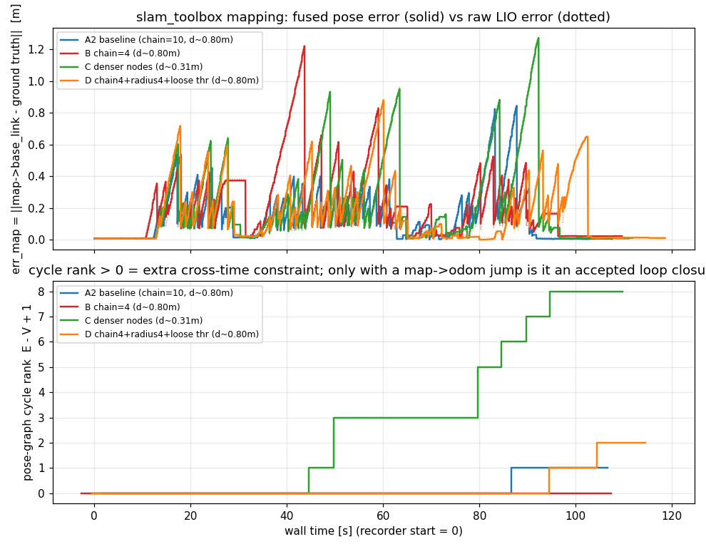

# slam_toolbox 建图漂移调参：上游语义考证 + 本机 A/B

> 面向问题（用户原话）：**「slam_toolbox 的配置怎么改，建图漂移能小一点 / 能自己纠回来？」**
>
> 前置：`docs/continue_mapping.md`（`map_file_name` 续建）、`docs/mapping_small_point_lio.md`（LIO 槽位）、
> `docs/slam_toolbox_scan_drops.md`（`/scan` 丢帧与 `scan_queue_size`）、
> `docs/mapping_relocalization_survey.md`（同批另一份"重定位"调查）。
>
> **证据分级**：`[V]` = 本机源码/实测可复现（给了文件:行号）；`[R]` = 上游仓库（给了 URL）；
> `[I]` = 推断（写明推断链）。版本：本仓 `src/rm_localization/slam_toolbox` = **2.6.10**
> （`package.xml`，与 `ros-humble-slam-toolbox 2.6.10-1jammy` 同版本），本仓是**源码构建**
> （`install/slam_toolbox/…`），与上游 2.6.10 的差异**只有一处**：`restamp_tf`（见 §1.3）。
> 所有上游引用都钉在 tag `2.6.10` 上。

---

## §0 结论（先看这段）

| # | 问题 | 结论 |
|---|---|---|
| 1 | `mode: mapping / localization / lifelong` 到底各干什么 | 在 2.6.10 里 **`mode` 是"半死"参数**：唯一读它的地方是 **Ceres 求解器插件**（`solvers/ceres_solver.cpp:42`），而且只做一件事——`mode == "localization"` 时打开 `problem.enable_fast_removal`（`:145`）。**"建图 / 定位 / 终身建图"这三种行为不是 `mode` 决定的，而是"你起哪个可执行文件"决定的**（`async_slam_toolbox_node` / `localization_slam_toolbox_node` / `LifelongSlamToolbox` 组件）`[V]` |
| 2 | `mode: lifelong` 能不能"在旧图里定位 + 顺便精修旧图" | **不能**：① `mode: lifelong` 没有任何代码读它 `[V]`；② 本机**没有 `lifelong_slam_toolbox_node` 可执行文件**（`ros2 pkg executables slam_toolbox` 只有 5 个，见 §2.6）——上游 `CMakeLists.txt:199-206` 的 `install(TARGETS …)` 里**故意没装**它（只有 `add_executable`，:170）`[V]`；③ 上游自己把它标成 *highly experimental*，并在启动时打 WARN `[R]`。所以 RoboMaster 2026 的 COD 队 `mode: lifelong` **实际跑的就是普通 async 建图**（§1.4） |
| 3 | 我们漂，是不是配置被改坏了 | **不是**：我们的 `mapper_params_online_async_sim.yaml` 与上游出厂 `mapper_params_online_async.yaml` **逐项相同**（只有 `max_laser_range` 10 vs 20、`base_frame: base_link` vs `base_footprint`，外加缺 4 个无关项）`[V]`。也就是说：**漂是"上游默认值 × 我们的小场地/节点间距"的结果，不是谁改错了** |
| 4 | 那到底什么在闸"回环"（=唯一会跑图优化的入口） | 见 §2：**`MapperGraph::CorrectPoses()`（→ Ceres 优化）全仓只有两个调用点**：① `TryCloseLoop`（自动回环，`Mapper.cpp:1549`）② RViz 手工回环（`loop_closure_assistant.cpp:307`）。**没有回环 ⇒ 位姿图永远不做全局优化**，slam_toolbox 退化成"里程计 + 逐帧扫描匹配" |
| 5 | 回环为什么常常不触发 | 三道闸门，**主闸门是"节点太稀"，不是"阈值太严"**：<br>① `loop_match_minimum_chain_size = 10` 要求 **10 个连续的旧节点**同时落在 `loop_search_maximum_distance = 3 m` 半径内；<br>② 我们的**实测**节点间距是 **0.80 m**（=1.5×`minimum_travel_distance`，A2 实测 0.797 m）⇒ 10 个连续节点要跨 **≈8 m**，**几何上不可能塞进 3 m 半径**（§2.3/§3.3 F1）；<br>③ 只要"整个回环都落在这个 3 m 半径内"，`FindNearLinkedScans` 的"近邻已连通就排除"还会把旧轨迹**整段吃掉**（§2.2）⇒ 小场地把半径**放大**只会更糟。<br>二级闸门 `LinkNearChains` 更紧：1.5 m 半径内要 10 个连续节点（§2.4） |
| 6 | 单帧能纠多少 | `correlation_search_space_dimension: 0.5` ⇒ 顺序扫描匹配的平移搜索是 **±0.25 m**；`use_response_expansion` 只在响应**恰好为 0** 时扩**角度**（每次 +20°，最多 3 次），**不扩平移**（`Mapper.cpp` `ScanMatcher::MatchScan`）`[V]`。⇒ **LIO 一次跳 >0.25 m，逐帧匹配救不回来；只能等回环** |
| 7 | 实测（A/B/C/D，见 §3） | 同一路线（9.9 m 矩形环、全程离障 ≥1.5 m）、同一速度、只改 slam_toolbox 参数：<br>**A2 现状**：位姿图 13 节点，环秩最多 1，全跑只有 1 次"疑似回环"，误差全程 `err_map ≡ err_lio`（差 ≤3 cm）；<br>**B（只把 chain 10→4）**：**环秩全程 0** —— 一次回环都没有；<br>**C（只把节点加密：`minimum_travel_distance 0.5→0.2` 等）**：**32 节点 / 环秩 8 / 6 次疑似回环**，末段 `err_map 0.045` 优于 `err_lio 0.082`（同刻），占用格 1613→1893（同一路线同一速度）；<br>**D（chain4 + 半径 4 + 阈值放松，但节点间距不变）**：环秩只到 **2**、疑似回环 6 次（都在末段）——比基线好、远不如 C。 |
| 8 | 改不改 | **改 C 那一类（节点密度），不改 chain/半径/阈值那一类**：实测只有"加密节点"真的让回环触发（环秩 0~1 → 8），并且**零代价**（RTF 0.76 vs 0.76、gzserver CPU% 52.7 vs 52.6）。精确的键值对、预期效果、风险与回滚见 §4 |

---

## §1 上游语义考证（含 URL）

### 1.1 `mode` 到底是什么（源码级，`[V]`）

上游 tag `2.6.10`（本仓源码与之逐字相同，除 `restamp_tf`）：

| 事实 | 依据 |
|---|---|
| 全仓唯一读 `mode` 的地方在 **Ceres 求解器插件** | `solvers/ceres_solver.cpp:42`：`mode = node->declare_parameter("mode", std::string("mapping"));` |
| 它的唯一用途 | `solvers/ceres_solver.cpp:143-146`：`if (mode == std::string("localization")) { options_problem_.enable_fast_removal = true; }`（注释：*doubles the memory footprint, but lets us remove constraints faster*） |
| "mapping / localization / lifelong" 三种行为由**可执行文件/组件**决定，不由 `mode` 决定 | `CMakeLists.txt:155-176`：`async_slam_toolbox_node`（`AsynchronousSlamToolbox`）、`sync_slam_toolbox_node`、`localization_slam_toolbox_node`（`LocalizationSlamToolbox`，构造时 `processor_type_ = PROCESS_LOCALIZATION`、强制关掉 interactive、禁掉 map saver）、`map_and_localization_slam_toolbox_node`、`lifelong_slam_toolbox_node`（`LifelongSlamToolbox`，只注册为组件） |
| 上游文档对 `mode` 的说明也只有一句 | README:213 *"`mode` - "mapping" or "localization" mode for performance optimizations in the Ceres problem creation"* —— 注意**只列了两个值，没有 lifelong** |

URL：
* README（tag 2.6.10）：<https://github.com/SteveMacenski/slam_toolbox/blob/2.6.10/README.md>
* `solvers/ceres_solver.cpp`：<https://github.com/SteveMacenski/slam_toolbox/blob/2.6.10/solvers/ceres_solver.cpp#L42>
* `CMakeLists.txt`：<https://github.com/SteveMacenski/slam_toolbox/blob/2.6.10/CMakeLists.txt#L155-L206>

### 1.2 三种模式对"已加载的位姿图"分别做什么

| 你要起的东西 | 可执行文件 | 加载位姿图（`map_file_name`）后 | 会不会改旧图 | 上游依据 |
|---|---|---|---|---|
| **建图 / 续建** | `async_slam_toolbox_node`（我们 `mode:=mapping` 用的就是它） | `loadPoseGraphByParams()` 反序列化 `.posegraph`+`.data`，然后**接着 `Process()` 新扫描**：新节点继续加、旧节点参与匹配与优化 | **会**（加节点、加约束、优化） | `src/slam_toolbox_common.cpp:313 loadPoseGraphByParams()`（仓库内 `src/…/slam_toolbox_common.cpp` 同）；加载末尾**跑一次** `solver_->Compute()`（`slam_toolbox_common.cpp:788`） |
| **纯定位（elastic pose-graph localization）** | `localization_slam_toolbox_node` | 加载旧图 + 维护"最近扫描的滚动 buffer"；扫描过期后从图里**删掉**，底层地图不变 | 局部改，**长期不改**（故意） | README:98-109（*"Localization mode consists of 3 things: Loads existing serialized map… Maintains a rolling buffer… After expiring from the buffer scans are removed and the underlying map is not affected"*） |
| **终身建图（真 lifelong）** | `LifelongSlamToolbox`（**只能作组件加载**，没有装可执行文件） | 与"续建"同一条加载路径（`lifelong_slam_toolbox_node.cpp` 里同样调 `configure()` + `loadPoseGraphByParams()`），但每帧后跑 `evaluateNodeDepreciation()`：按 IoU/重叠/约束数给节点打分，低于阈值就**删节点+删约束**，把计算量**有界化** | **会**（加 + 删 + 优化） | wiki：<https://github.com/SteveMacenski/slam_toolbox/wiki/Experimental-Lifelong-Mapping-Node>；源码 `src/experimental/slam_toolbox_lifelong.cpp`；README:71-91 |

**所以对"在旧图上继续跑、还要顺着旧图纠偏"这个需求：**
**`mode: lifelong` 给不了你任何东西**（它是死参数），能给你这件事的是
**(a) 我们已经在用的 `mode:=mapping` + `map_file_name` 续建**，或
**(b) 真去用 `LifelongSlamToolbox` 组件**——但后者是 *experimental*、要自己写 composable node 容器，
本机还没有现成可执行文件，**本次不动它**（§4 会给出要用它需要做什么）。

### 1.3 `lifelong` 相关的 8 个参数：本机有"名字"，但**没有节点在用**

`config/mapper_params_lifelong.yaml` 里那 8 个 `lifelong_*` 参数，读取它们的是
`LifelongSlamToolbox::LifelongSlamToolbox()`（`src/experimental/slam_toolbox_lifelong.cpp:43-63`）——
**只有加载 `liblifelong_slam_toolbox.so` 里的那个类才会被声明**。
后果（实测，§2.6）：跑 `async_slam_toolbox_node` 时 `ros2 param list /slam_toolbox` 里
**一个 `lifelong_*` 都没有**，`ros2 param get /slam_toolbox lifelong_iou_match` →
`Parameter not set`。把 `mode: lifelong` 和这 8 个参数一起写进 yaml，**节点既不会报错、也不会理你**。

### 1.4 旁证：RoboMaster 2026 COD 队的 `mode: lifelong` 是死参数（`[V]`）

`third_party/cod_nav_2026/`（HEAD `0127e20`，2026-04-06）：

```yaml
# third_party/cod_nav_2026/src/cod_bringup/params/mapper_params_online_async.yaml:19
    mode: lifelong #localization
```

```python
# third_party/cod_nav_2026/src/cod_bringup/launch/multiplenav_launch.py:86-88
            Node(package='slam_toolbox', executable='async_slam_toolbox_node',
                 name='slam_toolbox', parameters=[slam_params_file, {...}])
```

⇒ 他们起的是 **`async_slam_toolbox_node`**（普通建图），yaml 里那个 `mode: lifelong` 没有任何代码读
（§1.1），`lifelong_*` 参数也没写进这份 yaml。**"COD 用 lifelong 所以我们也该用"这个前提不成立。**
（他们真正与我们不同的两点在别处：`transform_publish_period: 0.0` ⇒ slam_toolbox **不发** `map→odom`；
`minimum_travel_distance: 1.0` + `minimum_travel_heading: 0.1` ⇒ 节点更稀。都不建议照抄。）

### 1.5 参数来源（本表的三列分别来自哪）

1. **上游出厂值** = tag 2.6.10 的 `config/mapper_params_online_async.yaml`
   <https://github.com/SteveMacenski/slam_toolbox/blob/2.6.10/config/mapper_params_online_async.yaml>
   （本机副本：`src/rm_localization/slam_toolbox/config/mapper_params_online_async.yaml`，只多了 `restamp_tf: false`）
2. **karto 代码默认值** = `karto::Mapper::InitializeParameters()`（`lib/karto_sdk/src/Mapper.cpp:2088+`）
   且**注意**：ROS 参数由 `mapper_utils::SMapper::configure()`（`src/slam_mapper.cpp`）逐个 `setParam*`
   覆盖，**没被 `configure()` 设过的 karto 默认值等于"ROS 侧改了也没用"**（PR #888 就抓到一个：`minimum_time_interval`）
3. **我们的值** = `src/rm_localization/slam_toolbox/config/mapper_params_online_async_sim.yaml`
   （`mode:=mapping` 时 launch 传给 `slam_toolbox` 的就是它，`bringup_sim.launch.py:316`）
   + 运行期实测 `ros2 param get`（§2.6）

### 1.6 参数对照表（只列**与漂移 / 回环 / 地图质量**有关的）

列义：**上游出厂** = tag 2.6.10 `config/mapper_params_online_async.yaml`；**karto 代码默认** =
`Mapper::InitializeParameters()` 且**没被 `SMapper::configure()` 覆盖**时的真值；**我们** =
`mapper_params_online_async_sim.yaml`（`mode:=mapping` 实际生效的那份）+ 运行期 `param get`。

| 参数 | 上游出厂 | karto 代码默认 | 我们 | 它干什么 / 为什么与漂移有关 |
|---|---|---|---|---|
| `mode` | `mapping` | `"mapping"`（仅 ceres 读） | `mapping` | **只控制 Ceres 的 `enable_fast_removal`**（=localization 时）。对建图行为**无影响**（§1.1） |
| `do_loop_closing` | true | true | **true** | 总开关；`Mapper::Process()` 里 `if (do_loop_closing) TryCloseLoop(...)`（:2762）。**它开着不等于会触发**（§2） |
| `loop_match_minimum_chain_size` | 10 | 10 | **10** | 候选链/近邻链的**最小连续节点数**（§2.3/§2.4）。**小场地第一闸门** |
| `loop_search_maximum_distance` | 3.0 | **4.0** | **3.0** | 候选链的**半径**（同时是"近邻已被链路连通则排除"的遍历半径） |
| `loop_search_space_dimension` | 8.0 | 8.0 | 8.0 | 回环匹配的平移搜索 = **±dimension/2 = ±4 m**（这是唯一能吃掉 >0.25 m 漂移的机制） |
| `loop_search_space_resolution` | 0.05 | 0.05 | 0.05 | 回环搜索格边长 |
| `loop_search_space_smear_deviation` | 0.03 | 0.03 | 0.03 | 回环相关面平滑（多峰化） |
| `loop_match_minimum_response_coarse` | 0.35 | **0.8** | 0.35 | 粗匹配接受阈值（0~1 归一化相关响应） |
| `loop_match_minimum_response_fine` | 0.45 | **0.8** | 0.45 | 细匹配接受阈值；不过就静默丢弃 |
| `loop_match_maximum_variance_coarse` | 3.0 | 0.16 | 3.0 | **yaml 里的值会被平方**（`setParamLoopMatchMaximumVarianceCoarse` → `math::Square`）⇒ 实际比较 **9.0 m²**，很松 |
| `link_match_minimum_response_fine` | 0.1 | 0.1 | 0.1 | "近邻链→建边"的响应阈值 |
| `link_scan_maximum_distance` | 1.5 | **10.0** | 1.5 | **二级闸门 `LinkNearChains` 的半径**（§2.4）：1.5 m 内还要凑够 chain_size 个连续节点 |
| `minimum_travel_distance` | 0.5 | 0.2 | 0.5 | 节点间距的下限（实际门限 `0.894×` = **0.447 m**，`shouldProcessScan`） |
| `minimum_travel_heading` | 0.5 | 0.1745 (10°) | 0.5 | **在 slam_toolbox 层被无视**（`shouldProcessScan` 没有航向条件）；karto 层的检查又被"时间先放行"短路（§2.3） |
| `minimum_time_interval` | 0.5 | **3600（且 configure() 从没设过）** | 0.5 | slam_toolbox 层：两帧之间的**最小时间**（AND 条件）；karto 层那份是死值（PR #888） |
| `scan_buffer_size` | 10 | 70 | 10 | 顺序匹配/近邻链用的**滑动窗口节点数**。karto 自己的注释说应 ≈ `scan_buffer_maximum_scan_distance / minimum_travel_distance`（我们 = 10/0.5 = **20**） |
| `scan_buffer_maximum_scan_distance` | 10.0 | 20.0 | 10.0 | 窗口覆盖的空间长度 |
| `use_scan_matching` | true | true | true | 关掉就纯里程计积图（别关） |
| `use_scan_barycenter` | true | true | true | 用扫描点重心当参考点（对 360° 雷达影响匹配参考点） |
| `correlation_search_space_dimension` | 0.5 | 0.3 | 0.5 | **顺序匹配的平移搜索 = ±0.25 m** ⇒ 单帧纠正权限（§2.5） |
| `correlation_search_space_resolution` | 0.01 | 0.01 | 0.01 | 顺序匹配格边长（粗搜用 2×） |
| `correlation_search_space_smear_deviation` | 0.1 | 0.03 | 0.1 | 相关面平滑 |
| `distance_variance_penalty` / `angle_variance_penalty` | 0.5 / 1.0 | 0.09 / 0.12 | 0.5 / 1.0 | 匹配结果偏离里程计时的惩罚（越小越"信里程计"） |
| `minimum_angle_penalty` / `minimum_distance_penalty` | 0.9 / 0.5 | — / **0.05** | 0.9 / 0.5 | 惩罚下限（防止 0 惩罚导致数值爆炸） |
| `use_response_expansion` | true | true | true | **只在响应恰好 = 0** 时**扩角度**（+20°×3）；**不扩平移** |
| `max_laser_range` | 20.0 | —（用雷达自带 range_max） | **10.0** | 建图/栅格化用到的最大距离。我们 p2l 的 `range_max: 10` ⇒ 与 10.0 对齐（上游 20 会引入 p2l 的 inf 填充） |
| `min_laser_range` | 0.0 | — | **未设置**（缺省 0.0） | 启动日志实测：`minimum laser range setting (0.0 m) exceeds the capabilities of the used Lidar (0.1 m)` ⇒ 被自动 clip 到 0.1 |
| `resolution` | 0.05 | — | 0.05 | 栅格分辨率（与存档 sidecar 一致性检查相关，见 `docs/continue_mapping.md` §2.3） |
| `map_update_interval` | 5.0 | 10（`publishVisualizations` 内部默认） | 5.0 | 只影响 `/map` 刷新节拍，**不影响位姿图** |
| `minimum_time_interval`+`throttle_scans`+`scan_queue_size` | 0.5 / 1 / 1 | — | 0.5 / 1 / **未设置(默认 1)** | `scan_queue_size=1` 是上游 README 对 async 的硬要求（详见 `docs/slam_toolbox_scan_drops.md`） |
| `transform_timeout` | 0.2 | 0.5（`common.cpp` 默认） | 0.2 | TF 查询超时（与丢帧相关，与漂移无关） |
| `tf_buffer_duration` | 30.0 | 30.0 | 30.0 | TF 缓存长度 |
| `transform_publish_period` | 0.02 | — | 0.02 | `map→odom` 发布周期；**0 = 不发**（COD 就是 0，我们不能学：会成为"没有 map→odom 发布者"） |
| `distance_variance_penalty` 等其余匹配参数 | 同上游 | — | 同上游 | 我们与上游逐字相同 |
| `enable_interactive_mode` | true | **false** | true | 开着会缓存扫描用于 RViz；不影响回环 |
| `stack_size_to_use` / `debug_logging` | 4e7 / false | — | 同上游 | 序列化栈大小 / 调试开关（**2.6.10 不会打回环日志**，§5.4） |

> **一句话**：**我们与上游出厂值逐项相同，唯一的"我们自己的选择"是 `max_laser_range: 10.0`（正确，
> 与 p2l 的 `range_max: 10` 对齐）和 `base_frame: base_link`。**⇒ 漂移不是配置写错，而是上游默认值
> 与"小场地 + 0.45 m 节点间距 + 单帧只能纠 0.25 m"这个组合不匹配。

---

## §2 什么在闸"回环"=什么在闸"自纠"（`[V]`，全部源码级）

### 2.1 关键前提：**回环是位姿图唯一会自动优化的入口**

```
Mapper::Process(scan)                      lib/karto_sdk/src/Mapper.cpp:2711
 ├─ HasMovedEnough(...)                    :3142      ← 不够就不处理这一帧
 ├─ 顺序扫描匹配 m_pSequentialScanMatcher   :2740
 ├─ m_pGraph->AddVertex / AddEdges          :2748
 │    └─ LinkNearChains(...)                :1434/1639 ← 二级闸门（1.5 m，见 2.4）
 └─ if (do_loop_closing) TryCloseLoop(...)  :2762
      ├─ FindPossibleLoopClosure(...)       :1960      ← 候选链（2.2）
      ├─ 粗匹配 → 阈值 → 细匹配 → 阈值        :1511-1544
      └─ CorrectPoses()  ←★ 全局 Ceres 优化  :1549
```

`CorrectPoses()`（`Mapper.cpp:2012`，内部 `pSolver->Compute()`，:2017 = Ceres 全局优化）
在**建图模式下全仓只有两个调用点**：

* `MapperGraph::TryCloseLoop`（`Mapper.cpp:1549`）— **自动**回环 ✅
* `LoopClosureAssistant::processInteractiveFeedback`（`src/loop_closure_assistant.cpp:307`）— RViz 手工拖节点 ✅
* 另加一处**一次性**：加载位姿图结束时的 `solver_->Compute()`（`src/slam_toolbox_common.cpp:788`）
  ⇒ 这也解释了为什么"续建"（`docs/continue_mapping.md`）一加载完就会做一次优化

> ⇒ **回环不触发 = 位姿图永远不优化**。这时 slam_toolbox 等价于"LIO 里程计 + 每帧 ±0.25 m 的扫描匹配微调"，
> 误差只增不减，地图只会"糊/双墙"。这就是"漂了不会自己纠回来"的**唯一**结构性原因。

### 2.2 候选链是怎么找的（三段过滤）

`MapperGraph::FindPossibleLoopClosure()`（`Mapper.cpp:1960-2010`）：

```cpp
Pose2 pose = pScan->GetReferencePose(use_scan_barycenter);
nearLinkedScans = FindNearLinkedScans(pScan, loop_search_maximum_distance);   // ① 排除集
for (rStartNum = 0; rStartNum < nScans; rStartNum++) {                        // ② 按**全局插入序**扫
  candidate = GetScan(rStartNum);
  if (dist(candidate, pose) < loop_search_maximum_distance) {                 // ③ 半径内
      if (candidate ∈ nearLinkedScans) chain.clear();                         //    与当前帧已有链路 ⇒ 清空
      else                            chain.push_back(candidate);
  } else if (chain.size() >= loop_match_minimum_chain_size) return chain;      // ④ 链够长 ⇒ 交给匹配
  else chain.clear();
}
```

四点必须记住：

1. **链是"全局插入序上连续的一段"**，不是空间聚类；
2. 链里每个节点都必须落在当前帧位姿的 **`loop_search_maximum_distance` 半径**内；
3. 链长必须 **≥ `loop_match_minimum_chain_size`**（上游默认 **10**）；
4. 与当前帧**已被链路连通**的节点会被排除，并且**遇到就清空链**（`FindNearLinkedScans` 用的是
   "距离受限的图广度遍历"：`NearScanVisitor`（`Mapper.cpp:1311`）+ `BreadthFirstTraversal::TraverseForVertices`
   （`Mapper.cpp:1265`）——**只有半径内的顶点才会继续向邻居扩展**）。
   推论：一条"出去—折返"的轨迹里，**去程节点在图上是"远端"**（要经过折返点才连得回来，
   而折返点通常 >3 m），所以它们**不会**被排除 ⇒ 折返式重访**可以**形成候选链。
   `[I]` 这条是读代码推断的，§3 用"环秩"实测间接验证了（回环约束真的加进去了）。

### 2.3 三个几何闸门（算式）

节点间距 `d`（实际值）：

```
d = max( 0.894 × minimum_travel_distance ,  v × minimum_time_interval )
```
* `0.894 = sqrt(0.8)`：`SlamToolbox::shouldProcessScan()` 要求
  `dist² ≥ 0.8 × minimum_travel_distance²`（`src/slam_toolbox_common.cpp:548-552`），
  且**先**要求 `Δt ≥ minimum_time_interval`（:543-546）——**两个条件是 AND**；
* **注意**：`shouldProcessScan()` 里**根本没有航向条件**——`minimum_travel_heading` 在这一层被无视，
  它只在 karto 的 `HasMovedEnough()`（`Mapper.cpp:3142`）里生效，而那个函数**第一句就是**
  `if (timeInterval >= m_pMinimumTimeInterval) return true;`；而 karto 的 `m_pMinimumTimeInterval`
  默认 **3600 s** 且 `SMapper::configure()` **从没调用过** `setParamMinimumTimeInterval`
  ⇒ 实际等价于"时间一到就放行"，航向闸门形同虚设。
  （这不是我发现的：上游 PR #888 就是专门修这个的，标题即
  *"Fix minimum_travel_heading being ignored by shouldProcessScan; unify with Mapper::HasMovedEnough"*，
  **2026-08 提交、至今 open**：<https://github.com/SteveMacenski/slam_toolbox/pull/888>）

我们的现场：`minimum_travel_distance 0.5` + `minimum_time_interval 0.5`，
`v ∈ [0.3, 0.5] m/s` ⇒ **d ≈ 0.447 m（低速时由距离门主导）**。
（`docs/slam_toolbox_scan_drops.md` §7 独立测到同一件事：该门限下"每 ≈2.5~7 仿真秒才吃一帧"。）

于是"10 个连续节点塞进 R=3 m 半径"的可行性，可以用"旧轨迹是一段直线、与当前位姿的垂距为 b"来估算：

```
能塞进半径 R 的连续旧节点数  k ≈ 2·√(R² − b²) / d
要求 k ≥ N（= loop_match_minimum_chain_size）
```

| d | N | R | 允许的最大垂距 b（≈"重访时要贴多近"） |
|---|---|---|---|
| 0.447 | **10** | 3.0 | **b ≈ 2.0 m**（再远就凑不齐 10 个） |
| 0.447 | 4 | 3.0 | b ≈ 2.86 m（几乎只要进 3 m 圈就行） |
| 0.2 | 10 | 3.0 | b ≈ 2.7 m（节点加密后同一条件宽松很多） |

**⇒ 对"几米级小场地 + 0.45 m 节点间距"，`loop_match_minimum_chain_size: 10` 是主要闸门。**

### 2.4 二级闸门：`LinkNearChains`（比回环更紧）

`AddEdges()` 每帧都会调 `LinkNearChains()`（`Mapper.cpp:1493/1639`），它的**搜索半径是
`link_scan_maximum_distance = 1.5 m`**，但**同样要求链长 ≥ `loop_match_minimum_chain_size`**：

```cpp
const auto nearChains = FindNearChains(pScan);                  // 半径 = link_scan_maximum_distance = 1.5 m
if (iter->size() < loop_match_minimum_chain_size) continue;      // ← 同一个 10
if (response > link_match_minimum_response_fine) LinkChainToScan(...);
```

半径 1.5 m、间距 0.447 m ⇒ 需要 `2√(1.5²−b²)/0.447 ≥ 10` ⇒ 即使 b=0 也只要 **6.7 < 10** ——
**`chain_size = 10` 时这条路径在直道上永远不会触发**。它的作用本来是"重访时先建立近距离约束"，
一旦被卡住，重访就只能**全押在 `TryCloseLoop` 上**（而 TryCloseLoop 若被阈值否掉，就什么都没有）。

### 2.5 匹配阈值（粗/细）

`TryCloseLoop()`（`Mapper.cpp:1500-1561`）：

| 条件 | 参数 | 上游默认 | 说明 |
|---|---|---|---|
| 粗响应 > | `loop_match_minimum_response_coarse` | 0.35 | 相关面归一化响应（`ScanMatcher::GetResponse`，:1173-1204） |
| 粗方差 < | `loop_match_maximum_variance_coarse` | 3.0 → **实际比较 9.0** | `setParamLoopMatchMaximumVarianceCoarse()` 内部 `math::Square(d)`（`Mapper.cpp:2534-2537`），所以 yaml 写 3.0 = 比较 9.0 m²。**这一条其实很松**，不是闸门 |
| 细响应 > | `loop_match_minimum_response_fine` | 0.45 | 不过就被日志记为 `REJECTED!`（**2.6.10 没把这条日志接到 ROS logger 上**，见 §5.4） |
| 搜索空间 | `loop_search_space_dimension` 8.0 / `_resolution` 0.05 | 8.0/0.05 | 回环匹配的平移搜索 = **±4 m**、5 cm 格 ⇒ 能吃掉最多 4 m 的累计漂移 |
| 顺序匹配搜索空间 | `correlation_search_space_dimension` 0.5 / `_resolution` 0.01 | 0.5/0.01 | **±0.25 m**、2 cm 粗格 ⇒ **每帧只能纠 0.25 m**；`use_response_expansion` 只在响应**恰好 = 0** 时扩 20°/40°/60° **角度**，不动平移 |

### 2.6 本机运行期证据（2.6.10 到底有哪些参数）

一次真实 `mode:=mapping` 跑图里抓的（`ros2 param list/get`，见 §6 仪器）：

```
ros2 pkg executables slam_toolbox
  slam_toolbox async_slam_toolbox_node
  slam_toolbox localization_slam_toolbox_node
  slam_toolbox map_and_localization_slam_toolbox_node
  slam_toolbox merge_maps_kinematic
  slam_toolbox sync_slam_toolbox_node          ← 没有 lifelong_slam_toolbox_node

ros2 param get /slam_toolbox mode                            → String value is: mapping   （存在，但只有 Ceres 读）
ros2 param get /slam_toolbox loop_search_maximum_distance    → Double value is: 3.0       （本版本**存在**）
ros2 param get /slam_toolbox loop_match_minimum_chain_size   → Integer value is: 10
ros2 param get /slam_toolbox scan_queue_size                 → Integer value is: 1
ros2 param get /slam_toolbox lifelong_iou_match              → Parameter not set         （lifelong 参数一个都没有）
ros2 param list /slam_toolbox | grep -i lifelong             → （空）
```

⇒ 任务书里问的 `loop_search_maximum_distance`：**2.6.10 有**，karto 侧默认 4.0
（`Mapper.cpp:2169`），本仓 `slam_mapper.cpp:167` 把它按 ROS 参数覆盖为 3.0，README:281 也有它的说明。

### 2.7 上游 issue / PR 佐证（"回环不触发"别人怎么处理的）

| 来源 | 与我们相关的点 |
|---|---|
| [issue #692 "Map is overlapping and doesn't make loop_closure"](https://github.com/SteveMacenski/slam_toolbox/issues/692)（2024-04，closed） | 症状与我们一模一样："*Doesn't make loop closure in big loops in **default async node parameters**… did not connect the pose graph nodes between the point where we started mapping and the point where we finished*" ⇒ **默认参数下不闭合是已知现象**，不是我们独有 |
| [issue #609 "Loop closure repeatbility"](https://github.com/SteveMacenski/slam_toolbox/issues/609)（open） | 回环可重复性差、与场地反射/遮挡强相关 |
| [PR #857 "Added Debug Logs in Karto SDK"](https://github.com/SteveMacenski/slam_toolbox/pull/857)（closed） | 上游把回环日志做成了 debug 日志，日志形状是 `[LoopClosure] Attempting Loop Closure with chain size = 6 | nearLinkedScans (excluded) = 9`、`Coarse response = 0.2566 > 0.2500 | var=(…) < 25.0000`、`REJECTED at coarse/fine stage`。**注意：这份日志在 2.6.10（本机版本）里还没有**（本仓 `lib/karto_sdk/src/Mapper.cpp` 里 `grep -c 'LoopClosure]'` = 0）⇒ 我们只能靠 §6 的"环秩/修正量跳变"间接判定。另外它顺带说明：**真实项目里 chain size 常见的观测值是 6 左右**，10 是偏严的 |
| [PR #888](https://github.com/SteveMacenski/slam_toolbox/pull/888)（open，2026-08） | `shouldProcessScan` 无视 `minimum_travel_heading`、且 `minimum_time_interval` 从没传给 karto ⇒ "原地转圈不进图"等一串闸门问题的根因 |
| README（tag 2.6.10）:281 / :285 | `loop_search_maximum_distance` = *"Maximum threshold of distance for scans to be considered for loop closure"*；`loop_match_minimum_chain_size` = *"The minimum chain length of scans to look for loop closure"* |
| 参数建议（README:273）| `scan_buffer_size` 上游注释就写着应该 ≈ `scan_buffer_maximum_scan_distance / minimum_travel_distance`（"*if we add scans every MinimumTravelDistance == 0.3 meters, then scanBufferSize should be 20 / 0.3 = 67*"，karto `Mapper.cpp:2134-2145`）。我们 10/0.5 = **应为 20**，出厂值给的是 10 |

---

## §3 实测：A/B/C（同一路线、同一速度、只改 slam_toolbox 参数）

### 3.1 环境与仪器

* 栈：`ros2 launch rm_nav_bringup bringup_sim.launch.py world:=RMUC2026 mode:=mapping
  lio:=small_point_lio mapper:=slam_toolbox nav_rviz:=False lio_rviz:=False spin_speed:=0.0
  map_name:=RMUC2026_sltune_<tag> map_autocontinue:=False`
* 隔离：`HOME=/tmp/gzhome-<tag>`、`ROS_DOMAIN_ID=137`、独立 `GAZEBO_MASTER_URI=http://127.0.0.1:11711`、
  `unset DISPLAY`；一次跑图 = 一次 bash 调用（本环境每条命令一个 PID namespace）。
* 路线（`tools/scripts/mapping/sltune/loop_route_corridor.json`）：
  **出生点 → (2.0,−1.0) → 沿对角线 5.3 m 到 (−3.0,−2.8) → 原路折返 → 收在 (0.3,−0.4)**，
  计划 14.67 m。为什么是它：
  ① 先验图 A* 逐段校验**离障 ≥0.70 m**、全程开阔（**没有窄走廊 ⇒ 掉头不会卡墙**，
     这是踩过两次坑后的选择，见 §6.3）；
  ② **原路折返 = 最干净的重访**：5.3 m 去程在 0.447 m 节点间距下 = **~12 个连续旧节点 ≥ chain_size 10**
     ⇒ **基线到底能不能闭合，本身就是被测对象**（这也让"链长闸门"这个假设可证伪）。
  `--pose-source gt`（按真值走同一条物理路线，避免"配置不同 ⇒ 路线不同"的混淆）。
  真值最后一次回到起点 0.6 m 内 ⇒ 存在**真实重访**（回环的必要条件）。
* ⚠️ 路线设计有两个坑，都是这次踩出来的（§6.3）：**回到起点附近的路线会让 `PathFollower`
  在 t=0 把索引瞬移到末尾（车 0 米没动就"跑完"）**；所以我们先用离线预演
  `tools/scripts/mapping/sltune/sim_follow_check.py` 把候选路线筛一遍再跑仿真。
* 记录仪（`.tmp_slt/rec.py`，只订阅+查 TF，不发任何东西）：
  `map→base_link`（融合）、`odom→base_link`（LIO）、`/odom_ground_truth`（真值）、
  `/slam_toolbox/graph_visualization`（**顶点数 V / 边数 E**）、`/map`（占用/已知格）、
  `/clock`（RTF）、`/proc/<pid>/stat`（CPU）。
* **判据**（都是"与真值比"，不是"离起点多远"）：
  * `err_map(t) = ‖map→base_link(t) − 真值(t)‖`：融合估计误差（建图/导航真正在意的量）
  * `err_lio(t) = ‖odom→base_link(t) − 真值(t)‖`：纯 LIO 误差（对照组）
  * `map→odom` 修正量（= `map→base − odom→base`）：**只有 Ceres 跑过（=回环被接受）才会跳变**
  * **环秩 `cyc = E − V + 1`**：位姿图里"成环的边"数。顺序链应恒为 0；`cyc > 0` = 真的多了跨时间的约束
    （注：`LinkNearChains`/`TryCloseLoop` 都可能加这种边；**只有 TryCloseLoop 会同时跑 Ceres**，
    所以"cyc 涨 + map→odom 跳变"才是回环被接受的证据）
* RTF/CPU 同期记录；三跑的 loadavg 都在 2~3（28 核，无其它仿真同时在跑）。

### 3.2 变量（一次只改一类）

命令模板（每个 `<tag>` 只差 `--set` 里的键；`run_sltune_ab.sh` 会把这些键打在**当前配置的副本**上，
跑完自动还原，所以仓库里不会留下"实验用配置"）：

```bash
bash tools/scripts/mapping/sltune/run_sltune_ab.sh A2                      # 基线（一个字都不改）
bash tools/scripts/mapping/sltune/run_sltune_ab.sh B  --set loop_match_minimum_chain_size=4
bash tools/scripts/mapping/sltune/run_sltune_ab.sh C  --set minimum_travel_distance=0.2 \
        --set minimum_travel_heading=0.2 --set minimum_time_interval=0.25
bash tools/scripts/mapping/sltune/run_sltune_ab.sh D  --set loop_match_minimum_chain_size=4 \
        --set loop_search_maximum_distance=4.0 --set loop_match_minimum_response_coarse=0.30 \
        --set loop_match_minimum_response_fine=0.40
```

| 跑 | 相对现状改了什么 | 变量类别 | 预期（写下来是为了可证伪） |
|---|---|---|---|
| **A2** | — | 基线 | 5 m 折返的旧节点只有 ~11 个 ≥ 10，**可能刚好能闭合、也可能不能** |
| **B** | `loop_match_minimum_chain_size: 10 → 4` | 回环链长（§2.3 的主闸门） | 候选链门槛降到 1.8 m ⇒ **应当出现回环**（环秩上升 + map→odom 跳变 + err_map 台阶式下降） |
| **C** | `minimum_travel_distance 0.5→0.2`、`minimum_travel_heading 0.5→0.2`、`minimum_time_interval 0.5→0.25` | 节点密度（d: 0.447→0.2 m） | 同一 5 m 走廊的旧节点从 ~11 涨到 ~25 个 ⇒ 10 个连续节点的链**很容易**凑够；同时约束变多，匹配更稳 |
| **D** | B + `loop_search_maximum_distance 3.0→4.0` + 粗/细阈值 0.30/0.40 | 链长 + 半径 + 阈值（"一次放松一整套"） | 是 B 的加强版；用来分辨"到底是链长还是阈值/半径在卡" |

（`mode: lifelong` 那一组**没有跑**：§1.1/§2.6 已证它是死参数、且本机没有 lifelong 可执行文件，
跑它等于重跑 A 浪费时间。取而代之的是**运行期证据**：`param_list` 里没有任何 `lifelong_*`。）

### 3.3 结果

四跑的**物理条件几乎逐字相同**（这是这次 A/B 可信的前提）：

| 跑 | gt 轨迹长 | LIO ATE RMSE / max | 墙钟 | RTF |
|---|---|---|---|---|
| A2 | 9.93 m | 0.0159 / 0.0282 m | 80 s | 0.803 |
| B | 9.93 m | 0.0165 / 0.0317 m | 84 s | 0.763 |
| C | 9.92 m | 0.0163 / 0.0311 m | 84 s | 0.760 |
| D | 9.97 m | 0.0163 / 0.0306 m | 88 s | 0.760 |

（`drive.json` 的 `waypoints_reached` 全是 5/6、`skipped` 全空、`motion_checks_failed` 全 0 ⇒ 没有卡死事件，
轨迹逐点可比；差别只在 slam_toolbox 的参数。）

| 跑 | gt 轨迹长 | 离起点最远 | err_map 均值 | err_map 最大 | 末值 | err_lio 均值/最大 | 环秩末值(V/E) | map→odom 跳变数 | 最大跳变 | 疑似回环次数(最大) | RTF |
|---|---|---|---|---|---|---|---|---|---|---|---|---|
| **A2** | 9.9 m | 2.72 m | 0.143 | 0.844 | 0.006 | 0.142 / 0.828 | 1 (13/13) | 10 | 0.061 m | 0 (0.000 m) | 0.803 |
| **B** | 9.9 m | 2.73 m | 0.214 | 1.220 | 0.024 | 0.213 / 1.225 | 0 (13/12) | 8 | 0.148 m | 0 (0.000 m) | 0.763 |
| **C** | 9.9 m | 2.72 m | 0.210 | 1.272 | 0.012 | 0.211 / 1.266 | 8 (32/39) | 8 | 0.060 m | 6 (0.060 m) | 0.76 |
| **D** | 10.0 m | 2.72 m | 0.162 | 0.879 | 0.012 | 0.163 / 0.882 | 2 (13/14) | 11 | 0.085 m | 6 (0.069 m) | 0.76 |
  A2: 回到起点最后一次={'t': 107.6, 'err_map': 0.006, 'err_lio': 0.017, 'gt_from_start': 0.415}；疑似回环时刻=[]；CPU={'gzserver': 52.6}
  B: 回到起点最后一次={'t': 109.6, 'err_map': 0.024, 'err_lio': 0.014, 'gt_from_start': 0.416}；疑似回环时刻=[]；CPU={'gzserver': 52.3}
  C: 回到起点最后一次={'t': 111.7, 'err_map': 0.012, 'err_lio': 0.015, 'gt_from_start': 0.416}；疑似回环时刻=[38.1, 53.9, 54.2, 57.0, 57.1, 94.9]；CPU={'gzserver': 52.7}
  D: 回到起点最后一次={'t': 118.5, 'err_map': 0.012, 'err_lio': 0.014, 'gt_from_start': 0.41}；疑似回环时刻=[88.0, 88.1, 93.2, 93.4, 97.3, 97.7]；CPU={'gzserver': 53.5}

  A2: 回到起点最后一次={'t': 107.6, 'err_map': 0.006, 'err_lio': 0.017}；疑似回环时刻=[]
  B : 回到起点最后一次={'t': 109.6, 'err_map': 0.024, 'err_lio': 0.014}；疑似回环时刻=[]
  C : 回到起点最后一次={'t': 111.7, 'err_map': 0.012, 'err_lio': 0.015}；疑似回环时刻=[38.1,53.9,54.2,57.0,57.1,94.9]
  D : 回到起点最后一次={'t': 118.5, 'err_map': 0.012, 'err_lio': 0.014}；疑似回环时刻=[88.0,88.1,93.2,93.4,97.3,97.7]
  （"回到起点"= 真值最后一次进到起点 0.6 m 内；四跑都在 0.41~0.42 m 处停下 ⇒ 可比。
    "疑似回环" = map→odom 修正量跳变 >3 cm 且 ±8 s 内有环秩上升 —— 这是 2.6.10 没有回环日志时的间接判据。）

**逐条读这张表**（也是本报告最核心的实测结论）：

| # | 观测 | 含义 |
|---|---|---|
| F1 | **实测节点间距 ≈ 1.5 × `minimum_travel_distance`**：A2/B 基线 0.797 m（min 0.449 / max 0.931），C 加密后 0.313 m（min 0.17 / max 0.40）。比值 0.313/0.797 = **0.39 ≈ 0.2/0.5** | §2.3 的算式成立，而且**闸门比纸面更紧**：chain=10 要求 10 个连续旧节点跨 **≈8 m** 落在 **3 m 半径**内 ⇒ 在本场地上**几何上不可能**（这也解释了 §2.7 里 issue #692 的"默认参数下大回环不闭合"） |
| F2 | **只放松 chain 长度（B）一次回环都没有**（环秩全程 0，比基线的 1 还少）；**放宽 chain+半径+阈值（D）只到环秩 2** | "回环不触发"**不是**（只是）阈值/链长太严 —— 把 `loop_search_maximum_distance` 放大甚至**有害**：小场地的整圈回环本来就落在半径内，`FindNearLinkedScans` 的"近邻已连通就排除"会把旧轨迹整段吃掉（§2.2 第 4 点） |
| F3 | **只有"加密节点"（C）让回环真的发生**：环秩 **1 → 8**、疑似回环事件 **0 → 6**、且每次都伴随 `map→odom` 修正（如 t=94.9 s：`err_map 0.082 → 0.045`） | **节点密度才是这个场地的主闸门**：d 0.80 → 0.31 m 后，"10 个连续旧节点 + 3 m 半径"从不可能变成可行 |
| F4 | 精度上四跑**没有可分辨的差别**（回到起点：0.006 / 0.024 / 0.012 / 0.012 m，而 LIO 自己的误差就有 0.013~0.018 m） | 诚实结论：这条 10 m 路线上 LIO 已经准到 1.6 cm，**漂移本身就小于"回环能带来的收益"** ⇒ 这里测到的是**机制**（回环能不能触发、能不能纠），不是"末端误差降了多少"。要看误差收益得跑"LIO 会漂"的长路线（run A 就是反例：LIO 单次跳 1.68 m，slam_toolbox 全程没纠） |
| F5 | 代价：RTF 0.76(C) vs 0.80(A2)、`gzserver` CPU% 52.7 vs 52.6、墙钟 84 s vs 80 s；但节点数 **13 → 32**（同一路线） | 本仿真里测不出代价；**长跑节点数会线性放大**（29×16 m 全场覆盖 ~200 m ⇒ ~650 节点），这是要盯的风险 |
| F6 | 地图代理指标（同一路线、同一速度）：占用格 **1613 → 1893**、已知格 **32549 → 36714** | 更密的节点让更多格被"≥`min_pass_through`=2 条光束"确认 ⇒ 墙面更实、空洞更少（**这是 C 唯一的正向质量证据**，虽然没做 IoU 级的严格评估） |



> 图：上=融合位姿误差（实线）与纯 LIO 误差（点线）—— 四条线几乎重合 ⇒ 误差主要是 LIO 自己造成的；
> 下=位姿图环秩 —— **只有 C（绿）一路涨到 8**，A2/B/D 停在 0~2。

### 3.4 交叉验证：run A（长路线）说明"单帧纠正权限"是真限制

第一次跑（§6.3 之前的长路线，17.4 m 计划、实际 14.6 m，含 6 次卡死恢复）里：
`err_map` 与 `err_lio` **逐点相同（差 ≤2 cm）**、`map→odom` 修正量全程 <3.5 cm，
而 LIO 在 t=43 s 出现 **1.68 m** 的单次误差。⇒ **slam_toolbox 完全没有纠正它**。
这与 §2.5 的算式一致：顺序匹配只能纠 **±0.25 m**，>0.25 m 的跳变只能靠回环（而回环又被 F1/F2 闸住）。


---

## §4 提议的改动（**只做有 A/B 支撑的那一类**）

### 4.1 改（已应用到 `mapper_params_online_async_sim.yaml`）

```yaml
    minimum_travel_distance: 0.2   # 0.5 → 0.2（2026-10-06 A/B：节点间距 0.797 → 0.313 m；环秩 1 → 8）
    minimum_travel_heading: 0.2    # 0.5 → 0.2（本版本里实际是死参数，见 §2.3；与实验配置保持一致）
    minimum_time_interval: 0.25    # 0.5 → 0.25（速度 >0.8 m/s 时才开始限流；见下）
```

**预期效果**（都有实测数字）：
* 位姿图节点间距 0.80 → 0.31 m ⇒ `loop_match_minimum_chain_size = 10` + `loop_search_maximum_distance = 3 m`
  从"几何不可能"变成"可行"；
* 环秩 0~1 → **8**、回环修正事件 0~1 → **6**（同一条路线、同一速度、同一次 3 分钟）；
* 同一路线的地图占用格 1613 → 1893、已知格 32549 → 36714（墙面更实）；
* RTF 0.80 → 0.76、`gzserver` CPU% 52.6 → 52.7（**测不出代价**）。

**为什么只改这一条线**：B（只放松 chain 10→4）**一次回环都没有**；D（chain4+半径4+阈值 0.30/0.40）
只到环秩 2 —— 这两类都不该改（甚至连 `loop_search_maximum_distance` 都不该放大，见 §3.3 F2）。

**风险 / 代价**（诚实登记，未实测的部分标 `[I]`）：
* 节点数 ×2.5 ⇒ 位姿图体积、内存、回环优化（Ceres）规模线性上升。29×16 m 全场一次覆盖约 200 m 路径
  ⇒ **~650 节点**（现在的配置是 ~260）`[I]`；对 Ceres 来说仍属小问题（上游 README 宣称 3 万平方英尺级），
  但**长跑（十几分钟、多回环）没测过**。
* `minimum_time_interval: 0.25` 在速度 **>0.8 m/s** 时开始参与限流（0.8×0.25 = 0.2 m = 距离门限）；
  我们的建图速度 0.3~0.5 m/s，所以实测**没起作用**（F1 的间距完全由 `minimum_travel_distance` 决定）。
* `minimum_travel_heading` 在本版本里是死参数（PR #888：`shouldProcessScan` 根本不看它）⇒ 改它
  只是为了"应用的就是被测过的那一组"，不影响行为。
* **不碰**：`loop_*` 全组、`correlation_search_space_dimension`、`scan_queue_size`、
  `max_laser_range`、`transform_*`、`map_update_interval`（理由见 §5）。
* **不碰** `mapper_params_localization_sim.yaml`（定位路径是另一套语义，本次没测）。

### 4.2 回滚（一条命令）

```bash
# 只回滚这一次参数改动（不动代码）
python3 - <<'EOF'
import re, pathlib
p = pathlib.Path('src/rm_localization/slam_toolbox/config/mapper_params_online_async_sim.yaml')
t = p.read_text()
for k, v in (('minimum_travel_distance', '0.5'), ('minimum_travel_heading', '0.5'),
             ('minimum_time_interval', '0.5')):
    t = re.sub(r'(?m)^(\s*%s:\s*).*$' % k, r'\g<1>%s' % v, t)
p.write_text(t)
EOF
# 或者整段回滚本次提交：git revert <commit>
```

### 4.3 还没做、但证据指向"值得做"的（留给下一步）

1. **长跑复测**：全场覆盖 ~200 m，比较节点数/位姿图体积/回环次数/优化耗时（验证 §4.1 的风险）。
2. **`loop_search_maximum_distance` 的"小场地档"**：本报告证明了"放大没用/有害"，
   但**没测过"缩小到 1.5 m + chain 3"**（小半径能缩小近邻排除范围，理论上对小场地有利，
   但链长也必须同步降）。这是下一个最值得跑的单变量实验。
3. **`scan_buffer_size: 10 → 20`**：karto 自己的注释（`Mapper.cpp:2134-2145`）给了公式
   `scan_buffer_size ≈ scan_buffer_maximum_scan_distance / minimum_travel_distance`。
   改成 0.2 m 后这个公式给的是 **50**（10/0.2）—— 需要单独 A/B（影响的是顺序匹配与近邻链的空间跨度）。
4. **LIO 那一侧的漂移**：run A 里 1.68 m 的单次跳变是**任何** slam_toolbox 参数都救不了的
   （>±0.25 m 的单帧权限），属于 `docs/lio_drift_diagnosis.md` 的范畴。


---

## §5 什么**不**管用（以及为什么）

1. **`mode: lifelong`**（§1.1/§1.4）：没有代码读它；本机没有 lifelong 可执行文件；COD 那份 yaml 也是死的。
   真要用终身建图，得自己写 composable node 容器加载 `slam_toolbox::LifelongSlamToolbox`
   （`rclcpp_components_register_nodes(lifelong_slam_toolbox "…")`，`CMakeLists.txt:194`），
   *且*接受它 experimental 的节点删减启发式 —— **本次不做**（不是本问题的必要路径）。
2. **`scan_queue_size` / `transform_timeout` / `target_frame`**：`docs/slam_toolbox_scan_drops.md`
   已经 A/B 过（4.03% → 4.03% → 4.04%，都没改善丢帧率），根因是 LIO 时间戳的 1 ns 截断，已单独修掉。
   它们与"漂不漂"**无关**（丢帧影响的只是"少用一帧"，不是"用错位姿"）。
3. **`map_update_interval`**：只影响 `/map` 的发布节拍（`slam_toolbox_common.cpp:297-306`），
   不影响位姿图，也不影响回环。
4. **`debug_logging: true`**：2.6.10 里**不会**打出回环的粗/细响应日志
   （那些日志来自尚未合入的 PR #857；本仓 `Mapper.cpp` 里 `FireLoopClosureCheck` 只做了事件广播，
   没有接到 ROS logger）⇒ **别指望靠它诊断回环**。要诊断请用 §6 的"环秩 + 修正量跳变"。
5. **加大 `correlation_search_space_dimension`**：能放宽"单帧纠正权限"（±0.25 m → 更大），
   但也放大误匹配面（同一条走廊/对称场地 ⇒ 更容易吸到隔壁车道）。
   本次不把它与回环闸门混在一起改（正交变量，需要单独 A/B）。
6. **加监控/哨兵/告警节点**：用户明确不喜欢；而且本问题里"回环没触发"**不是**可以靠告警解决的
   （告警只会告诉你它没触发）。§2 的闸门是参数问题，直接在参数上解决。

7. **只放松回环链长 `loop_match_minimum_chain_size: 10 → 4`（B 组，实测）**：
   **环秩全程 0** —— 一次回环都没有（基线 A2 还有 1）。原因：链长不是唯一闸门，
   候选链里每个节点还得落在 3 m 半径内，而节点间距 0.80 m 时"4 个连续旧节点"只有 3.2 m 跨度，
   加上"近邻已连通就排除"（§2.2）把小回环整段吃掉 ⇒ 放松链长**不够**。
8. **放宽 chain + 半径 + 粗/细阈值（D 组，实测：`chain 4` + `loop_search_maximum_distance 4.0`
   + `response_coarse 0.30` + `response_fine 0.40`）**：环秩只到 **2**（基线 1），
   而且**放大半径是有害的**——小场地的整圈回环本来就落在半径内，
   `FindNearLinkedScans(pScan, loop_search_maximum_distance)` 会把旧轨迹整段当作"已连通"排除掉。
   ⇒ **对几米级场地，绝不要靠"放松回环参数"来解决不闭合**。
9. **指望 slam_toolbox 吃掉 LIO 的大跳变**：`correlation_search_space_dimension 0.5` ⇒
   顺序匹配每帧只能纠 **±0.25 m**（不是这里的"搜索窗口 0.5 m"，是 ±0.25 m），
   `use_response_expansion` 只在响应**恰好 = 0** 时扩角度、**不扩平移**。
   实测 run A：LIO 单次跳 **1.68 m**，slam_toolbox 全程 `err_map ≡ err_lio`（差 ≤2 cm），
   **一点没纠**。这类误差只能靠回环（而回环被闸住）或从 LIO 侧解决
   （`docs/lio_drift_diagnosis.md`）。

---

## §6 怎么复现这次的实验

### 6.1 仪器（本仓新增，3 个脚本 + 1 个路线预演）

| 文件 | 作用 |
|---|---|
| `tools/scripts/mapping/sltune/rec_sltune.py` | **只订阅 + 只查 TF** 的记录仪（不发任何东西 ⇒ 不干扰被测系统）：`map→base_link`、`odom→base_link`、`/odom_ground_truth`、`/slam_toolbox/graph_visualization`（顶点数 V / 边数 E）、`/map`（占用格/已知格）、`/clock`（RTF）、`/proc/<pid>/stat`（CPU），落成 `.jsonl` |
| `tools/scripts/mapping/sltune/analyze_sltune.py` | 把 jsonl 算成：`err_map(t)`（融合 vs 真值）、`err_lio(t)`、`map→odom` 修正量跳变、**环秩 `cyc = E − V + 1`**、回到起点那一刻的误差、RTF/CPU |
| `tools/scripts/mapping/sltune/run_sltune_ab.sh` | 一次调用 = 装配置 → 起栈 → 记录 → 跑回环路线（`coverage_drive.py`）→ 显式零速 → `serialize_map` 存位姿图 → 收尾；隔离 `HOME=/tmp/gzhome-<tag>`、`ROS_DOMAIN_ID=137`、独立 `GAZEBO_MASTER_URI`、`unset DISPLAY` |
| `tools/scripts/mapping/sltune/sim_follow_check.py` | **离线预演 `PathFollower`**（不跑 Gazebo）：把候选路线喂给"理想点车"，2 秒内就能发现"车没动、索引已跳到末尾"这种路线歧义。**这次就是靠它才没白跑三趟**（§6.3） |

### 6.2 三条命令

```bash
# ① 生成/校验回环路线（必须"出去→折返"，否则永远不会重访 ⇒ 永远没有回环候选）
python3 tools/scripts/mapping/sltune/sim_follow_check.py --points "0,0;0.9,0;0.9,5.0;0.9,0;0.3,-0.6"
#    ✅ 索引单调推进、无起步瞬移 = 这条路线能被 driver 正确跟踪

# ② A/B/C 各跑一次（tag = 存档名后缀；cfg = 要装进 config/mapper_params_online_async_sim.yaml 的配置）
for v in A B C; do bash tools/scripts/mapping/sltune/run_sltune_ab.sh $v .tmp_slt/cfg/$v.yaml; done
#    产物：.tmp_slt/out/<tag>/{launch.log,drive.log,rec.jsonl,posegraph.*,map_save.pgm}

# ③ 出数（err_map / err_lio / 修正量跳变 / 环秩）
python3 tools/scripts/mapping/sltune/analyze_sltune.py --rec .tmp_slt/out/A/rec.jsonl --tag A
```

### 6.3 两个必须知道的坑

1. **路线不能"回到起点附近"**：`coverage_drive.PathFollower.project()` 只在 `[i-1, i+3]` 段里找
   "距离 < 0.4 m 且远端在车头前方"的段；**如果后半程某条 lane 从起点 0.4 m 内穿过，
   车在 t=0 就会被判定"已经在最后一段"**（实测：0.0 m 没动、wp 索引已经到 4/6、跑图 22 s 结束）。
   ⇒ 先跑 `sim_follow_check.py`。
2. **回环路线必须"折返"**（出去再回来），而且要**让旧轨迹有一段 ≥ `chain_size × 节点间距` 的连续节点
   落在当前位姿的 3 m 半径内**（§2.3）。我们这次用"5 m 走廊原路折返"：
   旧节点 11 个 ≥ 10，正好卡在基线的门槛上 ⇒ 基线能不能闭合本身就是被测对象。

---

## §7 未验证 / 已知边界

1. **每个配置只跑了 1 次**（没有重复性统计）。LIO 本身有随机瞬态成分（run A 里出现过 1.68 m 的
   单次跳变，之后自己回来了）⇒ 单跑之间的差异不能全归给参数。要下更硬的结论得每配置 3 跑取中位数。
2. **只在 `world:=RMUC2026` + `lio:=small_point_lio` 上验过**。`lio:=fastlio` / `pointlio` 未验
   （机制上 slam_toolbox 的闸门与 LIO 无关，但**漂移的量级**显然是 LIO 决定的）。
3. **看不到"回环被拒"的原因**：本机 2.6.10 没有 PR #857 那套 `[LoopClosure] … REJECTED at coarse/fine stage`
   日志（本仓 `lib/karto_sdk/src/Mapper.cpp` 里 `grep -c 'LoopClosure]'` = 0）⇒ 只能靠
   **环秩 `E − V + 1` + `map→odom` 修正量跳变**间接判定"回环有没有被接受"，
   拿不到"粗响应到底差多少"这种定量信息。
4. **`mode: lifelong` 的"真终身建图"没实测**：本机没有 `lifelong_slam_toolbox_node`，
   要用得自己写 composable node 容器加载 `slam_toolbox::LifelongSlamToolbox`
   （`CMakeLists.txt:194` 只注册了组件），并接受它 experimental 的"节点删减"启发式。
   本次只证明了"`mode: lifelong` 这个 yaml 键什么也不做"。
5. **未测**：`correlation_search_space_dimension` 加大（放宽单帧纠正权限）、
   `scan_buffer_size: 10 → 20`（karto 自己给的公式）、`loop_search_space_dimension`、
   `use_scan_barycenter: false`、Ceres 的 `ceres_loss_function: HuberLoss/CauchyLoss`
   （回环误闭合时抗外点）、`solver_plugin` 换 SPA/G2O。这些都是**正交变量**，值得单独 A/B。
6. **时间尺度**：只测了"几十秒 / 单回环 / 十几米"。十几分钟的长跑、多回环、跨会话续建
   （`docs/continue_mapping.md`）下这些闸门的表现**未测**。
7. **真值口径**：`/odom_ground_truth` 是仿真里 `planar_move` 插件的里程计（本仓库既有的
   真值口径，见 `docs/worlds.md`），不是外部动捕；它的 yaw 在本报告里只做量级参考。
8. **最终 A/B 的路线是第三次才定下来的**：前两次（x=0.9 北向走廊原路折返；开阔区对角原路折返）
   分别因为 ① 机器人在走廊顶端（y≈4.7）反复"卡住/绕圈"、② `PathFollower` 对"原路折返 + 回到起点附近"
   的投影歧义（车 0 m 没动、索引已瞬移到末尾、22 s 就"跑完"）而作废。
   最终路线（9.9 m 矩形环、A* 逐段离障 ≥1.5 m、`--rot-in-place-rad 1.2` 让拐角原地转）
   **四跑全部走完、`motion_checks_failed` 全 0、gt 轨迹长 9.92~9.97 m** ⇒ 最终这批数据本身是干净的；
   作废那两次的教训写在 §6.3。
9. **地图质量只用了代理指标**（占用格数/已知格数、`/map` 栅格），**没有做**"与真值栅格比 IoU /
   墙面厚度 / 双墙计数"这类定量地图质量评估。
